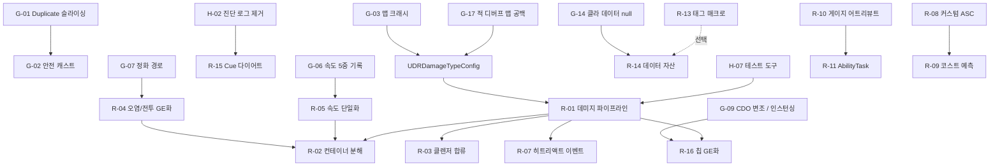

# Plan8 — GAS 개조 계획서 (Gameplay Ability System Teardown & Rebuild)

> **작성일** 2026-09-10
> **범위** `Source/DaeRune/{Public,Private}/AbilitySystem/**` 전체(8,404줄) + GAS 를 직접 건드리는 주변 코드
> (`DRAbilityTypes`, `DRGameplayTags`, `DRCharacterBase`, `DRCharacter`, `DREnemy`, `DRPlayerState`,
> `DRCleanserSite`, `DRInputComponent`, `OverlayWidgetController`) + 관련 BP 에셋 바이너리 검색
> **성격** 기능 추가 계획서가 아니라 **개조(改造) 계획서**. "엔진이 준 걸 조합"하는 단계에서 "엔진이 준 걸 뜯어고쳐 내 것으로" 만드는 단계로 넘어가기 위한 항목표.
> **판정 기준** 출시 후에도 계속 손볼 프로젝트다. 그래서 "지금 안 터지면 됐다"가 아니라 **"1년 뒤에도 이 위에 새 기능을 얹을 수 있나"** 를 기준으로 판정했다.
> **엔진 근거** 엔진 동작에 대한 주장은 `D:/UE_5.5/Engine/Plugins/Runtime/GameplayAbilities` 소스를 직접 열어 확인한 것만 적었다 (부록 C).

---

## 0. 이 문서 읽는 법

각 항목은 이렇게 구성된다.

```
### [ID] 제목                               우선순위 / 난이도 / 리스크
증상     지금 코드가 실제로 무슨 일을 하는가 (파일:줄 인용)
왜 문제  이게 왜 나중에 터지는가
개조안   어떻게 뜯어고칠 것인가 (코드 스케치 포함)
검증     고쳤는지 어떻게 확인하는가
```

| 표기 | 뜻 |
|---|---|
| **P0** | 이미 깨져 있거나, 특정 조건에서 크래시/메모리 오염/기능 무효. 다른 작업 전에 처리 |
| **P1** | 지금은 굴러가지만 구조가 확장을 막고 있음. **이 문서의 본론** |
| **P2** | 위생·현대화. 한가할 때 몰아서 |

난이도: `S`(반나절 이하) / `M`(2~3일) / `L`(1주+). 리스크: 손댔을 때 다른 게 깨질 가능성.

> ⚠️ 줄 번호는 2026-09-10 working tree 기준이다. 커밋이 쌓이면 어긋나니 함수명으로 찾을 것.

---

## 1. 한눈에 보기

### 1.1 P0 — 지금 깨져 있는 것 (17건)

| ID | 제목 | 난이도 | 리스크 |
|---|---|---|---|
| G-01 | `FDRGameplayEffectContext::Duplicate()` 가 부모 타입을 new → 슬라이싱 (**최우선**) | S | 낮음 |
| G-02 | 이펙트 컨텍스트 무검증 `static_cast` (라이브러리 전역) | S | 낮음 |
| G-03 | `DamageTypesToDebuffs[DamageType]` — 키 없으면 즉시 크래시 | S | 낮음 |
| G-04 | 디버프 성공 플래그가 컨텍스트에 눌러붙음 + 서버/클라 따로 굴리는 난수 | S | 낮음 |
| G-05 | 물 부족 시 체력 대납이 컨테이너/오염/사망 파이프라인을 우회 | M | 중간 |
| G-06 | `MaxWalkSpeed` 를 5군데서 따로 씀 → 스턴이 풀림 | M | 중간 |
| G-07 | 오염 정화 경로가 오염 해제 경로와 갈라져 UI 가 오염 상태로 남음 | S | 낮음 |
| G-08 | 컨테이너 데미지 계산 경계 케이스 (피해가 회복이 됨 / 0 나누기) | S | 중간 |
| G-09 | `OnGiveAbility` 가 어빌리티 CDO 를 런타임에 변조 | S | 중간 |
| G-10 | 넉백 해제 타이머 핸들이 지역 변수 | S | 낮음 |
| G-11 | 널 역참조 / 즉시 크래시 후보 9곳 | S | 낮음 |
| G-12 | `WaitCooldownChange` 델리게이트 해제 누락 + GC 미보호 | S | 낮음 |
| G-13 | `FMath::RoundToFloat` 반환값 버림 2곳 | S | 없음 |
| G-14 | 클라에서 `GetCharacterClassInfo/AbilityInfo/GameBalanceConfig` 전부 null | M | 중간 |
| G-15 | 이펙트 적용/제거 델리게이트가 클라에서 이중 방송 + Spec 통째 RPC | S | 낮음 |
| G-16 | Cue 태그 ↔ Cue 에셋 불일치, 클렌저 피격 Cue 가 엘리트일 때만 울림 | S | 없음 |
| **G-17** | **적의 `DebuffEffectMap` 이 비어 있음 → 적에게 디버프가 안 걸리고 벽 스턴이 죽어 있음** | S | 낮음 |

### 1.2 P1 — 개조 본론 (16건)

| ID | 제목 | 난이도 | 리스크 |
|---|---|---|---|
| R-01 | 데미지 파이프라인을 AttributeSet → ExecCalc 로 (방어/저항/치명타 자리 만들기) | **L** | 높음 |
| R-02 | 컨테이너 체력을 **데미지 모디파이어 체인** / 전용 어트리뷰트로 분해 | L | 높음 |
| R-03 | 클렌저 사이트 AttributeSet 을 본진(`UDRAttributeSet`)에 합류 | M | 중간 |
| R-04 | 오염·전투 상태를 bool 여러 개 → GE + 태그 하나로 | M | 중간 |
| R-05 | 이동속도 단일 소스화 (스턴/운반/히트리액트를 GE 모디파이어로) | M | 중간 |
| R-06 | 디버프 VFX 를 복제 bool + Niagara 컴포넌트 → `GameplayCueNotify_Looping` | M | 낮음 |
| R-07 | 히트리액트를 AttributeSet 직접 호출 → GameplayEvent 트리거 어빌리티 | M | 중간 |
| R-08 | **커스텀 ASC 를 제대로 키운다** (입력 버퍼 / RPC 배칭 / 캐시 자동화 / 1키 다중 어빌리티) | L | 중간 |
| R-09 | 어빌리티 코스트 예측 + 물↔체력 환산 규칙 단일화 | M | 중간 |
| R-10 | 게이지/스택을 커스텀 Attribute 로 승격 (전용 RPC 3개 삭제) | M | 중간 |
| R-11 | 타이머 → AbilityTask, 프로젝트 전용 Task 3종 자작 | M | 중간 |
| R-12 | TargetData 서버 검증 + Cancel 콜백 | S | 낮음 |
| R-13 | 네이티브 태그 644줄 → `UE_DEFINE_GAMEPLAY_TAG` 매크로 | M | 낮음 |
| R-14 | 데이터 자산 현대화 (PrimaryDataAsset / Soft ref / TMap 인덱스 / DataValidation) | M | 중간 |
| R-15 | GameplayCue 네트워크 트래픽 다이어트 | M | 중간 |
| R-16 | 업그레이드 칩을 C++ 수동 계산 → GE 모디파이어로 | L | 높음 |

### 1.3 P2 — 위생 (7건)

| ID | 제목 |
|---|---|
| H-01 | UE 5.5 deprecated API 마이그레이션 |
| H-02 | `[임시 진단]` 로그 제거 (데미지 핫패스 Warning 스팸) |
| H-03 | 소스 인코딩 정리 (CP949 27개 + 복구불능 mojibake 63개) |
| H-04 | 죽은 코드 / 죽은 프로퍼티 제거 |
| H-05 | 매직넘버 전수 수거 |
| H-06 | `ATTRIBUTE_ACCESSORS` 매크로 중복 정의 |
| H-07 | GAS 디버깅·테스트 도구 정비 |

실행 순서는 **§6 로드맵** 참고.

---

## 2. 현재 아키텍처 요약 (개조 대상 지도)

```
                          ┌──────────────────────────────────────┐
   EnhancedInput ───────► │ DRPlayerController                    │
   (Started/Triggered/     │  AbilityInputTagPressed/Held/Released │
    Completed)             └───────────────┬──────────────────────┘
                                           │ InputTag
                          ┌───────────────▼──────────────────────┐
                          │ UDRAbilitySystemComponent             │
                          │  InputTagToAbilityMap (Tag→Handle 1:1)│  ← R-08
                          │  UI 전용 델리게이트/Client RPC 다수    │  ← G-15, R-10
                          └───────────────┬──────────────────────┘
                                          │ TryActivateAbility
                          ┌───────────────▼──────────────────────┐
                          │ UDRGameplayAbility                    │
                          │  CheckCost / ApplyCost(서버만)         │  ← R-09, G-05
                          │  ApplyCooldown (SetByCaller)          │
                          │  OnGiveAbility (CDO 변조)             │  ← G-09
                          │  업그레이드 칩 수동 계산               │  ← R-16
                          └───────────────┬──────────────────────┘
                                          │ FDamageEffectParams
                          ┌───────────────▼──────────────────────┐
                          │ UDRAbilitySystemLibrary::ApplyDamageEffect │
                          │  FDRGameplayEffectContext 생성        │  ← G-01, G-02
                          │  SetByCaller(DamageType/Debuff.*)     │
                          └───────────────┬──────────────────────┘
                                          │ ApplyGameplayEffectSpecToSelf
                          ┌───────────────▼──────────────────────┐
                          │ UExecCalc_Damage                      │
                          │  ★ 캡처 어트리뷰트 0개                  │  ← R-01
                          │  SetByCaller 합산 × 하드코딩 배율      │
                          │  → IncomingDamage (메타 어트리뷰트)    │
                          └───────────────┬──────────────────────┘
                                          │ PostGameplayEffectExecute (서버 전용)
        ┌─────────────────────────────────┼─────────────────────────────────┐
        ▼                                 ▼                                 ▼
┌───────────────────┐     ┌────────────────────────┐     ┌──────────────────────────┐
│ UDRPlayerAttrSet  │     │ UDREnemyAttributeSet    │     │ UDRCleanserSiteAttrSet   │
│ 컨테이너/오염/     │     │ 엘리트/블랙보드/튜토리얼│     │ ★UDRAttributeSet 미상속   │
│ 부품/칩/마운트공유 │     │ 넉백/광폭화/처치크레딧  │     │  독자 파이프라인          │
│  ← R-02, R-04     │     │  ← R-01, R-07           │     │  ← R-03                  │
└───────────────────┘     └────────────────────────┘     └──────────────────────────┘
```

**한 줄 요약**: 지금 이 프로젝트의 GAS 는 **"ExecCalc 는 껍데기이고, AttributeSet 이 게임 규칙 전부를 들고 있는"** 구조다.
P1 항목 대부분이 여기서 나온다. 그리고 상태 하나(오염, 스턴, 전투중, 게이지)를 **GAS 태그/어트리뷰트와 별도 bool/RPC 로 이중 관리**하는 패턴이 반복된다. P0 버그 절반이 이 이중 관리 사이에서 어긋난 것들이다.

---

# 3. P0 — 지금 깨져 있는 것

## G-01 `FDRGameplayEffectContext::Duplicate()` 가 부모 타입을 new 한다 (슬라이싱)

**P0 / S / 낮음 — 이 문서에서 가장 먼저 고칠 한 줄**

**증상** — `Source/DaeRune/Public/DRAbilityTypes.h:98-108`

```cpp
virtual FGameplayEffectContext* Duplicate() const override
{
    FGameplayEffectContext* NewContext = new FGameplayEffectContext();  // ★ 부모를 new
    *NewContext = *this;                                               // ★ 부모 부분만 복사 (슬라이싱)
    if (GetHitResult()) { NewContext->AddHitResult(*GetHitResult(), true); }
    return NewContext;
}
```

복제되는 순간 커스텀 필드 7개(`bIsSuccessfulDebuff`, `DebuffDamage`, `DebuffDuration`, `DamageType`, `DeathImpulse`, `KnockbackForce`, `SourceAbilityTags`)가 **전부 사라진다.**

**왜 문제** — 엔진이 이 함수를 부르는 경로가 실제로 3곳 있다 (UE 5.5 소스에서 확인):

| 호출 지점 | 언제 |
|---|---|
| `FGameplayAbilityTargetData::ApplyGameplayEffectSpec()` — `GameplayAbilityTargetTypes.cpp:42` | **TargetData 로 GE 를 적용할 때마다** 타깃별로 컨텍스트를 복제한다. `UTargetDataFromCamera` 가 만드는 데이터가 바로 이 경로를 탄다 |
| `FGameplayEffectSpec::InitializeFromLinkedSpec()` — `GameplayEffect.cpp:1657` | GE 의 Overflow / PrematureExpiration 연쇄 GE |
| `FActiveGameplayEffectsContainer::CloneFrom()` — `GameplayEffect.cpp:5622` | 리플리케이션 프록시 / 예측 복제 |

슬라이싱만이면 "넉백이 안 먹는다" 정도로 끝나겠지만, 프로젝트 코드는 복제된 포인터를 **파생 타입으로 검사 없이 캐스팅해서 읽는다** (G-02). `sizeof(FGameplayEffectContext) < sizeof(FDRGameplayEffectContext)` 이므로 이건 **힙 범위 밖 읽기**다. `TSharedPtr<FGameplayTag> DamageType` 자리의 쓰레기값을 역참조하면 그 자리에서 크래시가 난다.

**게임에서 실제로 터지는 시나리오 — 마운트 공유 데미지 무한 핑퐁**

`DRCharacter.cpp:224` 의 재전파 차단 조건이 `SourceAbilityTags.HasTag(Damage.MountShared)` 다. 그런데 `SourceAbilityTags` 는 슬라이싱으로 사라지는 필드다. 가드가 뚫리면 청소기와 라이더가 서로에게 끝없이 데미지를 던진다. 지금은 위 3경로를 타는 데미지가 없어서 잠복해 있을 뿐이고, TargetData 로 데미지를 넣는 어빌리티를 하나만 추가해도 바로 드러난다.

**개조안**

```cpp
virtual FGameplayEffectContext* Duplicate() const override
{
    FDRGameplayEffectContext* NewContext = new FDRGameplayEffectContext(*this);  // 파생 타입 복사 생성
    if (GetHitResult())
    {
        NewContext->AddHitResult(*GetHitResult(), /*bReset=*/true);             // HitResult 는 깊은 복사
    }
    return NewContext;
}
```

같이 손볼 것 — `NetSerialize()` (`DRAbilityTypes.cpp:4-147`) 에 `SourceAbilityTags` 가 빠져 있다. RepBits 는 13비트만 쓴다. 그래서 클라는 이 태그를 받지 못한다. 비트 하나를 추가하자.

```cpp
if (!SourceAbilityTags.IsEmpty()) { RepBits |= 1 << 13; }
// ...
Ar.SerializeBits(&RepBits, 14);                 // 13 → 14
// ...
if (RepBits & (1 << 13)) { SourceAbilityTags.NetSerialize(Ar, Map, bOutSuccess); }
```

> **한 발 더**: 지금 `NetSerialize` 는 부모 구현을 통째로 복붙한 뒤 필드를 덧붙인 형태라, 엔진이 부모에 필드를 추가하면 조용히 누락된다. 엔진 버전을 올릴 때마다 `FGameplayEffectContext::NetSerialize` 와 diff 를 떠 보는 걸 체크리스트에 넣어 두자.

**검증**
- 데미지 어빌리티 하나를 `UTargetDataFromCamera` + `ApplyGameplayEffectSpecToTarget(TargetData)` 경로로 바꾸고 넉백/사망 임펄스가 살아있는지 본다.
- 청소기에 탑승한 상태에서 라이더가 맞았을 때 `PropagateSharedDamage` 로그가 1홉에서 끝나는지 본다.

---

## G-02 이펙트 컨텍스트 무검증 `static_cast`

**P0 / S / 낮음**

**증상** — `DRAbilitySystemLibrary.cpp:197-310` 의 Getter 8개, Setter 6개, 그리고 `DREnemyAttributeSet.cpp:68`, `DRAttributeSet.cpp:147`:

```cpp
if (const FDRGameplayEffectContext* Ctx =
        static_cast<const FDRGameplayEffectContext*>(EffectContextHandle.Get()))
```

nullptr 여부만 보고 **실제 타입은 확인하지 않는다.**

**왜 문제**
- G-01 로 슬라이싱된 컨텍스트가 들어오면 범위 밖 읽기가 된다.
- 엔진이나 플러그인이 만든 기본 컨텍스트가 들어와도 마찬가지다. `UDRAbilitySystemGlobals::AllocGameplayEffectContext()` 오버라이드(`DRAbilitySystemGlobals.cpp:7-10`)가 막아 주는 건 **ASC 가 `MakeEffectContext` 로 만든 것뿐**이다.

**개조안** — 안전 캐스트 헬퍼 하나로 통일한다. `GetScriptStruct()` 는 가상 함수라서 슬라이싱된 객체에서는 부모 struct 를 돌려준다. 그래서 슬라이싱까지 잡힌다.

```cpp
// DRAbilityTypes.h
namespace DRContext
{
    FORCEINLINE const FDRGameplayEffectContext* Get(const FGameplayEffectContextHandle& Handle)
    {
        const FGameplayEffectContext* Raw = Handle.Get();
        if (!Raw) return nullptr;
        const UScriptStruct* SS = Raw->GetScriptStruct();
        if (!SS || !SS->IsChildOf(FDRGameplayEffectContext::StaticStruct()))
        {
            UE_LOG(LogDR, Warning, TEXT("[GAS] DR 컨텍스트가 아님 (%s) — 기본값 사용"),
                   SS ? *SS->GetName() : TEXT("null"));
            return nullptr;
        }
        return static_cast<const FDRGameplayEffectContext*>(Raw);
    }

    FORCEINLINE FDRGameplayEffectContext* GetMutable(FGameplayEffectContextHandle& Handle)
    {
        return const_cast<FDRGameplayEffectContext*>(Get(Handle));
    }
}
```

라이브러리의 Getter/Setter 14개와 AttributeSet 2곳을 전부 이걸로 바꾼다. Getter 는 실패하면 기본값(`ZeroVector`, `false`, 빈 태그)을 돌려주므로 호출부는 손댈 필요가 없다.

**검증** — `FGameplayEffectContextHandle(new FGameplayEffectContext())` 를 일부러 만들어 `GetDeathImpulse()` 에 넣어 본다. 크래시 대신 경고 한 줄과 `ZeroVector` 가 나오면 된다.

---

## G-03 `DamageTypesToDebuffs[DamageType]` — 키 없으면 즉시 크래시

**P0 / S / 낮음**

**증상** — `DRAttributeSet.cpp:129`

```cpp
const FGameplayTag DebuffTag = GameplayTags.DamageTypesToDebuffs[DamageType];  // TMap::operator[] → 키 없으면 check() 실패
if (!DebuffEffectMap.Contains(DebuffTag)) return;                               // 방어 코드는 그 "다음 줄"에 있다
```

등록된 키는 `DRGameplayTags.cpp:271-275` 의 5개(`Damage.Arcane/Lightning/Physical/Fire/Bite`)뿐이다.

**왜 문제** — `DamageType` 이 빈 태그이거나 이 5개가 아니면 서버가 `check` 로 멈춘다. 들어올 수 있는 경로는 이렇다.
- **새 데미지 타입을 추가하고 이 맵 등록을 깜빡한 경우.** 가장 현실적이다. 태그 추가, `DamageTypeTags` 추가, `DamageTypesToDebuffs` 추가를 서로 다른 곳에서 해야 한다.
- G-01/G-02 로 `IsSuccessfulDebuff` 가 쓰레기값 true 가 되고 `DamageType` 이 비는 경우.
- `Damage.MountShared` 처럼 "데미지 타입이 아닌 Damage.* 태그"가 늘어나는 경우.

**개조안**

```cpp
const FGameplayTag* DebuffTagPtr = GameplayTags.DamageTypesToDebuffs.Find(DamageType);
if (!DebuffTagPtr || !DebuffTagPtr->IsValid())
{
    UE_LOG(LogDR, Warning, TEXT("[GAS] DamageType %s 에 매핑된 디버프 없음 — 생략"), *DamageType.ToString());
    return;
}
const TSubclassOf<UGameplayEffect>* GEClass = DebuffEffectMap.Find(*DebuffTagPtr);
if (!GEClass || !*GEClass) return;
```

**근본 개조 (R-14 와 연계)** — "데미지 타입 ↔ 디버프 태그 ↔ 디버프 GE ↔ 저항 어트리뷰트" 매핑이 지금은 세 곳에 흩어져 있다: `FDRGameplayTags` C++ 하드코딩, AttributeSet 인스턴스의 `DebuffEffectMap`, 그리고 앞으로 생길 저항. 이걸 데이터 자산 하나로 합친다.

```cpp
USTRUCT(BlueprintType)
struct FDRDamageTypeDef
{
    GENERATED_BODY()
    UPROPERTY(EditDefaultsOnly) FGameplayTag DamageType;                  // Damage.Fire
    UPROPERTY(EditDefaultsOnly) FGameplayTag DebuffTag;                   // Debuff.Burn
    UPROPERTY(EditDefaultsOnly) TSubclassOf<UGameplayEffect> DebuffEffect;
    UPROPERTY(EditDefaultsOnly) FGameplayAttribute ResistanceAttribute;   // R-01 에서 사용
    UPROPERTY(EditDefaultsOnly) FLinearColor DamageNumberColor = FLinearColor::White;
};

UCLASS() class UDRDamageTypeConfig : public UPrimaryDataAsset
{
    GENERATED_BODY()
public:
    UPROPERTY(EditDefaultsOnly) TArray<FDRDamageTypeDef> DamageTypes;
    const FDRDamageTypeDef* Find(const FGameplayTag& DamageType) const;   // PostLoad 에서 만든 TMap 인덱스로 조회
};
```

G-17 도 이걸로 같이 해결된다.

---

## G-04 디버프 성공 플래그가 컨텍스트에 눌러붙는다

**P0 / S / 낮음**

**증상** — `ExecCalc_Damage.cpp:15-45`

```cpp
for (TTuple<FGameplayTag, FGameplayTag> Pair : GameplayTags.DamageTypesToDebuffs)
{
    const float TypeDamage = Spec.GetSetByCallerMagnitude(DamageType, false, -1.f);
    if (TypeDamage > -.5f)
    {
        const float SourceDebuffChance = Spec.GetSetByCallerMagnitude(GameplayTags.Debuff_Chance, false, -1.f);
        if (FMath::RandRange(1, 100) <= SourceDebuffChance)
        {
            FGameplayEffectContextHandle ContextHandle = Spec.GetContext();   // 핸들 복사 = 같은 컨텍스트 공유
            UDRAbilitySystemLibrary::SetIsSuccessfulDebuff(ContextHandle, true); // false 로 되돌리는 코드가 어디에도 없다
            ...
        }
    }
}
```

**왜 문제** — 네 가지가 겹쳐 있다.
1. **false 로 리셋하지 않는다.** 지금은 `ApplyDamageEffect()` 가 타깃마다 컨텍스트를 새로 만들어서(`DRAbilitySystemLibrary.cpp:495`) 드러나지 않는다. **스펙 하나를 여러 타깃에 적용하는 순간**(AoE GE, TargetData 경로, BP 에서 `ApplyGameplayEffectSpecToTarget` 을 루프로 돌리는 경우) 첫 타깃이 뽑은 확률 결과가 나머지 전부에 그대로 적용된다.
2. **`Debuff.Chance` 가 스펙 전체에 하나뿐이다.** 타입별 확률을 줄 수 없어서 화염+물리 복합 피해를 설계할 수 없다.
3. **`break` 가 없다.** 타입이 둘 이상이면 마지막으로 성공한 타입이 컨텍스트를 덮어쓴다. 결과가 TMap 순회 순서에 달려 있다.
4. **`FMath::RandRange` 를 서버와 클라가 각자 굴린다.** 이 ExecCalc 가 예측 경로에서 돌면 결과가 서로 달라서 롤백이 난다.

**개조안**

```cpp
void UExecCalc_Damage::DetermineDebuff(const FGameplayEffectCustomExecutionParameters& Params,
                                       const FGameplayEffectSpec& Spec) const
{
    FGameplayEffectContextHandle Ctx = Spec.GetContext();
    UDRAbilitySystemLibrary::SetIsSuccessfulDebuff(Ctx, false);             // ① 매번 리셋으로 시작

    const UAbilitySystemComponent* TargetASC = Params.GetTargetAbilitySystemComponent();
    if (!TargetASC || !TargetASC->IsOwnerActorAuthoritative()) return;      // ② 확률은 서버만 굴린다

    const FDRGameplayTags& Tags = FDRGameplayTags::Get();
    for (const TTuple<FGameplayTag, FGameplayTag>& Pair : Tags.DamageTypesToDebuffs)
    {
        if (Spec.GetSetByCallerMagnitude(Pair.Key, false, -1.f) <= -0.5f) continue;

        const float Chance = GetDebuffChanceFor(Spec, Pair.Key);   // ③ Debuff.Chance.<Type> 우선, 없으면 전역 Debuff.Chance
        if (FMath::FRand() * 100.f >= Chance) continue;

        UDRAbilitySystemLibrary::SetIsSuccessfulDebuff(Ctx, true);
        UDRAbilitySystemLibrary::SetDamageType(Ctx, Pair.Key);
        UDRAbilitySystemLibrary::SetDebuffDamage(Ctx, Spec.GetSetByCallerMagnitude(Tags.Debuff_Damage, false, 0.f));
        UDRAbilitySystemLibrary::SetDebuffDuration(Ctx, Spec.GetSetByCallerMagnitude(Tags.Debuff_Duration, false, 0.f));
        break;                                                               // ④ 첫 성공에서 멈춘다
    }
}
```

> **R-01 에서 다시 설계할 것**: 디버프 정보를 컨텍스트에 실어 AttributeSet 까지 넘기는 방식 자체를 없애는 게 맞다. 지금은 `ExecCalc → Context → AttributeSet::Debuff() → 새 GE` 3단 릴레이라서 중간 하나만 어긋나도 디버프가 조용히 사라진다. G-01, G-03, G-17 이 전부 이 릴레이에서 생긴 버그다. ExecCalc 가 판정한 뒤 **디버프 GE 스펙을 직접 만들어 적용**하면 릴레이가 없어진다.

---

## G-05 물 부족 시 체력 대납이 컨테이너/오염/사망 파이프라인을 우회한다

**P0 / M / 중간**

**증상** — `ExecCalc_WaterCost.cpp:99-106`

```cpp
if (HealthCost > 0.f)
{
    FGameplayModifierEvaluatedData HealthData(
        UDRAttributeSet::GetHealthAttribute(),        // ★ IncomingDamage 가 아니라 Health 를 직접 깎는다
        EGameplayModOp::Additive, -HealthCost);
    OutExecutionOutput.AddOutputModifier(HealthData);
}
```

**왜 문제** — 플레이어 체력은 그냥 숫자가 아니라 **컨테이너 시스템**이다. `ProcessNormalDamage → CalculateContainerDamage → 0이면 EnterCorruptedState` 로직은 `IncomingDamage` 메타 어트리뷰트를 거칠 때만 돈다. Health 를 직접 깎으면 아래가 전부 건너뛰어진다.

| 건너뛰는 것 | 결과 |
|---|---|
| 컨테이너 경계 / 오버플로 규칙 | 스킬 코스트가 칸 경계를 무시하고 관통한다 |
| `EnterCorruptedState()` | **체력 0 인데 오염으로 넘어가지 않는다.** `PreAttributeBaseChange` 가 0 으로 클램프만 한다 |
| `Die()` | 죽지도 않는다 → **체력 0 좀비 상태** |
| `ShouldPreventDeath()` (로비/튜토리얼 보호) | 무시된다 |
| 전투 진입, 피격 연출, 데미지 숫자 | 전부 없다 |

같은 ×0.5 환산 규칙이 3곳에 복붙돼 있는 것도 문제다.

| 파일:줄 | 코드 |
|---|---|
| `DRGameplayAbility.cpp:52` (`CheckCost`) | `FMath::FloorToFloat(WaterShortage * 0.5f)` |
| `ExecCalc_WaterCost.cpp:85` | `FMath::FloorToFloat(WaterShortage * 0.5f)` |
| `DRVacuumDash.cpp:61` (`TickCharge`) | `FMath::FloorToFloat((WaterPerGauge - CurrentWater) * 0.5f)` |

**개조안**

*1단계 — 파이프라인으로 돌려보내기 (바로 적용 가능)*

```cpp
if (HealthCost > 0.f)
{
    // Health 직접 조작 금지. IncomingDamage 로 보내 컨테이너/오염/사망 규칙을 거치게 한다
    FGameplayModifierEvaluatedData HealthData(
        UDRAttributeSet::GetIncomingDamageAttribute(),
        EGameplayModOp::Additive, HealthCost);           // IncomingDamage 는 양수가 피해다
    OutExecutionOutput.AddOutputModifier(HealthData);
}
```
자해 피해에 넉백·디버프·데미지 숫자·마운트 공유가 붙으면 안 되니까, `Damage.SelfCost` 태그를 컨텍스트나 스펙에 달아 `HandleIncomingDamage` 에서 그 부분만 걸러낸다.

*2단계 — 환산 규칙을 한 곳으로 (R-09)* — `UGameBalanceConfig` 에 `HealthPerWaterRate` 를 두고, `UDRAbilitySystemLibrary::CalcHealthCostForWaterShortage()` 하나만 부르게 한다. 세 호출부 모두 이걸로 바꾼다.

**검증**
- 물 0 에서 스킬을 연타한다. 체력이 칸 경계 규칙대로 깎이고, 0 이 되면 오염으로 넘어가는지 본다.
- 로비/튜토리얼에서는 체력이 1 밑으로 내려가지 않는지 본다.

---

## G-06 `MaxWalkSpeed` 를 5군데서 따로 쓴다 → 스턴이 풀린다

**P0 / M / 중간**

**증상** — 같은 변수에 쓰는 코드가 다섯 군데다.

| 파일:줄 | 코드 | 언제 |
|---|---|---|
| `DRAttributeSet.cpp:218` | `MaxWalkSpeed = NewValue` | MoveSpeed 어트리뷰트가 바뀔 때 (`PostAttributeChange`) |
| `DRCharacterBase.cpp:497` | `MaxWalkSpeed = Data.NewValue` | **같은 이벤트**를 델리게이트로 또 받는다 (`OnMoveSpeedChanged`) |
| `DRCharacterBase.cpp:328` | `MaxWalkSpeed = bIsStunned ? StunnedMoveSpeed : GetMoveSpeed()` | `Debuff.Stun` 태그가 늘거나 줄 때 |
| `DREnemy.cpp:259` | `MaxWalkSpeed = bHitReacting ? HitReactingMoveSpeed : GetMoveSpeed()` | 히트리액트 태그가 바뀔 때 |
| `DRCharacter.cpp:1045` | `MaxWalkSpeed = DRAS->GetMoveSpeed()` | 바인딩 초기화 |

**왜 문제 — 재현 가능한 버그**

```
1. 스턴에 걸린다                      → StunTagChanged      → MaxWalkSpeed = 0
2. 스턴 중에 MoveSpeed 어트리뷰트가 바뀐다
   (대시 버프 스택 감쇠 / 업그레이드 GE 재적용 / 기타 GE)
3. PostAttributeChange                → MaxWalkSpeed = MoveSpeed   ★ 스턴이 풀린다
4. 스턴 태그는 여전히 붙어 있다. 태그가 빠질 때 StunTagChanged 가 다시 속도를 넣지만,
   그 사이 몇 초 동안 자유롭게 움직인다
```

`DRVacuumDash::TickDecay` 는 1초마다 버프 스택을 하나 빼면서 MoveSpeed 를 다시 계산한다. **청소기가 대시 중에 스턴을 맞으면 1초 안에 스턴이 풀린다.** 적도 같다. 히트리액트 태그가 빠질 때 `GetMoveSpeed()` 로 되돌리니까, 히트리액트와 스턴이 겹치면 스턴이 풀린다.

**개조안**
- *즉시(1시간)*: `ADRCharacterBase::OnMoveSpeedChanged` 바인딩을 지워 중복을 없앤다. `PostAttributeChange` 쪽에는 "이동 억제 태그(`Debuff.Stun` 등)가 있으면 CMC 를 덮어쓰지 않는다" 가드를 넣는다.
- *제대로(R-05)*: 스턴·운반·히트리액트를 **MoveSpeed 어트리뷰트에 모디파이어를 얹는 GE** 로 바꾼다. 그러면 `MaxWalkSpeed == MoveSpeed` 라는 불변식 하나만 남는다.

**검증** — 청소기 대시 중에 스턴을 맞은 뒤 감쇠 틱이 돌아도 캐릭터가 움직이지 않으면 된다.

---

## G-07 오염 정화 경로가 오염 해제 경로와 갈라져 있다

**P0 / S / 낮음**

**증상** — 오염을 푸는 함수가 둘인데 하는 일이 다르다.

| `ExitCorruptedState()` `DRPlayerAttributeSet.cpp:106-130` | `HandleCorruptionPurification()` `:363-381` |
|---|---|
| `bCorrupted = false` | `bCorrupted = false` |
| `SetMaxHealth / SetHealth` | `SetMaxHealth / SetHealth` |
| `PS->SetCorruptedState(false)` | `PS->SetCorruptedState(false)` |
| `DRPC->CorruptedStateChanged(false)` ✅ | **없음** ❌ |
| 호출하는 곳: **없음** (죽은 함수) | 호출하는 곳: `HandleIncomingHealing` |

**왜 문제** — 실제로 쓰이는 정화 경로는 `ADRPlayerController::CorruptedStateChanged(false)` 를 부르지 않는다. 컨트롤러가 오염 해제 때 하는 일(화면 효과 해제, 팀 시야·통신 복구, HUD 상태)이 **오염 상태로 남는다.** 제대로 된 쪽(`ExitCorruptedState`)은 아무도 호출하지 않는다.

**개조안** — 당장은 정화 함수가 해제 함수에 위임하게 만든다.

```cpp
void UDRPlayerAttributeSet::HandleCorruptionPurification(const FEffectProperties& Props, float HealAmount)
{
    ExitCorruptedState(Props);   // 상태 전이는 한 함수에서만
}
```

근본 해결은 R-04 다. 오염을 bool 로 관리하지 않으면 이런 동기화 누락 자체가 생길 수 없다.

---

## G-08 컨테이너 데미지 계산의 경계 케이스

**P0 / S / 중간**

**증상** — `DRPlayerAttributeSet.cpp:251-287` `CalculateContainerDamage()`

```cpp
if (OverflowDamage <= (Damage * OVERFLOW_THRESHOLD))
{
    NewHealth = ContainerIndex * ContainerHealth + 1.f;   // ★
    break;
}
```

**문제 세 가지**

① **피해를 받았는데 체력이 오르는 구간이 있다.** `ContainerHealth=100`, 현재 체력 `0.5`, 피해 `0.55` 를 넣어 보자.
`ContainerIndex=0`, `HealthInContainer=0.5`, `Overflow=0.05`. `0.05 ≤ 0.055` 가 참이므로 `NewHealth = 0 + 1 = 1.0` 이 된다.
체력 0.5 에서 피해 0.55 를 받았는데 결과가 1.0 이다. `PreAttributeBaseChange` 가 체력을 반올림하므로 소수 체력은 드물지만, `MMC_HealthRegen`, 칩 배율, 코스트 경로(G-05)에서 소수가 생길 수 있다.

② **마지막 칸에서는 오버플로 임계값 안쪽 피해로 죽지 않는다.** `+1.f` 때문이다. "마지막 칸은 한 방에 안 죽는다"가 의도라면 괜찮지만, 그 의도가 코드 어디에도 적혀 있지 않고 `+1.f` 매직넘버로만 남아 있다.

③ **`ContainerHealth == 0` 이면 0 으로 나눈다.** `SetContainerInfo(_, 0.f)` 를 막는 코드는 업그레이드 경로(`DRCharacter.cpp:960` 의 `FMath::Max(1.f, ...)`) 한 곳뿐이다.

덤으로, "체력 → 칸 인덱스" 계산이 **3곳에 복붙**돼 있다: `PostAttributeChange` 람다(`:31-40`), `GetCurrentContainerIndex()`(`:65-79`), `CalculateContainerDamage()` 루프 안(`:258-263`).

**개조안**

```cpp
float UDRPlayerAttributeSet::CalculateContainerDamage(float CurrentHealth, float Damage) const
{
    if (ContainerHealth <= KINDA_SMALL_NUMBER || NumContainers <= 0)
        return FMath::Max(0.f, CurrentHealth - Damage);        // 컨테이너 미설정이면 일반 체력으로 폴백
    if (Damage <= 0.f) return CurrentHealth;

    float NewHealth = CurrentHealth, Remaining = Damage;
    for (int32 Guard = NumContainers + 1; Remaining > 0.f && NewHealth > 0.f && Guard > 0; --Guard)
    {
        const int32 Idx   = ContainerIndexFromHealth(NewHealth);    // 3곳 복붙 → 멤버 함수 하나
        const float Floor = Idx * ContainerHealth;
        const float InBox = NewHealth - Floor;

        if (Remaining < InBox) { NewHealth -= Remaining; break; }

        const float Overflow = Remaining - InBox;
        if (Overflow <= Damage * OverflowThreshold)
        {
            NewHealth = FMath::Min(NewHealth, Floor + ContainerSurvivalMargin);  // 절대 원래 값보다 올라가지 않게
            break;
        }
        NewHealth = Floor;
        Remaining = Overflow;
    }
    return FMath::Max(0.f, NewHealth);
}
```

`OVERFLOW_THRESHOLD`(0.1) 와 `+1.f` 는 `UGameBalanceConfig::PlayerContainer` 로 옮긴다. 이 함수는 **순수 함수로 떼어 내서 자동화 테스트**를 붙이기 좋은 첫 후보다 (H-07, 부록 B).

---

## G-09 `OnGiveAbility` 가 어빌리티 CDO 를 런타임에 변조한다

**P0 / S / 중간**

**증상** — `DRGameplayAbility.cpp:89-103`

```cpp
void UDRGameplayAbility::OnGiveAbility(const FGameplayAbilityActorInfo* ActorInfo, const FGameplayAbilitySpec& Spec)
{
    Super::OnGiveAbility(ActorInfo, Spec);
    for (const FGameplayTag& Tag : AbilityTags)
        if (!ActivationOwnedTags.HasTagExact(Tag)) ActivationOwnedTags.AddTag(Tag);   // ★
}
```

**왜 문제** — 엔진 코드를 직접 확인했다. `AbilitySystemComponent_Abilities.cpp:583-591`:

```cpp
UGameplayAbility* PrimaryInstance = bInstancedPerActor ? Spec.GetPrimaryInstance() : nullptr;
if (PrimaryInstance) { PrimaryInstance->OnGiveAbility(AbilityActorInfo.Get(), Spec); }
else                 { Spec.Ability->OnGiveAbility(AbilityActorInfo.Get(), Spec); }   // Spec.Ability == CDO
```

`UGameplayAbility` 의 기본 `InstancingPolicy` 는 **`InstancedPerExecution`** 이다 (`GameplayAbility.cpp:91`). C++ 에서 `InstancedPerActor` 를 명시한 어빌리티는 `DRS2MoleClawAttack` 과 `DRS2MoleBurrowStrike` **두 개뿐**이다. 나머지 어빌리티는 BP 에서 바꾸지 않았다면 `ActivationOwnedTags.AddTag` 가 **CDO 를 수정한다.**

- CDO 는 프로세스 전체가 공유한다. 리슨 서버 호스트, 그 로컬 클라, 모든 적이 같은 객체를 본다.
- 에디터에서는 PIE 가 끝나도 CDO 가 남는다. **PIE 1회차와 2회차의 동작이 달라질 수 있다.**
- 나중에 `AbilityTags` 에서 태그를 지워도 CDO 에 이미 붙은 태그는 에디터를 재시작할 때까지 남는다(유령 태그).
- `AbilityTags` 는 5.5 에서 deprecated 다 (H-01). 같은 파일 `:112` 는 이미 `GetAssetTags()` 를 쓴다.

**개조안 — 둘 중 하나**

*A안 (권장, 간단)* — CDO 대신 **스펙의 동적 태그**에 얹는다. GAS 는 활성화할 때 스펙 동적 태그도 반영하므로, 차단 UI 트리거라는 원래 목적은 그대로 달성된다. 적용하기 전에 `HandleBlockedAbilityTagsAnyChange` 가 기대하는 신호가 여전히 오는지 확인한다.

*B안 (정석)* — 머지를 **에디터 시점**에 끝내고 런타임 변조를 아예 없앤다.

```cpp
#if WITH_EDITOR
void UDRGameplayAbility::PostEditChangeProperty(FPropertyChangedEvent& E)
{
    Super::PostEditChangeProperty(E);
    for (const FGameplayTag& Tag : GetAssetTags())
        if (!ActivationOwnedTags.HasTagExact(Tag)) ActivationOwnedTags.AddTag(Tag);
}
EDataValidationResult UDRGameplayAbility::IsDataValid(FDataValidationContext& Ctx) const
{
    // AssetTags 중 ActivationOwnedTags 에 없는 게 있으면 에러 → 저장 시 바로 드러난다
}
#endif
```

**별도 권장** — `UDRGameplayAbility` 의 기본 인스턴싱을 명시적으로 `InstancedPerActor` 로 통일한다. `InstancedPerExecution` 은 활성화할 때마다 UObject 를 새로 만들어 GC 부담이 크고, 지금처럼 어빌리티 인스턴스에 상태(게이지, 타이머 핸들, `bImpactBound`)를 들고 있는 코드와 가장 안 맞는다. R-16 에서 `GetUpgradeRuntimeFor(ActorInfo)` 우회가 생긴 이유도 결국 이 문제다.

```cpp
UDRGameplayAbility::UDRGameplayAbility()
{
    InstancingPolicy   = EGameplayAbilityInstancingPolicy::InstancedPerActor;
    NetExecutionPolicy = EGameplayAbilityNetExecutionPolicy::LocalPredicted;   // 의도를 명시
}
```
⚠️ **기존 BP 어빌리티의 기본값이 바뀐다.** BP 에서 값을 명시적으로 덮어쓴 에셋은 영향이 없지만, 그렇지 않은 에셋은 동작이 달라진다. 하나씩 확인하면서 진행한다.

---

## G-10 넉백 해제 타이머 핸들이 지역 변수다

**P0 / S / 낮음**

**증상** — `DREnemyAttributeSet.cpp:177-193`

```cpp
Enemy->SetKnockbackState(true);
FTimerHandle KnockbackEndTimer;                         // ★ 스택 변수. 함수가 끝나면 핸들을 잃는다
GetWorld()->GetTimerManager().SetTimer(KnockbackEndTimer,
    [Enemy](){ if (IsValid(Enemy)) Enemy->SetKnockbackState(false); }, 1.5f, false);
```

**왜 문제**
- 핸들을 버리니까 **취소할 수 없다.**
- 1.5초 안에 두 번 넉백되면 타이머가 두 개 뜬다. **먼저 끝난 타이머가 아직 진행 중인 두 번째 넉백 상태를 일찍 풀어 버린다.**
- 1.5f 가 매직넘버다.
- AttributeSet 이 월드 타이머를 직접 건다. 이건 R-01 에서 다룰 "AttributeSet 이 게임 규칙을 들고 있다"는 문제의 한 사례다.

**개조안** — 핸들을 적 액터가 들고 있게 한다.

```cpp
// DREnemy.h
FTimerHandle KnockbackRecoveryTimer;
UPROPERTY(EditDefaultsOnly, Category="Combat|Knockback") float KnockbackRecoveryTime = 1.5f;
void BeginKnockback();   // SetKnockbackState(true) + 타이머 ClearTimer 후 재설정
void EndKnockback();
```

> 더 나은 방향은 넉백 상태를 `State.Knockback` 을 부여하는 **HasDuration GE**(스택 정책: 지속시간 갱신)로 표현하는 것이다. 지속시간 갱신과 중복 처리를 GAS 가 해 주고, ABP 와 AI 는 태그만 보면 된다.

---

## G-11 널 역참조 / 즉시 크래시 후보

**P0 / S / 낮음**

| 파일:줄 | 코드 | 터지는 조건 |
|---|---|---|
| `DRAbilitySystemLibrary.cpp:510` | `TargetAbilitySystemComponent->ApplyGameplayEffectSpecToSelf(...)` | 477줄에서 null 체크를 하지만 그건 근접 전용 분기 안이다. 여기서는 무조건 역참조한다. **ASC 가 없는 액터를 때리면 크래시** |
| `DRAbilitySystemLibrary.cpp:465` | `SourceAbilitySystemComponent->GetAvatarActor()` | Source ASC 가 없을 때 |
| `DRAbilitySystemLibrary.cpp:336` | `Overlap.GetActor()->Implements<...>()` | 오버랩 결과의 액터가 null 일 때 (파괴 대기 중 등) |
| `DRAbilitySystemLibrary.cpp:61, 77, 127` | `ASC->GetAvatarActor()->...` / `CharacterClassInfo->...` | 아바타가 설정되기 전에 호출될 때, 클라에서 ClassInfo 가 null 일 때(G-14) |
| `DRSummonAbility.cpp:34-35` | `RandRange(0, MinionClasses.Num()-1)` → `MinionClasses[Selection]` | **배열이 비면 인덱스 -1 → 크래시.** `GA_SummonAbility` 에셋이 실제로 쓰고 있다 |
| `DRSummonAbility.cpp:10` | `SpawnSpread / NumMinions` | `NumMinions == 0` 이면 0 나누기 |
| `DRProjectileSpell.cpp:36`, `DRFireBolt.cpp:30` | `SpawnActorDeferred` 결과를 확인 없이 사용 | `ProjectileClass` 를 지정하지 않은 BP |
| `DRFireBolt.cpp:45` | `NewObject<USceneComponent>(USceneComponent::StaticClass())` | Outer 자리에 클래스를 넘겨서 **트랜지언트 패키지 소속**이 되고, `RegisterComponent()` 도 하지 않는다. GC 대상이 되어 유도 타깃이 사라진다 |
| `DREnemyAttributeSet.cpp:77, 162` | `Props.TargetCharacter->Implements<...>()` | 타깃이 캐릭터가 아닐 때 (`SetEffectProperties` 는 캐스트 실패 시 null 을 둔다) |
| `TargetDataFromCamera.cpp:17, 41-42` | `Ability->GetCurrentActorInfo()->...`, `PC->GetPlayerViewPoint` | AI 나 PC 없는 아바타가 이 태스크를 쓸 때 |

```cpp
// DRFireBolt.cpp — 유도 타깃 컴포넌트는 발사체 소속으로
Projectile->HomingTargetSceneComponent = NewObject<USceneComponent>(Projectile);
Projectile->HomingTargetSceneComponent->RegisterComponent();
Projectile->HomingTargetSceneComponent->SetWorldLocation(ProjectileTargetLocation);
```

```cpp
// ApplyDamageEffect 진입부 한 줄로 대부분이 막힌다
if (!DamageEffectParams.SourceAbilitySystemComponent || !DamageEffectParams.TargetAbilitySystemComponent
    || !DamageEffectParams.DamageGameplayEffectClass) return FGameplayEffectContextHandle();
```

---

## G-12 `WaitCooldownChange` 델리게이트 해제 누락 + GC 미보호

**P0 / S / 낮음**

**증상** — `WaitCooldownChange.cpp`

```cpp
UWaitCooldownChange* Task = NewObject<UWaitCooldownChange>();     // :9  Outer 없음, GameInstance 등록 없음
...
ASC->OnActiveGameplayEffectAddedDelegateToSelf.AddUObject(Task, &...::OnActiveEffectAdded);   // :27

void UWaitCooldownChange::EndTask()                               // :32
{
    ASC->RegisterGameplayTagEvent(CooldownTag, ...).RemoveAll(this);
    // ★ OnActiveGameplayEffectAddedDelegateToSelf 는 풀지 않는다
    SetReadyToDestroy(); MarkAsGarbage();
}
```

**왜 문제**
- GE 추가 델리게이트가 풀리지 않는다. HUD 가 다시 만들어질 때마다(스테이지 재입장, 클래스 변경, 관전 전환) **바인딩이 쌓인다.**
- `UBlueprintAsyncActionBase` 는 `RegisterWithGameInstance()` 로 수명을 잡는 게 정석인데, 그 호출이 없다.
- 입력이 잘못됐을 때 `MarkAsGarbage()` 를 한 뒤 null 을 돌려준다. BP 노드는 null 을 받으면 조용히 아무 일도 하지 않는다.
- **성능**: `OnActiveGameplayEffectAddedDelegateToSelf` 는 모든 GE 마다 불린다. 스킬 슬롯이 4개면 GE 하나마다 콜백이 4번 돌고, 매번 `GetActiveEffectsTimeRemaining(Query)` 로 활성 GE 전체를 훑는다. 웨이브 구간처럼 디버프 틱과 물 보상이 쏟아질 때 누적된다.

**개조안**

```cpp
UWaitCooldownChange* UWaitCooldownChange::WaitForCooldownChange(UAbilitySystemComponent* InASC, const FGameplayTag& InTag)
{
    if (!IsValid(InASC) || !InTag.IsValid()) return nullptr;       // 만들기 전에 검증
    UWaitCooldownChange* Task = NewObject<UWaitCooldownChange>(InASC);
    Task->RegisterWithGameInstance(InASC);
    Task->ASC = InASC; Task->CooldownTag = InTag;
    Task->TagHandle   = InASC->RegisterGameplayTagEvent(InTag, EGameplayTagEventType::NewOrRemoved)
                              .AddUObject(Task, &UWaitCooldownChange::CooldownTagChanged);
    Task->AddedHandle = InASC->OnActiveGameplayEffectAddedDelegateToSelf
                              .AddUObject(Task, &UWaitCooldownChange::OnActiveEffectAdded);
    return Task;
}
void UWaitCooldownChange::EndTask()
{
    if (IsValid(ASC))
    {
        ASC->RegisterGameplayTagEvent(CooldownTag, EGameplayTagEventType::NewOrRemoved).Remove(TagHandle);
        ASC->OnActiveGameplayEffectAddedDelegateToSelf.Remove(AddedHandle);
    }
    SetReadyToDestroy(); MarkAsGarbage();
}
```

> 근본 개조(R-08): ASC 가 쿨다운 GE 를 적용하는 시점에 "쿨다운 태그 → 남은 시간"을 **한 번만** 방송하게 한다. 슬롯마다 모든 GE 를 감시하는 구조 자체를 없앤다.

---

## G-13 `FMath::RoundToFloat` 반환값을 버린다 (2곳)

**P0 / S / 없음**

```cpp
// DREnemyAttributeSet.cpp:43-44
LocalIncomingDamage *= EliteBuffModifier;
FMath::RoundToFloat(LocalIncomingDamage);         // ★ 결과를 받지 않는다 → 아무 일도 안 일어난다

// DRCleanserSiteAttributeSet.cpp:72-73
LocalIncomingDamage *= EliteDebuffModifier;
FMath::RoundToFloat(LocalIncomingDamage);         // ★ 같은 실수
```
→ `LocalIncomingDamage = FMath::RoundToFloat(LocalIncomingDamage);`

같이 정리: `DREnemyAttributeSet.cpp:156` 의 미사용 변수 `FVector Impulse`. 바로 다음 줄에서 같은 함수를 한 번 더 부른다.

---

## G-14 클라이언트에서 `GetCharacterClassInfo` / `GetAbilityInfo` / `GetGameBalanceConfig` 가 전부 null

**P0 / M / 중간**

**증상** — `DRAbilitySystemLibrary.cpp:100-105, 183-195`

```cpp
const ADRGameModeBase* GM = Cast<ADRGameModeBase>(UGameplayStatics::GetGameMode(WorldContextObject));
if (GM == nullptr) return nullptr;       // ★ 클라이언트에서는 항상 여기로 빠진다 (GameMode 는 서버 전용)
```

`GetPlayerCharacterClassInfo()` 만 GameInstance 를 써서 양쪽에서 동작한다(`:107-113`). 나머지 셋은 서버에서만 값이 나온다.

**왜 문제**
- `GetGameBalanceConfig()` 는 `DRCharacter::InitAbilityActorInfo` 의 `HasAuthority()` 블록 안에서만 호출된다. 그래서 **클라의 `NumContainers` / `ContainerHealth` 는 C++ 기본값(4 / 100)으로 고정된다.** 밸런스 에셋에서 이 값을 바꾸면 서버와 클라의 칸 계산이 달라지고, HUD 칸 표시와 `GetCurrentContainerIndex()` 가 틀린다.
- `UDRPlayerAttributeSet::NumContainers / ContainerHealth / CorruptMaxHealth` 도 복제되지 않는다(`DRPlayerAttributeSet.h`). 주석은 "각 클라이언트가 자체 계산"이라고 하지만, 계산에 필요한 입력값이 클라에 없으니 전제가 이미 깨져 있다.
- `GetAbilityInfo()` 를 클라 UI 에서 쓰면 빈 결과가 나온다. 앞으로 UI 를 추가할 때 함정이다.

**개조안**
1. 데이터 접근을 `UDeveloperSettings`(또는 GameInstance)로 옮긴다. 둘 다 서버와 클라에 존재한다.

```cpp
UCLASS(config=Game, defaultconfig, meta=(DisplayName="DaeRune GAS"))
class UDRGASSettings : public UDeveloperSettings
{
    GENERATED_BODY()
public:
    UPROPERTY(config, EditAnywhere, Category="Data") TSoftObjectPtr<UCharacterClassInfo>       EnemyClassInfo;
    UPROPERTY(config, EditAnywhere, Category="Data") TSoftObjectPtr<UPlayerCharacterClassInfo> PlayerClassInfo;
    UPROPERTY(config, EditAnywhere, Category="Data") TSoftObjectPtr<UAbilityInfo>              AbilityInfo;
    UPROPERTY(config, EditAnywhere, Category="Data") TSoftObjectPtr<UGameBalanceConfig>        Balance;
    UPROPERTY(config, EditAnywhere, Category="Data") TSoftObjectPtr<UDRDamageTypeConfig>       DamageTypes;
    static const UDRGASSettings& Get() { return *GetDefault<UDRGASSettings>(); }
};
```
기존 `ADRGameModeBase` 포인터는 과도기 동안 남겨 두고, 라이브러리 함수만 설정을 보게 바꾼다.

2. 칸 정보를 **복제**한다: `UPROPERTY(Replicated)` + `COND_OwnerOnly`. 더 나은 방법은 R-02 A안처럼 어트리뷰트로 올리는 것이다.

**검증** — 클라 인스턴스에서 `GetGameBalanceConfig()` 가 유효한지, 밸런스 에셋의 칸 수를 5로 바꿨을 때 클라 HUD 도 5칸이 되는지 확인한다.

---

## G-15 이펙트 적용/제거 델리게이트가 클라에서 두 번 방송된다

**P0 / S / 낮음**

**증상** — `DRAbilitySystemComponent.cpp:11-12`

```cpp
OnGameplayEffectAppliedDelegateToSelf.AddUObject(this, &UDRAbilitySystemComponent::ClientEffectApplied);
OnAnyGameplayEffectRemovedDelegate().AddUObject(this, &UDRAbilitySystemComponent::OnRemoveGameplayEffectCallback);
```
두 콜백 모두 `UFUNCTION(Client, Reliable)` 이다.

**왜 문제**
- `OnAnyGameplayEffectRemovedDelegate()` 는 **클라에서도** 불린다. 복제된 GE 가 클라에서 제거될 때다. 클라가 자기 소유 컴포넌트의 Client RPC 를 호출하면 네트워크를 거치지 않고 **바로 로컬에서 실행된다.** 여기에 서버가 보낸 RPC 도 도착하므로, `EffectRemovedDelegate` 가 **두 번 방송될 수 있다.** 상태이상 아이콘 제거가 두 번 처리되고, 스택 표시가 어긋날 수 있다.
- `ClientEffectApplied` 는 **`FGameplayEffectSpec` 전체를 Reliable RPC 로 보낸다.** 스펙에는 SetByCaller 맵, 캡처 어트리뷰트, 태그 컨테이너, 컨텍스트가 다 들어 있다. UI 가 쓰는 건 태그, 지속시간, 스택 수뿐이다. Reliable 이라서 대역폭이 밀리면 큐가 쌓인다.

**개조안**

```cpp
if (IsOwnerActorAuthoritative())   // 훅은 권위 머신에서만 건다
{
    OnGameplayEffectAppliedDelegateToSelf.AddUObject(this, &ThisClass::HandleEffectAppliedServer);
    OnAnyGameplayEffectRemovedDelegate().AddUObject(this, &ThisClass::HandleEffectRemovedServer);
}

// UI 에 필요한 값만 추려서 보낸다. 연출용이므로 Unreliable 로 충분하다
UFUNCTION(Client, Unreliable)
void ClientEffectApplied(const FGameplayTagContainer& GrantedTags, bool bHasDuration, float Duration, int32 StackCount);
```

> 더 나은 방향: 상태이상 UI 는 RPC 가 아니라 **복제되는 owned tag** 를 보면 된다. Mixed 모드에서는 소유 클라에 GE 가 복제되므로, `RegisterGameplayTagEvent` 와 `GetActiveEffectsTimeRemainingAndDuration` 만으로 RPC 없이 같은 UI 를 만들 수 있다.

---

## G-16 Cue 태그와 Cue 에셋이 어긋나 있다

**P0 / S / 없음**

| 태그 | 호출하는 코드 | Notify 에셋(`GameplayCueNotifies/`) |
|---|---|---|
| `GameplayCue.Player.Damage / Death / LowHealth / WaterDepleted` | ✅ | ✅ |
| `GameplayCue.Enemy.Damage` | ✅ | ✅ |
| `GameplayCue.Cleanser.Damage` | ⚠️ **엘리트 디버프일 때만** | ✅ |
| `GameplayCue.Skill.WaterPump` | ✅ | ✅ |
| `GameplayCue.Skill.ClawSwipe` | ❌ C++ 호출 없음 (BP 에서 쓰는지 확인 필요) | ✅ |
| `GameplayCue.Skill.VacuumJetJump` | ✅ `DRVacuumJetJump.cpp:95` | ❌ **에셋 없음 → 아무 일도 안 일어남** |
| `GameplayCue.Skill.VacuumAirShot` | ❌ | ❌ |
| `GameplayCue.Skill.VacuumDash` | ❌ | ❌ |

**버그** — `DRCleanserSiteAttributeSet.cpp:70-83`: Cue 실행 코드가 `if (HasMatchingGameplayTag(Debuff_Elite))` 블록 **안**에 들어가 있다. 그래서 **평소 클렌저 사이트가 맞을 때는 소리도 이펙트도 없다.** Cue 실행을 분기 밖으로 빼야 한다.

**개조안**
- Cue 실행을 분기 밖으로 옮긴다.
- 에셋이 없는 태그 3개는 에셋을 만들거나 태그를 지운다. 지금은 "있는 줄 알았는데 아무것도 안 나오는" 상태다.
- 재발 방지: 에디터 시작 시 `GameplayCue.*` 네이티브 태그 전부를 `UGameplayCueManager` 의 로드된 Notify 목록과 대조해 경고하는 에디터 서브시스템을 하나 만든다 (H-07).

---

## G-17 적의 `DebuffEffectMap` 이 비어 있다 → 적에게 디버프가 안 걸리고 벽 스턴이 죽어 있다

**P0 / S / 낮음 — 이번 조사에서 새로 드러난 기능 무효 버그**

**증상**

`UDRAttributeSet::DebuffEffectMap` 은 **AttributeSet 인스턴스의 프로퍼티**다(`DRAttributeSet.h:132-133`, `EditDefaultsOnly`).
`Debuff()` 는 **피격자의** AttributeSet 에서 이 맵을 읽는다(`DRAttributeSet.cpp:132`). 벽 스턴도 **적 자신의** 맵에서 스턴 GE 를 찾는다(`DREnemy.cpp:621`).

그런데 에셋 바이너리를 검색해 보면 이 맵을 채운 곳은 **`BP_DRPlayerState` 하나뿐**이다.

| 에셋 | `DebuffEffectMap` 값 | 디버프 GE 참조 |
|---|---|---|
| `BP_DRPlayerState` | 있음 | `GE_Debuff_Bleed`, `GE_Debuff_Stun` |
| `BP_EnemyBase`, `BP_Dog*`, `BP_DRArmadillo*`, `BP_DRDragonFly*`, `BP_ElteBear`, `BP_EliteMole`, `BP_DRTutorialDummy` (적 BP 12개 전부) | **없음** | **없음** |

그리고 디버프 GE 에셋은 `GE_Debuff_Bleed`, `GE_Debuff_Stun` **두 개만 있다.** Burn, Arcane, Physical 은 GE 가 없다.

**결과**
- **플레이어가 적에게 거는 디버프(화상/스턴/출혈…)는 전부 `Debuff()` 의 `!DebuffEffectMap.Contains()` 에서 조용히 끝난다.** `DebuffChance`, `DebuffDamage`, `DebuffDuration` 설정이 사실상 장식이다.
- **`ADREnemy::ApplyWallStun()` 은 항상 `if (!StunEffectClass) return;` 에서 빠진다.** CLAUDE.md 에 적힌 "벽 스턴 메커니즘"이 동작하지 않는다.
- 플레이어가 받는 디버프도 5종 중 2종(출혈, 스턴)만 GE 가 있다.

> 확인 방법: 에디터에서 적 BP 의 Class Defaults → EnemyAttributeSet 하위 `DebuffEffectMap` 을 연다. 또는 PIE 에서 `ApplyWallStun` 에 브레이크포인트를 걸고 `StunEffectClass` 가 null 인지 본다. (에셋 검색은 `grep -a` 로 uasset 의 이름 테이블을 본 결과다. 프로퍼티를 기본값에서 바꾸면 이름이 기록되므로 신뢰도는 높지만, 에디터로 한 번 확인하는 걸 권한다.)

**왜 이런 구조가 됐나** — "어떤 디버프 태그에 어떤 GE 를 쓰나"는 **게임 전역 규칙**이다. 그걸 **피격자 개체마다 따로 들고 있는** AttributeSet 인스턴스 프로퍼티에 넣었다. 그래서 대상 종류마다 채워 줘야 하고, 하나를 빠뜨려도 에러 없이 그 대상만 디버프에 면역이 된다.

**개조안**
- *즉시*: `DebuffEffectMap` 을 AttributeSet 에서 빼서 G-03 의 `UDRDamageTypeConfig`(전역 데이터 자산)로 옮긴다. `Debuff()` 와 `ApplyWallStun()` 이 그 자산을 보게 한다.
- 빠진 GE 3종(Burn, Arcane, Physical)을 만든다. `SetByCaller(Debuff.Damage)` 주기 데미지와 `SetDuration` 규칙은 기존 `GE_Debuff_Bleed` 를 참고한다.
- 특정 적만 특정 디버프에 면역이어야 한다면, 맵에서 빼는 식이 아니라 **`Immunity.Debuff.Burn` 같은 태그 + GE 의 `ApplicationTagRequirements`** 로 표현한다. GAS 가 원래 제공하는 기능이다.

---

# 4. P1 — 개조 본론

> 여기부터가 "있는 기능을 조합하는" 단계를 벗어나는 부분이다. 각 항목은 둘 중 하나다.
> **(a) 엔진이 이미 제공하는데 안 쓰고 손으로 다시 짠 것** → 엔진 기능으로 되돌리면서 내 규칙을 얹는다
> **(b) 엔진이 주지 않아서 내가 만들어야 하는 것** → 커스텀 ASC / Task / ExecCalc / 인터페이스를 설계한다

## R-01 데미지 파이프라인을 AttributeSet 에서 ExecCalc 로 끌어내린다

**P1 / L / 높음 — 가장 큰 개조. 나머지 항목 절반이 여기에 걸려 있다.**

### 지금 이렇다

`UExecCalc_Damage` 는 **어트리뷰트를 하나도 캡처하지 않는다** (`ExecCalc_Damage.cpp:11-13`, 생성자가 비어 있음). `Execute_Implementation` 이 하는 일은 이게 전부다.

1. SetByCaller 데미지 타입 값을 모두 더한다 (`:61-66`)
2. `Buff.Elite.Roar` 가 있으면 `× 1.2f` (`:69-73`, 하드코딩)
3. `State.Enemy.Phase1` 이면 `× 0.7f` (`:93-99`, 하드코딩)
4. 타깃에 클렌저 AttributeSet 이 있는지 보고 `IncomingDamage` 어트리뷰트를 고른다 (`:82-91`)
5. 그 값을 `IncomingDamage` 에 더한다

`EvaluationParameters` 는 만들어 놓고 쓰지 않는다 (`:53-55`).

**실제 게임 규칙은 전부 `PostGameplayEffectExecute` 안에 있다.**

| 규칙 | 위치 |
|---|---|
| 부품 운반 중 받는 피해 ×1.5 + 부품 떨어뜨리기 | `DRPlayerAttributeSet.cpp:163-171` |
| 업그레이드 칩 `DamageTaken` 배율 | `:173-181` |
| 로비/튜토리얼 사망 방지 | `:183-188` |
| 오염/정상 분기, 컨테이너 계산 | `:190-198`, `:235-287` |
| 마운트 공유 데미지 전파 | `:208-213` |
| 엘리트 피해 ×0.7 | `DREnemyAttributeSet.cpp:37-46` |
| 튜토리얼 더미 무적 + 적중 보고 | `:55-87` |
| 블랙보드 어그로 세팅 (키 이름 문자열 6개) | `:91-132` |
| 광폭화 발동 | `:134-138` |
| 처치 크레딧 | `:141-151` |
| 히트리액트 어빌리티 활성화 | `:160-167` |
| 넉백 + 넉백 상태 타이머 | `:169-194` |
| 클렌저 엘리트 ×2.0, 50% 델리게이트, 파괴 델리게이트 | `DRCleanserSiteAttributeSet.cpp:60-111` |

### 왜 문제

1. **방어력, 저항, 치명타를 넣을 곳이 없다.** 캡처를 안 하니까 "방어력만큼 감산", "화염 저항 30%", "치명타 ×2" 를 추가하려면 `PostGameplayEffectExecute` 에 `if` 를 또 붙이는 수밖에 없다. 출시 후 콘텐츠 확장(새 적 타입, 새 장비, 새 칩)을 가장 직접적으로 막는 부분이다.
2. **AttributeSet 이 AI, 튜토리얼, 부품, 업그레이드를 다 안다.** `DREnemyAttributeSet.cpp` 가 `BlackboardComponent.h`, `DRAIController.h`, `DRTutorialManager.h` 를 include 한다. 어트리뷰트 계산기가 `"HasFirstAttacker"`, `"FirstAttacker"`, `"TargetToFollow"`, `"AttackingPlayer"`, `"IsHealthLow"`, `"IsInitialized"` 같은 BT 키를 문자열로 쓴다. BT 에서 키 이름을 바꾸면 컴파일은 되고 동작만 조용히 멈춘다.
3. **수치를 계산하는 곳에서 부수 효과가 일어난다.** `PostGameplayEffectExecute` 는 어트리뷰트 값이 확정된 뒤 후처리하는 자리지, 게임플레이를 조율하는 자리가 아니다. 여기서 부품을 떨어뜨리고, 블랙보드를 쓰고, 타이머를 걸고, 다른 캐릭터에게 데미지를 전파한다.
4. **"최종 데미지가 얼마인가"를 한 곳에서 알 수 없다.** 배율이 ExecCalc 두 곳, AttributeSet 세 곳에 흩어져 있어서 밸런싱할 때 계산을 역추적해야 한다.

### 개조안

**단계 1 — 캡처 어트리뷰트 도입 (계산을 ExecCalc 로)**

기본값을 0 또는 1 로 두면 기존 수치는 바뀌지 않는다. 먼저 자리부터 만든다.

```cpp
// UDRAttributeSet 에 추가 (Primary)
FGameplayAttributeData Armor;                  // 기본 0
FGameplayAttributeData ArmorPenetration;       // 기본 0
FGameplayAttributeData CritChance;             // 기본 0
FGameplayAttributeData CritDamage;             // 기본 1.5
FGameplayAttributeData DamageDealtMultiplier;  // 기본 1  ← 공격자 측 배율 (칩 SkillDamage, Roar 버프)
FGameplayAttributeData DamageTakenMultiplier;  // 기본 1  ← 피격자 측 배율 (부품 운반, 칩 DamageTaken, 엘리트)
FGameplayAttributeData FireResistance;         // 타입별 저항 (기본 0)
FGameplayAttributeData LightningResistance;
// ...
```

```cpp
// ExecCalc_Damage.cpp
struct FDRDamageStatics
{
    DECLARE_ATTRIBUTE_CAPTUREDEF(Armor);
    DECLARE_ATTRIBUTE_CAPTUREDEF(ArmorPenetration);
    DECLARE_ATTRIBUTE_CAPTUREDEF(CritChance);
    DECLARE_ATTRIBUTE_CAPTUREDEF(CritDamage);
    DECLARE_ATTRIBUTE_CAPTUREDEF(DamageDealtMultiplier);
    DECLARE_ATTRIBUTE_CAPTUREDEF(DamageTakenMultiplier);
    TMap<FGameplayTag, FGameplayEffectAttributeCaptureDefinition> ResistanceByDamageType;

    FDRDamageStatics()
    {
        DEFINE_ATTRIBUTE_CAPTUREDEF(UDRAttributeSet, Armor,                 Target, false);
        DEFINE_ATTRIBUTE_CAPTUREDEF(UDRAttributeSet, ArmorPenetration,      Source, true);  // 발사 시점 스냅샷
        DEFINE_ATTRIBUTE_CAPTUREDEF(UDRAttributeSet, CritChance,            Source, true);
        DEFINE_ATTRIBUTE_CAPTUREDEF(UDRAttributeSet, CritDamage,            Source, true);
        DEFINE_ATTRIBUTE_CAPTUREDEF(UDRAttributeSet, DamageDealtMultiplier, Source, true);
        DEFINE_ATTRIBUTE_CAPTUREDEF(UDRAttributeSet, DamageTakenMultiplier, Target, false);
        // 저항 캡처 정의는 UDRDamageTypeConfig(G-03)의 ResistanceAttribute 에서 만든다
    }
};
```

> 스냅샷 정책(`bSnapshot`)은 일부러 고른다. 공격자 스탯은 **발사 시점**(투사체가 날아가는 동안 버프가 끝나도 발사 때 값 유지), 피격자 스탯은 **적중 시점**으로 둔다. 지금은 이런 정책을 정할 자리 자체가 없다.

**계산 순서를 규칙으로 못박는다** (코드 주석과 이 문서 둘 다에 적는다):

```
Base      = Σ SetByCaller(Damage.*)
× DamageDealtMultiplier (소스)
× (1 − clamp(Resistance[Type], 0, 0.9))
− max(0, Armor − ArmorPenetration)          ← 감산식이 싫으면 Armor/(Armor+K) 비율식
× (Crit ? CritDamage : 1)
× DamageTakenMultiplier (타깃)
= IncomingDamage (0 미만이면 0)
```

**단계 2 — 하드코딩 배율을 태그 테이블로**

```cpp
// UGameBalanceConfig
UPROPERTY(EditDefaultsOnly, Category="Damage|TagModifiers")
TMap<FGameplayTag, float> SourceTagDamageMultipliers;   // Buff.Elite.Roar → 1.2, State.Enemy.Phase1 → 0.7

UPROPERTY(EditDefaultsOnly, Category="Damage|TagModifiers")
TMap<FGameplayTag, float> TargetTagDamageMultipliers;   // Buff.Elite → 0.7, Debuff.Elite → 2.0, State.Carrying → 1.5
```

ExecCalc 는 `Spec.CapturedSourceTags` 와 `CapturedTargetTags` 를 돌면서 표에 있는 태그의 배율을 곱한다. **새 태그 조건이 생길 때마다 `if (HasMatchingGameplayTag(...))` 를 추가하는 방식이 끝난다.** 부품 운반 ×1.5, 엘리트 ×0.7, 클렌저 엘리트 ×2.0, Roar ×1.2, Phase1 ×0.7 이 표 하나로 모인다.

> 표와 어트리뷰트 중 어느 쪽을 쓸지 기준: **상태에 따라 붙었다 떨어지는 배율**(버프, 운반 중)은 태그 표로, **누적되고 칩으로 올라가는 배율**(칩 데미지 +25%)은 어트리뷰트로 한다. 태그 표는 디자이너가 만지기 쉽고, 어트리뷰트는 GE 로 스택할 수 있다.

**단계 3 — 부수 효과를 옵서버로 떼어 낸다**

`PostGameplayEffectExecute` 에는 **체력 적용과 사망 판정만** 남기고, 나머지는 이벤트로 방송한다.

```cpp
USTRUCT(BlueprintType)
struct FDRDamageEvent
{
    GENERATED_BODY()
    UPROPERTY(BlueprintReadOnly) TObjectPtr<AActor> Source = nullptr;
    UPROPERTY(BlueprintReadOnly) TObjectPtr<AActor> Target = nullptr;
    UPROPERTY(BlueprintReadOnly) float FinalDamage = 0.f;
    UPROPERTY(BlueprintReadOnly) bool  bFatal = false;
    UPROPERTY(BlueprintReadOnly) bool  bCritical = false;
    UPROPERTY(BlueprintReadOnly) FGameplayTag DamageType;
    FGameplayEffectContextHandle Context;
};

// UDRAttributeSet
DECLARE_MULTICAST_DELEGATE_OneParam(FOnDRDamageApplied, const FDRDamageEvent&);
FOnDRDamageApplied OnDamageApplied;          // AttributeSet 은 방송만 한다
```

| 지금 AttributeSet 안 | 옮길 곳 (`OnDamageApplied` 구독) |
|---|---|
| 블랙보드 어그로 세팅 | `ADRAIController` — 키는 `FBlackboardKeySelector` / `FName` 상수로 |
| 광폭화 | `ADREnemy` 또는 `UDREnrageComponent` |
| 처치 크레딧 | `ADRStageGameMode` → `ADRPlayerState::AddStageKill` |
| 튜토리얼 적중 보고 | `ADRTutorialManager` 가 더미의 이벤트를 구독 |
| 데미지 숫자 | `ADRPlayerController::ShowDamageNumber` (지금 `ShowFloatingText` 가 하는 일) |
| 넉백 | `UDRKnockbackComponent`, 또는 넉백 GE (G-10) |
| 히트리액트 | GameplayEvent (R-07) |
| 부품 떨어뜨리기 | `ADRCharacter` |
| 마운트 공유 | `ADRCharacter::PropagateSharedDamage` (이미 캐릭터에 있다. 호출 위치만 옮긴다) |

**리스크 관리 — 한 번에 하지 말 것**
1. 캡처 어트리뷰트를 추가한다 (기본값이 중립이라 수치 변화 없음) → 2. 하드코딩 배율만 태그 표로 옮긴다 → 3. 부수 효과를 하나씩 이벤트로 옮긴다 → 4. 컨테이너(R-02).
- 각 단계가 끝날 때마다 "같은 입력 → 같은 최종 데미지"를 자동 테스트로 확인한다 (H-07). 이 개조의 안전망이다.

---

## R-02 컨테이너 체력을 "데미지 모디파이어 체인"으로 분해한다

**P1 / L / 높음**

### 지금 이렇다

컨테이너 규칙이 `UDRPlayerAttributeSet` 안에 통째로 들어 있다. `Health` 하나에 `NumContainers × ContainerHealth` 전체를 담고, 나눗셈으로 몇 번째 칸인지 거꾸로 계산한다. 이 방식에는 대가가 있다.

- **MaxHealth 를 건드릴 수 없다.** 칩이 MaxHealth 를 올리면 칸 계산이 깨진다. 그래서 `DRCharacter.cpp` `RefreshUpgradeEffects()` 는 "칸 용량을 올리고, 그 증가분 × 칸 수를 MaxHealth Flat 으로 넣는" 우회를 한다. MaxHealth 가 사실상 다른 값에서 계산되는 값인데 어트리뷰트로 따로 존재하는 셈이다.
- 오염 전환 시 `SetMaxHealth()` / `SetHealth()` 로 **BaseValue 를 직접 덮어쓴다** (`DRPlayerAttributeSet.cpp:88-89, 114-115, 369-370`). MaxHealth 에 걸린 GE 모디파이어(업그레이드 GE 포함)와 계산이 어긋난다. 오염됐다가 정화되면 `NumContainers × ContainerHealth` 로 되돌리는데, 이건 **칩 보너스가 반영되지 않은 값**일 수 있다.
- 칸 정보가 복제되지 않아 클라가 다른 계산을 한다 (G-14).

### 개조안 — 두 갈래

**A안: "칸"을 어트리뷰트로 올린다 (장기 권장)**

```cpp
// UDRPlayerAttributeSet
FGameplayAttributeData ContainerCount;      // 남은 칸 수
FGameplayAttributeData ContainerCapacity;   // 칸 하나의 최대 체력 ← 칩은 여기에 평범한 GE 모디파이어를 건다
FGameplayAttributeData Health;              // "현재 칸 안의" 체력 (0 ~ ContainerCapacity)
```

- `MaxHealth` 는 `ContainerCount × ContainerCapacity` 로 계산해 UI 에만 쓴다.
- 칸이 깨지는 순간은 `Health` 가 0 이 되는 순간이다. `ContainerCount -= 1`, `Health = ContainerCapacity`.
- 칩은 `ContainerCapacity` 에 모디파이어만 얹으면 된다. **우회 계산이 사라진다.**
- 오염은 `ContainerCount = 0` + `State.Corrupt` 태그로 표현한다. `SetMaxHealth` 직접 조작이 없어진다 (R-04).
- 어트리뷰트라서 **클라 동기화가 공짜**다. G-14 의 복제 문제도 같이 풀린다.
- 칸 인덱스 역산(3곳 복붙)이 필요 없어진다.

**B안: 데미지 모디파이어 인터페이스 (착수용, 덜 침습적)**

컨테이너 규칙을 "들어온 데미지를 가공하는 체인"의 한 칸으로 만든다.

```cpp
UINTERFACE(MinimalAPI) class UDRDamageModifier : public UInterface { GENERATED_BODY() };
class IDRDamageModifier
{
    GENERATED_BODY()
public:
    virtual void  ModifyIncomingDamage(FDRDamageEvent& InOut) = 0;   // Damage 를 그 자리에서 고친다
    virtual int32 GetDamageModifierPriority() const { return 0; }    // 오름차순으로 실행
};
```

`HandleIncomingDamage` 는 아바타에 붙은 모디파이어 컴포넌트를 우선순위 순서로 돌리기만 한다.

```
priority   0  UDRInvulnerabilityComponent    로비/튜토리얼/더미/보스 잠수 무적
priority  10  UDRCarryPenaltyComponent       부품 운반 ×1.5 + 떨어뜨리기
priority  20  UDRUpgradeMitigationComponent  칩 DamageTaken
priority 100  UDRContainerHealthComponent    칸 규칙
```

> 지금 무적이 **세 가지 다른 방식**으로 구현돼 있다: `bIsTutorialDummy`(적 AttributeSet), `ShouldPreventDeath()`(GameMode 타입 검사), `State.MoleBoss.Burrowed` 태그. B안은 이것들을 `InvulnerabilityComponent` 하나로 모은다. 더 GAS 다운 방법은 무적을 태그 하나(`State.Invulnerable`)로 통일하고, R-01 의 `TargetTagDamageMultipliers` 에 `State.Invulnerable → 0` 을 넣는 것이다. 한 줄로 끝난다.

**추천**: B안으로 시작해서 A안으로 옮긴다. B안으로 규칙을 AttributeSet 밖으로 빼 두면, 나중에 A안으로 바꿀 때 손댈 곳이 `UDRContainerHealthComponent` 하나로 줄어든다.

---

## R-03 클렌저 사이트 AttributeSet 을 본진에 합류시킨다

**P1 / M / 중간**

### 지금 이렇다

`UDRCleanserSiteAttributeSet : public UAttributeSet` — **`UDRAttributeSet` 을 상속하지 않는다.**

| 항목 | 본진 `UDRAttributeSet` | 클렌저 |
|---|---|---|
| `ATTRIBUTE_ACCESSORS` 매크로 | 정의 | **다시 정의** (H-06) |
| Health / MaxHealth / IncomingDamage | 있음 | 따로 선언 |
| 디버프 / 회복 / 넉백 / 사망 임펄스 | 있음 | **없음** |
| 피격 Cue | 정상 | 엘리트일 때만 (G-16) |
| `bHalfHealthTriggered` | — | **한 번 켜지면 다시 꺼지지 않는다** |

그래서 `UExecCalc_Damage` 에 이런 분기가 생겼다 (`:82`):

```cpp
const bool bTargetIsCleanserSite =
    TargetASC->HasAttributeSetForAttribute(UDRCleanserSiteAttributeSet::GetIncomingDamageAttribute());
```

"AttributeSet 종류로 타깃 종류를 판별"하는 방식은 확장되지 않는다. 다음에 `DRBreakableDoor`, 열차 장애물, 방어 포탑에 체력을 붙이면 이 분기가 계속 늘어난다.

### 개조안

1. **상속으로 합친다.** 이름도 일반화한다: `UDRStructureAttributeSet : public UDRAttributeSet`. ExecCalc 의 타깃 분기가 없어지고 `UDRAttributeSet::GetIncomingDamageAttribute()` 하나만 남는다. 구조물은 디버프와 넉백을 쓰지 않을 테니 `HandleIncomingDamage` 를 오버라이드해서 해당 부분만 끈다.
2. **체력 임계값 이벤트를 데이터로 만든다.**
   ```cpp
   UPROPERTY(EditDefaultsOnly, Category="Thresholds") TArray<float> HealthThresholds { 0.75f, 0.5f, 0.25f };
   DECLARE_MULTICAST_DELEGATE_OneParam(FOnHealthThresholdCrossed, float /*Threshold*/);
   ```
   체력이 다시 올라가면 해당 플래그를 되돌려 다시 울릴 수 있게 한다. 스테이지 재시작이나 사이트 회복 시나리오를 위해서다.
   > 더 GAS 다운 방법: Infinite GE 가 MMC 로 체력 비율을 읽고, `GameplayEffectComponent` 로 `State.Structure.Critical` 태그를 붙였다 뗐다 하게 한다. 그러면 `DRPhase3` 은 델리게이트 대신 **태그 이벤트**를 구독하게 되고 결합도가 더 낮아진다.
3. **"맞을 수 있는 것"을 인터페이스 하나로 묶는다.** 지금은 세 갈래다: `ICombatInterface`(캐릭터), `IDRProximityHitOnly`(홀로그램 두더지), 클렌저(전용 AttributeSet 검사). `GetLiveObjectsWithinRadius` 의 3중 분기(`DRAbilitySystemLibrary.cpp:336-350`)가 그 흔적이다. `IDRDamageTarget` 하나로 합친다.

---

## R-04 오염·전투 상태를 bool 여러 개에서 GE + 태그 하나로

**P1 / M / 중간**

### 지금 이렇다 — 오염 상태를 네 곳에서 표현한다

| 표현 | 위치 | 복제 |
|---|---|---|
| `UDRPlayerAttributeSet::bCorrupted` | `.h` private bool | ❌ |
| `ADRPlayerState::bIsCorrupted` | `ReplicatedUsing=OnRep_IsCorrupted` | ✅ |
| `State.Corrupt` Loose 태그 | `DRPlayerState.cpp:314, 325` (서버), `:372, 376` (OnRep 에서 클라가 수동으로 다시 붙임) | Loose 는 복제 안 됨 → 수동 동기화 |
| `ADRPlayerController::CorruptedStateChanged()` | 호출 경로 둘 중 하나에서 빠짐 (G-07) | — |

전투 상태도 같은 구조다: `bIsInCombat`(복제 bool) + `State.InCombat`(Loose 태그, OnRep 에서 수동 재부여) + `CombatTimerHandle` + `OnCombatStateChanged`.

체력 재생은 이 두 상태를 보고 **손으로 켜고 끈다**: `StartHealthRegen / StopHealthRegen / CheckAndStartHealthRegen / CheckHealthRegenStatus` + `HealthRegenEffectHandle` + `CachedHealthRegenSpec` (`DRPlayerState.cpp:384-421` 부근).

- `MMC_HealthRegen.cpp` 는 `PlayerAS->IsCorrupted()` 를 읽는다. 이 bool 은 **클라에서는 항상 false** 다. 서버에서만 계산되는 MMC 라서 지금은 문제가 드러나지 않을 뿐이다.
- `MMC_HealthRegen.cpp:48-50` 은 변수 이름이 `TargetASC` 인데 실제로는 **Instigator** ASC 를 읽는다. 자기 자신에게 거는 재생 GE 라서 우연히 같을 뿐이다.
- `CachedHealthRegenSpec` 은 **스펙 하나(= 컨텍스트 하나)를 재사용**한다. G-04 같은 컨텍스트 공유 문제를 부르는 패턴이다.

### 개조안

**오염 = "`GE_Player_Corrupted` 가 붙어 있는 상태" 하나로 정의한다.**

```
GE_Player_Corrupted   (Infinite)
├─ GrantedTags : State.Corrupt                  ← 유일한 진실. Mixed 모드라 소유 클라에 자동 복제
├─ Modifiers   : MaxHealth Override = CorruptMaxHealth
│                (R-02 A안이면 ContainerCount Override = 0)
└─ GameplayCues: GameplayCue.Player.Corrupted   ← 화면 효과와 사운드가 GE 수명에 맞춰 자동으로 켜지고 꺼짐
```

- `bCorrupted` / `bIsCorrupted` / Loose 태그 수동 관리 / OnRep 수동 동기화를 **전부 지운다.**
- `IsCorrupted()` 는 `ASC->HasMatchingGameplayTag(State_Corrupt)` 가 된다. 서버에서 물어도 클라에서 물어도 같은 답이 나온다.
- 컨트롤러 연출은 `RegisterGameplayTagEvent(State_Corrupt)` 를 구독하면 된다. G-07 같은 호출 누락이 생길 수 없다.
- `SetMaxHealth` 직접 조작이 없어지고 모디파이어가 된다. 칩 보너스와 자연스럽게 합쳐진다.

**전투 상태도 같은 방식으로 바꾼다.**

```
GE_Player_InCombat   (HasDuration = CombatExitDelay, 스택: Aggregate by Target, Limit 1, Refresh Duration on Apply)
└─ GrantedTags : State.InCombat
```
피격될 때마다 이 GE 를 다시 적용하면 지속시간이 갱신된다. 만료는 엔진이 처리한다. `EnterCombat / CheckCombatExit / ExitCombat / CombatTimerHandle / bIsInCombat / OnRep_IsInCombat` 가 사라진다.

**체력 재생은 GE 설정만으로 끝난다.**

```
GE_Player_HealthRegen   (Infinite, Period 1s)   — 스폰 시 한 번 적용하고 계속 둔다
└─ Ongoing Tag Requirements
     Ignore: State.InCombat, State.Corrupt     ← 두 태그 중 하나라도 있으면 엔진이 GE 를 자동으로 멈춘다
```
`StartHealthRegen`, `StopHealthRegen`, `CheckAndStartHealthRegen`, `CheckHealthRegenStatus`, `HealthRegenEffectHandle`, `CachedHealthRegenSpec` 과 호출부가 사라진다. 대략 100줄이 GE 설정 두 줄로 바뀐다. **"GAS 가 이미 해 주는 걸 손으로 짠" 대표적인 사례다.**

### 주의 — Loose 태그 사용처 전수 점검

Loose 태그는 복제되지 않는다. **클라가 알아야 하는 상태는 반드시 GE 로 붙여야 한다.**

| 위치 | 태그 | 판정 |
|---|---|---|
| `DRPlayerState.cpp:241, 278, 314, 325` | `State.InCombat`, `State.Corrupt` | → GE 로 이관 |
| `DRPlayerState.cpp:353, 357, 372, 376` | 위 두 태그의 OnRep 수동 동기화 | → 삭제 |
| `DREnemyAttributeSet.cpp:119` | `State.Aggroed` | ABP 가 클라에서 봐야 하면 GE, 아니면 유지 |
| `ADRCharacter::SetCarryingState` | `State.Carrying` (CLAUDE.md: 클라는 OnRep 에서 동기화) | → GE 로 이관하면 OnRep 동기화 불필요 (R-05 의 운반 감속 GE 와 합침) |

---

## R-05 이동속도 단일 소스화 (스턴/운반/히트리액트를 GE 모디파이어로)

**P1 / M / 중간 — G-06 의 근본 해결**

**불변식 하나만 남긴다: `CharacterMovement->MaxWalkSpeed == MoveSpeed 어트리뷰트의 현재 값`.**
`UDRAttributeSet::PostAttributeChange` 한 곳에서만 쓰고, 나머지 네 곳(G-06 표)은 지운다.

속도를 바꾸는 요인은 전부 **MoveSpeed 에 모디파이어를 거는 GE** 로 표현한다.

| 상태 | 지금 | 개조 후 |
|---|---|---|
| 스턴 | `StunTagChanged` 가 `MaxWalkSpeed = 0` | `GE_Debuff_Stun` 에 `MoveSpeed Override 0` 추가 |
| 부품 운반 | `SetCarryingState` 가 속도 조작 | `GE_State_Carrying`(Infinite) 에 `MoveSpeed Multiply` |
| 적 히트리액트 | `HitReactTagChanged` 가 `HitReactingMoveSpeed` 대입 | `GE_HitReact` 에 `MoveSpeed Override` |
| 청소기 대시 버프 | 스택 GE ✅ | 그대로 둔다 (이미 정답인 방식) |
| 오염 | — | 필요하면 `GE_Player_Corrupted` 에 모디파이어 추가 |

GAS Aggregator 가 Add → Multiply → Divide → Override 순서로 **자동 합성**한다. "스턴 중에 다른 속도 변화가 들어와서 스턴이 풀리는" 상황이 구조적으로 불가능해진다.

> Override 끼리 겹치면 나중에 적용된 것이 이긴다. 그래서 **스턴처럼 반드시 이겨야 하는 것만 Override** 로 두고, 나머지 감속·가속은 Multiply 로 둔다. 그러면 스턴이 항상 이긴다.

**같이 지울 것**: `ADRCharacterBase::OnMoveSpeedChanged`, `GetMoveSpeed()`, `BaseWalkSpeed`, `StunnedMoveSpeed`, `ADRCharacter::InitializeMoveSpeedBinding()`, `ADRCharacter::GetMoveSpeed()`, `FEnemyCombatConfig::HitReactingMoveSpeed`(GE 로 옮김). `DRFlyingEnemy` 는 `MaxFlySpeed` 를 쓰므로 `PostAttributeChange` 에서 이동 모드에 따라 분기하는 가상 함수(`ApplyMoveSpeedToMovement(float)`) 하나를 둔다.

`PreAttributeChange` 의 `Clamp(0, 2000)` 두 곳(`DRAttributeSet.cpp:57, 75`)도 `MaxMoveSpeed` 밸런스 값으로 옮긴다.

---

## R-06 디버프 VFX 를 복제 bool + Niagara 컴포넌트에서 `GameplayCueNotify_Looping` 으로

**P1 / M / 낮음**

### 지금 이렇다

`ADRCharacterBase` 가 GAS 태그를 **복제 bool 로 한 번 더 들고 있다** (`DRCharacterBase.h:84-91`).

```cpp
UPROPERTY(ReplicatedUsing=OnRep_Stunned) bool bIsStunned = false;
UPROPERTY(ReplicatedUsing=OnRep_Burned)  bool bIsBurned  = false;
UPROPERTY(Replicated)                    bool bIsBeingShocked = false;
```

그런데 `OnRep_Stunned()` 와 `OnRep_Burned()` 는 **본문이 비어 있다** (`DRCharacterBase.cpp:337-343`). 실제 VFX 는 `UDebuffNiagaraComponent` 가 태그 이벤트를 따로 구독해서 처리한다. **같은 정보가 두 경로로 흐른다**: GE 복제 → 태그 이벤트 → Niagara, 그리고 bool 복제 → 빈 RepNotify → ABP 참조.

- 디버프 하나를 추가하려면 bool, RepNotify, 컴포넌트 인스턴스, 태그 등록 네 곳을 고쳐야 한다. 디버프는 5종인데 Niagara 컴포넌트는 2개(Burn, Stun)뿐이라 나머지 3종은 VFX 가 없다.
- `UDebuffNiagaraComponent.cpp:18` 의 `Cast<ICombatInterface>(GetOwner())` 는 **인터페이스를 BP 에서 구현한 액터면 항상 null** 이다. `Implements<>()` 를 써야 한다.
- `bIsBurned` 는 C++ 어디서도 값을 쓰지 않고, `BlueprintReadOnly` 라서 BP 도 쓸 수 없다. 항상 false 인 복제 프로퍼티이고, 이걸 읽는 `DRCharacter.cpp:341` 분기는 실행되지 않는 코드다.

### 개조안

디버프 GE 의 `GameplayCues` 배열에 태그를 넣고, 태그마다 `GameplayCueNotify_Looping` 을 하나씩 만든다.

```
GameplayCue.Debuff.Burn      → GCN_Debuff_Burn     (Looping: OnApplication 스폰 / OnRemoval 정리)
GameplayCue.Debuff.Stun      → GCN_Debuff_Stun
GameplayCue.Debuff.Arcane    → GCN_Debuff_Arcane
GameplayCue.Debuff.Physical  → GCN_Debuff_Physical
GameplayCue.Debuff.Bleed     → GCN_Debuff_Bleed
```

- GE 가 적용되면 Niagara 가 뜨고 제거되면 정리된다. **복제, 수명, 늦게 접속한 클라(Join-in-progress) 처리까지 엔진이 한다.**
- `bIsStunned`, `bIsBurned`, `OnRep_*`, `UDebuffNiagaraComponent`, 캐릭터마다 붙인 Niagara 컴포넌트 인스턴스를 지운다.
- ABP 가 스턴 여부를 알아야 하면 `NativeThreadSafeUpdateAnimation` 에서 ASC 태그를 읽어 캐시한다.
- 사망 시 VFX 를 끄는 처리는 사망 흐름에서 디버프 GE 를 제거(`RemoveActiveEffectsWithGrantedTags(Debuff)`)하면 따라온다.

**남겨 둘 것**: `bDead`. 콜리전, 카메라, 메시 상태가 같이 바뀌는 액터 수명 주기 이벤트라서 태그로 바꿔도 얻는 게 적다.

---

## R-07 히트리액트를 AttributeSet 직접 호출에서 GameplayEvent 트리거로

**P1 / M / 중간**

### 지금 이렇다

`DRPlayerAttributeSet.cpp:289-327`, `DREnemyAttributeSet.cpp:77-82, 160-167` — 같은 코드가 세 번 복붙돼 있다. 그중 하나에는 디버깅하다 남긴 잔해가 있다.

```cpp
const bool bSuccess = Props.TargetASC->TryActivateAbilitiesByTag(TagContainer);
if (!bSuccess && Props.TargetASC)
{
    FGameplayTagContainer ActivatableAbilities;              // 쓰지 않는 변수
    TArray<FGameplayAbilitySpec*> MatchingSpecs;
    Props.TargetASC->GetActivatableGameplayAbilitySpecsByAllMatchingTags(TagContainer, MatchingSpecs);
    for (const FGameplayAbilitySpec* Spec : MatchingSpecs) { }   // ★ 빈 루프
}
else { }                                                          // ★ 빈 else
```

### 왜 문제
- 히트리액트 어빌리티에 **아무 정보도 넘길 수 없다.** 어느 방향에서 맞았는지, 얼마나 세게 맞았는지, 치명타였는지, 어떤 타입이었는지. 방향별 피격 모션이나 강도별 경직을 넣고 싶어도 지금 구조로는 안 된다.
- `PostGameplayEffectExecute` 는 서버에서만 돈다. 클라는 서버 왕복 뒤에야 히트리액트를 본다.
- 복붙이 세 곳이다.

### 개조안 — GameplayEvent 로 던진다

```cpp
// 데미지가 확정되는 한 곳 (R-01 이후에는 OnDamageApplied 구독자)
FGameplayEventData Payload;
Payload.EventTag       = DRTags::Event_Combat_HitReact;
Payload.Instigator     = Props.SourceAvatarActor;
Payload.Target         = Props.TargetAvatarActor;
Payload.EventMagnitude = FinalDamage;
Payload.ContextHandle  = Props.EffectContextHandle;   // 방향·타입·치명타·넉백이 모두 들어 있다
Props.TargetASC->HandleGameplayEvent(Payload.EventTag, &Payload);
```

`GA_HitReact` 의 `AbilityTriggers` 에 `{ TriggerTag = Event.Combat.HitReact, TriggerSource = GameplayEvent }` 를 등록한다.

- `ActivateAbilityFromEvent` 에서 **페이로드를 받는다.** 공격자 방향과 내 정면의 내적으로 몽타주 섹션(Front/Back/Left/Right)을 고르고, 크기로 경직 시간을 정한다.
- 트리거 등록을 GAS 가 관리하므로 복붙 세 곳이 한 곳이 된다.
- 쇼크 중 히트리액트 금지(`Execute_IsBeingShocked`)는 GA 의 `ActivationBlockedTags = {Debuff.Shock}` 로 옮긴다. `bIsBeingShocked` 복제 bool 도 필요 없어진다 (R-06).
- **같은 패턴을 다른 이벤트에 재사용**할 수 있다: `Event.Combat.Death`, `Event.Combat.Kill`(처치 시 발동하는 패시브 칩), `Event.Combat.Critical`, `Event.Part.Dropped`. 특히 **"처치 시 물 회복" 같은 칩을 GA 하나로 만들 수 있게 된다.** 지금은 C++ 을 고쳐야 한다.

---

## R-08 커스텀 ASC 를 제대로 키운다 (입력 버퍼 / RPC 배칭 / 캐시 자동화 / 1키 다중 어빌리티)

**P1 / L / 중간 — "엔진을 커스텀한다"에 가장 가까운 항목**

`UDRAbilitySystemComponent` 는 지금 "InputTag 캐시 + UI 전용 델리게이트/RPC" 정도다. 액션 게임의 ASC 가 해야 할 일 중 빠진 게 많다.

### R-08-a 입력 버퍼링 — 손맛 개선 1순위

**지금** (`DRAbilitySystemComponent.cpp:67-103`)
- `Pressed`(Started): `AbilitySpecInputPressed` 만 하고 **활성화는 하지 않는다.**
- `Held`(Triggered): 매 프레임 `AbilitySpecInputPressed` 를 하고, 비활성이면 `TryActivateAbility`.
- 모든 IA 가 기본 트리거(Down)라서 `Triggered` 는 **누르고 있는 동안 매 프레임** 온다. (IA 에셋 12개를 확인했고 전부 트리거 미지정)

결과는 이렇다.
1. **몽타주가 도는 중에 다음 스킬 키를 탭하면 무시된다.** 누르고 있어야만 어빌리티가 끝나는 프레임에 활성화된다. 탭 콤보가 씹힌다.
2. 키를 누르고 있는 동안 `TryActivateAbility` 가 매 프레임 실패하면서 돈다. 코스트, 쿨다운, 태그 검사를 매번 다시 하고 GAS 로그도 남긴다.
3. `AbilitySpecInputPressed` 가 매 프레임 불리니까 어빌리티의 `InputPressed()` 도 초당 60번 불린다.

**개조안 — ASC 에 입력 버퍼를 넣는다**

```cpp
// DRAbilitySystemComponent.h
protected:
    struct FDRBufferedInput { FGameplayTag InputTag; double Time = 0.0; };
    TArray<FDRBufferedInput> InputBuffer;

    UPROPERTY(EditDefaultsOnly, Category="Input") float InputBufferWindow = 0.2f;

    void BufferInput(const FGameplayTag& InputTag);
    void FlushInputBuffer();          // 어빌리티가 끝날 때 호출 (HandleAbilityEnded 에 한 줄 추가)
```

```cpp
void UDRAbilitySystemComponent::AbilityInputTagPressed(const FGameplayTag& InputTag)
{
    if (!InputTag.IsValid() || HasMatchingGameplayTag(DRTags::Player_Block_InputPressed)) return;
    FGameplayAbilitySpec* Spec = FindAbilitySpecByInputTag(InputTag);
    if (!Spec) return;

    AbilitySpecInputPressed(*Spec);
    if (Spec->IsActive())
    {
        if (UGameplayAbility* Primary = Spec->GetPrimaryInstance())
            InvokeReplicatedEvent(EAbilityGenericReplicatedEvent::InputPressed, Spec->Handle,
                                  Primary->GetCurrentActivationInfo().GetActivationPredictionKey());
        return;
    }
    if (!TryActivateAbility(Spec->Handle))
    {
        BufferInput(InputTag);          // 지금은 못 쓴다 → 잠깐 기억해 뒀다가 다시 시도
    }
}

void UDRAbilitySystemComponent::FlushInputBuffer()
{
    const double Now = GetWorld()->GetTimeSeconds();
    InputBuffer.RemoveAll([&](const FDRBufferedInput& E) { return Now - E.Time > InputBufferWindow; });
    for (int32 i = 0; i < InputBuffer.Num(); ++i)
    {
        if (FGameplayAbilitySpec* Spec = FindAbilitySpecByInputTag(InputBuffer[i].InputTag))
        {
            if (TryActivateAbility(Spec->Handle)) { InputBuffer.RemoveAt(i); break; }   // 한 번에 하나만
        }
    }
}
```

`Held` 에서 재시도하는 건 **누르고 있으면 연사하는 어빌리티만** 하도록 좁힌다.

```cpp
// UDRGameplayAbility
UPROPERTY(EditDefaultsOnly, Category="Input") bool bActivateWhileHeld = false;
UPROPERTY(EditDefaultsOnly, Category="Input") bool bBufferable = true;     // 버퍼에 넣어도 되는지
```

> 튜닝 포인트: 버퍼 창(0.1~0.25초)은 체감을 크게 바꾼다. `UGameBalanceConfig` 나 콘솔 변수(`dr.Input.BufferWindow`)로 빼서 플레이테스트하면서 맞춘다.

### R-08-b 어빌리티 활성화 RPC 배칭

클라가 즉발 어빌리티를 쓰면 RPC 가 최소 세 번 나간다: `ServerTryActivateAbility` → `ServerSetReplicatedTargetData` → `ServerEndAbility`. 엔진은 이걸 하나로 묶는 장치(`FScopedServerAbilityRPCBatcher`, `ServerAbilityRPCBatch`)를 제공하는데, **켜야 동작한다.**

```cpp
// UDRAbilitySystemComponent
virtual bool ShouldDoServerAbilityRPCBatch() const override { return true; }

// 활성화 지점 (즉발 어빌리티만)
{
    FScopedServerAbilityRPCBatcher Batcher(this, Spec->Handle);
    TryActivateAbility(Spec->Handle);      // 같은 프레임 안에 TargetData/End 까지 끝나면 RPC 하나로 합쳐진다
}
```
몽타주 끝을 기다리는 어빌리티는 대상이 아니다. 4인 코옵에서 웨이브당 공격이 수백 번이니 효과가 있다. `net.DumpRPCs` 로 전후를 비교한다.

### R-08-c InputTag 캐시를 엔진 훅으로 자동화

**지금**: `InputTagToAbilityMap` 은 `AddCharacterAbilities` 에서만 채운다. 제거는 외부에서 `RemoveFromInputTagCache` / `ClearInputTagCache` 를 **직접 불러야 한다**(헤더 주석에 적힌 규약). 캐시에 없으면 선형 탐색으로 폴백한다. 튜토리얼 매니저는 어빌리티를 따로 부여하면서 캐시를 직접 챙긴다(`DRTutorialManager.cpp:339`).

**개조안**
```cpp
virtual void OnGiveAbility(FGameplayAbilitySpec& Spec) override   { Super::OnGiveAbility(Spec); AddToInputTagCache(Spec); }
virtual void OnRemoveAbility(FGameplayAbilitySpec& Spec) override { RemoveFromInputTagCacheBySpec(Spec); Super::OnRemoveAbility(Spec); }
```
어빌리티를 **어디서 어떻게 부여하든** 캐시가 맞게 유지된다. 이 훅은 클라에서도 불린다. 스펙 배열이 복제될 때 `FGameplayAbilitySpec::PostReplicatedAdd / PreReplicatedRemove`(`GameplayAbilityTypes.cpp:239, 259`)가 호출한다. 수동 API 3개와 폴백 탐색, 튜토리얼 쪽 중복 코드가 없어진다.

### R-08-d 한 키에 여러 어빌리티

**지금**: `TMap<FGameplayTag, FGameplayAbilitySpecHandle>` — 한 키에 어빌리티 하나로 고정이다. 같은 LMB 에 "탑승 중이면 청소기 공기탄, 내리면 기본 공격", "부품을 들고 있으면 설치" 같은 **상황별 어빌리티를 걸 수 없다.** 지금은 BP 나 캐릭터 코드에서 분기해야 한다.

**개조안**
```cpp
TMap<FGameplayTag, TArray<FGameplayAbilitySpecHandle>> InputTagToAbilities;
// UDRGameplayAbility
UPROPERTY(EditDefaultsOnly, Category="Input") int32 InputPriority = 0;   // 높은 것부터 시도
```
후보를 우선순위 순서로 `TryActivateAbility` 하고, 처음 성공한 데서 멈춘다. 조건은 각 GA 의 `ActivationRequiredTags` / `ActivationBlockedTags` 로 건다(`State.Mounted`, `State.Carrying`). **GAS 가 알아서 고르게 된다.**

### R-08-e `AddCharacterAbilities` 의 조용한 누락과 권한 검사

```cpp
if (const UDRGameplayAbility* DRAbility = Cast<UDRGameplayAbility>(AbilitySpec.Ability))
{
    ... GiveAbility(AbilitySpec);
}
// else 가 없다 → UDRGameplayAbility 가 아닌 어빌리티는 경고 없이 부여되지 않는다
```
엔진 기본 GA 나 다른 베이스를 쓴 BP 를 배열에 넣으면 조용히 사라진다. **먼저 무조건 부여**하고, DR 어빌리티일 때만 InputTag 를 붙이게 바꾼다. 맨 앞에 `if (!IsOwnerActorAuthoritative()) return;` 도 넣는다.

적 쪽 `GiveStartupAbilities`(`DRAbilitySystemLibrary.cpp:71-98`)는 `ASC->GiveAbility` 를 직접 호출하는 **별도 경로**다. 부여 경로를 `AddCharacterAbilities` 하나로 합친다.

### R-08-f 어빌리티 레벨을 살린다

`AddCharacterAbilities` 는 항상 **레벨 1** 로 부여한다. `FScalableFloat Damage` 와 `GetAbilityLevel()` 이 있는데 레벨이 늘 1 이라서 커브 테이블이 쓸모가 없다. 칩이 레벨 대신 별도 계산 경로(`FDRUpgradeRuntime`)를 쓰게 된 이유이기도 하다. 레벨을 칩 단계나 스테이지 난이도와 연결하면 `FScalableFloat` 가 제 역할을 한다 (R-16).

### R-08-g UI 전용 채널 정리

ASC 헤더에 UI 전용 델리게이트가 7개, UI 전용 Client RPC 가 4개 있다: `OnVendingMachineStacksChanged`, `OnVacuumDashGaugeChanged`, `OnVacuumAirShotGaugeChanged`, `ClientVendingMachineStacksChanged`, `ClientVacuumDashGaugeChanged` 등. 클래스가 하나 늘 때마다 ASC 가 커진다. R-10(게이지 어트리뷰트)과 G-15(태그 기반 상태이상 UI)를 하면 대부분 없어진다. 남는 건 **이벤트 태그 하나 + 페이로드**로 통합한다.

```cpp
DECLARE_MULTICAST_DELEGATE_TwoParams(FOnDRUIEvent, FGameplayTag /*Channel*/, const FDRUIEventPayload&);
FOnDRUIEvent OnUIEvent;   // UI.Vending.Stacks, UI.Vacuum.Gauge ... 채널은 태그로
```

---

## R-09 어빌리티 코스트 예측 + 물↔체력 환산 규칙 단일화

**P1 / M / 중간**

### 지금 이렇다

- `UDRGameplayAbility::ApplyCost` 는 `if (... || !HasAuthority(&ActivationInfo)) return;` (`DRGameplayAbility.cpp:64`). **서버에서만** 물을 깎는다. 클라의 물 게이지는 서버 왕복 뒤에야 줄어든다. 연타하면 게이지가 끊겨 보인다.
- `CheckCost` 는 "물이 모자라면 체력으로 낼 수 있나"까지 판정한다(`:12-56`). 하지만 **얼마를 낼지 계산하는 곳은 `ExecCalc_WaterCost` 에 따로 있다.** 두 계산이 같다는 보장이 없다. ×0.5 규칙이 세 곳에 복붙돼 있다(G-05).
- `ApplyCost` 는 `Super::ApplyCost` 를 먼저 부르고 나서 코스트 GE 를 **한 번 더** 적용한다(`:58-86`). BP 에서 `CostGameplayEffectClass` 를 지정하면 `Super` 가 SetByCaller 값 없이 한 번 적용하고, 우리가 값을 넣어 또 한 번 적용한다. 코스트 GE 가 SetByCaller 를 쓰면 `Super` 쪽 적용은 0 이 되어 드러나지 않을 뿐, 의도와 다르다.

### 개조안

**1) 코스트 계산을 한 함수로**

```cpp
USTRUCT() struct FDRResolvedCost { float Water = 0.f; float Health = 0.f; bool bAffordable = false; };

FDRResolvedCost UDRGameplayAbility::ResolveCost(const FGameplayAbilityActorInfo* ActorInfo) const;
// CheckCost   → ResolveCost().bAffordable 만 본다
// ApplyCost   → ResolveCost() 결과를 SetByCaller(Cost.Water / Cost.Health) 로 GE 에 넣는다
// ExecCalc_WaterCost → 계산하지 않고 SetByCaller 두 값을 적용만 한다 (Health 는 G-05 대로 IncomingDamage 로)
```
"낼 수 있나"와 "얼마 내나"가 같은 함수에서 나오므로 **어긋날 수 없다.** 환산 비율은 `UGameBalanceConfig::WaterSystem.HealthPerWaterRate` 한 곳에 둔다.

**2) 예측 적용**

```cpp
void UDRGameplayAbility::ApplyCost(...) const
{
    // Super 는 부르지 않는다: 코스트 GE 적용은 여기서 한 번만
    const FDRResolvedCost Cost = ResolveCost(ActorInfo);
    if (Cost.Water <= 0.f && Cost.Health <= 0.f) return;
    FGameplayEffectSpecHandle Spec = MakeOutgoingGameplayEffectSpec(Handle, ActorInfo, ActivationInfo,
                                                                    GetCostGameplayEffect()->GetClass(), GetAbilityLevel());
    Spec.Data->SetSetByCallerMagnitude(DRTags::Cost_Water,  Cost.Water);
    Spec.Data->SetSetByCallerMagnitude(DRTags::Cost_Health, Cost.Health);
    ApplyGameplayEffectSpecToOwner(Handle, ActorInfo, ActivationInfo, Spec);   // 예측 키를 자동으로 태운다
}
```
- 전제: 어빌리티가 `LocalPredicted` 여야 한다. 체력 대납은 컨테이너/오염 로직(서버 전용 `PostGameplayEffectExecute`)을 타므로 **물만 예측하고 체력은 서버 확정**으로 나누는 게 안전하다.
- Instant GE 를 예측으로 적용하면 GAS 가 확정될 때까지 임시로 Infinite 처럼 다룬다. 서버가 거부하면 롤백된다. 이 규칙을 알고 쓴다.

**3) 코스트 UI**: `ResolveCost` 가 const 이고 ActorInfo 만 있으면 되므로, 스킬 아이콘에 "지금 쓰면 체력 N 이 든다" 경고를 띄울 수 있다. 지금 구조로는 불가능하다.

---

## R-10 게이지/스택을 커스텀 Attribute 로 승격한다

**P1 / M / 중간**

### 지금 이렇다

| 게이지 | 저장 위치 | 클라 전달 | 문제 |
|---|---|---|---|
| 청소기 대시 게이지 | `UDRVacuumDash::Gauge` (어빌리티 인스턴스의 int32) | `ClientVacuumDashGaugeChanged` RPC | 어빌리티가 끝나면 값이 사라진다. 다른 시스템이 읽을 수 없다 |
| 공기탄 충전 | `UDRVacuumAirShot` 인스턴스 | RPC 없이 클라가 로컬 계산 (헤더 주석: "소유 클라 인스턴스에서만 호출해야 함") | 서버와 클라가 각자 계산해서 어긋날 수 있다. 호출 규약이 주석으로만 지켜진다 |
| 자판기 잭팟 스택 | GE 스택 수를 매번 조회 (`DRVendingMachineAttackSpeedBuff.cpp:17-35`) | `ClientVendingMachineStacksChanged` RPC | 조회할 때마다 활성 GE 를 선형 탐색한다 |

게이지 하나를 추가하려면 RPC, Client 함수, 델리게이트, `OverlayWidgetController` 바인딩, 위젯 이벤트 다섯 곳을 고쳐야 한다.

### 개조안 — 게이지는 어트리뷰트로 만든다

```cpp
// 클래스 전용 AttributeSet 으로 분리 (UDRVacuumAttributeSet 등). 공용 셋이 비대해지지 않게
FGameplayAttributeData DashCharge;     FGameplayAttributeData MaxDashCharge;
FGameplayAttributeData AirShotCharge;  FGameplayAttributeData MaxAirShotCharge;
FGameplayAttributeData JackpotStacks;  FGameplayAttributeData MaxJackpotStacks;
```

- **복제가 공짜다.** Mixed 모드에서 소유 클라로 자동 전달된다. 위 RPC 3개와 Client 함수 3개를 지운다.
- **UI 바인딩이 공짜다.** 체력이나 물과 똑같이 `GetGameplayAttributeValueChangeDelegate` 로 받는다.
- **칩을 붙일 수 있다.** "최대 대시 게이지 +1", "충전 속도 +20%" 를 GE 모디파이어로 만들 수 있다. 지금은 코드 수정이 필요하다.
- **계산식에 쓸 수 있다.** MMC 가 게이지를 읽어 데미지를 키우거나, 코스트 GE 가 게이지를 소모하게 할 수 있다.
- **어빌리티 수명과 분리된다.** 어빌리티가 취소돼도 게이지가 남거나 서서히 줄어드는 설계가 가능해진다.

`UDRVacuumDash` 의 `TickCharge` 와 `TickDecay` 타이머(R-11)도 GE 로 바뀐다.
```
GE_Vacuum_DashCharge   Instant                    DashCharge +1 (코스트는 같은 GE 에 Water −N)
GE_Vacuum_DashDecay    Infinite, Period 1s        DashCharge −1  | Ongoing Required: State.Vacuum.Dashing
```
적용 조건과 해제는 태그로 제어한다. 게이지 로직이 어빌리티 코드에서 데이터로 옮겨 간다.

---

## R-11 타이머를 AbilityTask 로 바꾸고 전용 Task 를 만든다

**P1 / M / 중간**

### 지금 이렇다 — 어빌리티가 `FTimerManager` 를 직접 쓰는 곳

| 파일 | `SetTimer` 수 |
|---|---|
| `DRS2MoleBurrowStrike.cpp` | 5 |
| `DRVendingMachineBasicAttack.cpp` | 3 |
| `DRWaterPump.cpp` | 2 |
| `DRVacuumDash.cpp` | 2 |
| `DREliteRoar.cpp` | 2 |
| `DRVacuumAirShot.cpp` | 1 |
| `DREnemyAttributeSet.cpp` (AttributeSet!) | 1 (G-10) |

### 왜 문제
- **어빌리티가 취소돼도 타이머는 멈추지 않는다.** 어빌리티마다 `EndAbility` 에서 `ClearTimer` 를 직접 불러야 하고, 하나라도 빠뜨리면 "끝난 어빌리티가 계속 데미지를 넣는" 버그가 된다.
- 예측과 롤백에 참여하지 않는다.
- `showdebug abilitysystem` 에 보이지 않아서 디버깅이 어렵다.
- `InstancedPerExecution` 어빌리티에서는 이전 인스턴스의 타이머와 새 인스턴스의 상태가 섞일 수 있다 (G-09).

### 개조안

**1) 엔진 기본 Task 로 바꿀 수 있는 것부터**

| 지금 | 대체 |
|---|---|
| 한 번 기다리기 | `UAbilityTask_WaitDelay` |
| 충전 → 릴리즈 (`DRVacuumDash`) | `UAbilityTask_WaitInputRelease` (누른 시간도 준다) |
| 애님 노티파이 시점에 판정 | `UAbilityTask_WaitGameplayEvent` + AnimNotify 에서 `SendGameplayEventToActor` |
| 태그가 붙거나 떨어질 때까지 | `UAbilityTask_WaitGameplayTagAdded` / `Removed` |
| 몽타주 | `UAbilityTask_PlayMontageAndWait` (일부는 이미 쓰고 있다 ✅) |

**2) 프로젝트 전용 Task 3종 — "커스텀"의 핵심**

```cpp
// ① UDRAbilityTask_TickLoop — 일정 간격으로 반복, 어빌리티가 끝나면 자동 정지
UCLASS()
class UDRAbilityTask_TickLoop : public UAbilityTask
{
    GENERATED_BODY()
public:
    UPROPERTY(BlueprintAssignable) FDRTickLoopDelegate OnTick;       // (int32 TickIndex, float Elapsed)
    UPROPERTY(BlueprintAssignable) FDRTickLoopDelegate OnFinished;

    UFUNCTION(BlueprintCallable, Category="Ability|Tasks",
              meta=(HidePin="OwningAbility", DefaultToSelf="OwningAbility", BlueprintInternalUseOnly="true"))
    static UDRAbilityTask_TickLoop* TickLoop(UGameplayAbility* OwningAbility, float Interval,
                                             float Duration = 0.f, bool bTickImmediately = true);
protected:
    virtual void Activate() override;
    virtual void OnDestroy(bool bInOwnerFinished) override;   // ★ 여기서 타이머를 정리한다
};
```
전체 구현은 부록 B. `DRWaterPump` 의 데미지 틱, `DRVacuumDash` 충전/감쇠, `DRVacuumAirShot` 충전 UI, `DREliteRoar` 가 이걸 쓰게 된다. **어빌리티가 취소되면 루프도 멈추는 게 자동으로 따라온다.**

```cpp
// ② UDRAbilityTask_WaitTargetsInVolume — 지속형 범위 판정 (빔, 오라, 전기장)
//    내부: 일정 간격 오버랩 → IsValidDamageTarget 필터 → 새로 들어온 대상 / 나간 대상을 따로 방송
UPROPERTY(BlueprintAssignable) FDRTargetsDelegate OnTargetsEntered;
UPROPERTY(BlueprintAssignable) FDRTargetsDelegate OnTargetsExited;
UPROPERTY(BlueprintAssignable) FDRTargetsDelegate OnTargetsTick;      // 현재 안에 있는 대상 전체
```
`DRWaterPump::FindClosestTarget`, `DREliteSweepAttack::PerformSweepAttack`, `DRS2ElectricField`, `DRS2MoleSlashWave` 에 흩어진 "오버랩 + 필터" 코드가 하나로 모인다. 오버랩 채널 최적화(지금은 `AllDynamicObjects` 로 전부 긁는다, `DRAbilitySystemLibrary.cpp:320`)도 이 Task 한 곳에서 하면 된다.

```cpp
// ③ UDRAbilityTask_TelegraphedStrike — 경고 표시 → 대기 → 발동 (보스 패턴 공용)
static UDRAbilityTask_TelegraphedStrike* TelegraphedStrike(UGameplayAbility* OwningAbility,
    FVector Location, float Radius, float WarningTime, float StrikeDelay,
    TSubclassOf<ADRS2GroundWarning> WarningActorClass);
// Delegates: OnWarningStarted / OnStrike(Location) / OnCancelled
```
`DRS2MoleBurrowStrike` 의 타이머 5개 연쇄가 Task 하나로 줄고, **다음 보스에서 그대로 재사용**할 수 있다.

**3) 발사체 스폰** — `SpawnActorDeferred → 파라미터 세팅 → FinishSpawning` 이 `DRProjectileSpell`, `DRFireBolt`, `DRSeedCannon` 등에 복붙돼 있다. `UAbilityTask_SpawnActor` 를 참고해 `UDRAbilityTask_SpawnProjectile` 로 모으면 G-11 의 null 체크도 한 곳에서 끝난다.

**4) 클라 발사체 연출** — 지금은 발사체를 **서버에서만** 스폰한다(`DRProjectileSpell.cpp:19-20`, `DRFireBolt.cpp:11-12`). 클라는 복제된 발사체가 도착해야 보이므로, 핑만큼 늦게 튀어나온다. Task 로 모은 김에 **소유 클라에서 가짜(코스메틱) 발사체를 즉시 띄우고, 서버 발사체가 복제되면 교체**하는 방식을 넣을 수 있다. 액션 게임 손맛에 큰 차이가 난다.

---

## R-12 TargetData 를 서버에서 검증한다

**P1 / S / 낮음**

### 지금 이렇다 — `TargetDataFromCamera.cpp`
- 클라가 라인트레이스 결과를 보내면 서버는 **검증 없이 믿는다.**
- `AbilityTargetDataCancelledDelegate` 를 구독하지 않는다. 클라가 취소하면 **서버 쪽 Task 가 계속 기다린다.** 어빌리티가 끝나지 않고, `ActivationOwnedTags` 가 남아서 다음 활성화를 막을 수 있다. ← 실제 버그 후보
- 트레이스 채널이 제각각이다: 이 Task 는 `ECC_Target`(`:51`), `DRProjectileSpell::CalculateTargetLocation` 은 `ECC_Visibility`(`:72`), `DRWaterPump` 도 `ECC_Visibility`. 같은 조준점을 두고 어빌리티마다 다른 걸 맞힐 수 있다.

### 개조안
```cpp
// Activate() 의 서버 분기
ASC->AbilityTargetDataSetDelegate(H, K).AddUObject(this, &ThisClass::OnTargetDataReplicatedCallback);
ASC->AbilityTargetDataCancelledDelegate(H, K).AddUObject(this, &ThisClass::OnTargetDataCancelled);   // ★ 추가

void UTargetDataFromCamera::OnTargetDataReplicatedCallback(const FGameplayAbilityTargetDataHandle& Data, FGameplayTag)
{
    AbilitySystemComponent->ConsumeClientReplicatedTargetData(GetAbilitySpecHandle(), GetActivationPredictionKey());
    const FGameplayAbilityTargetDataHandle Validated = ValidateOnServer(Data);   // 거리, 시야, 대상 유효성
    if (ShouldBroadcastAbilityTaskDelegates()) ValidData.Broadcast(Validated);
}
```
- 검증 정책은 `UPROPERTY` 로 둔다: `MaxDistanceFromAvatar`, `bRequireLineOfSight`.
- 목적은 치트 방지보다 **버그성 이상값을 거르는 것**이다. 카메라가 아직 초기화되지 않은 프레임의 트레이스 같은 것.
- 조준용 트레이스 채널을 하나로 정하고 `DefaultEngine.ini` 채널 정의에 용도를 주석으로 남긴다.
- G-11 의 null 가드도 여기서 같이 처리한다.

---

## R-13 네이티브 태그 644줄을 매크로 선언으로 접는다

**P1 / M / 낮음**

### 지금 이렇다
`DRGameplayTags.cpp` 는 **644줄짜리 함수 하나**다. 태그 하나에 4줄이 들고, 헤더(184줄)에도 같은 이름을 또 선언한다. **태그 하나를 추가하려면 두 파일에 다섯 줄**이 필요하다. `DamageTypeTags` 배열과 `DamageTypesToDebuffs` 맵도 이 함수 안에서 손으로 채운다(G-03).

또 `RequestGameplayTag(FName("Abilities"))`(`DRAbilitySystemComponent.cpp:140`, `DRGameplayAbility.cpp:110`), `RequestGameplayTag(FName("InputTag"))`(`DRAbilitySystemComponent.cpp:155`), `RequestGameplayTag(FName("Heal"))`(`ExecCalc_Heal.cpp:22`, **실행할 때마다 문자열 조회**) 처럼 문자열로 태그를 찾는 곳이 남아 있다.

### 개조안 — `NativeGameplayTags.h` 매크로 (UE5 표준)

```cpp
// DRGameplayTags.h
#include "NativeGameplayTags.h"
namespace DRTags
{
    DAERUNE_API UE_DECLARE_GAMEPLAY_TAG_EXTERN(Cost_Water);
    DAERUNE_API UE_DECLARE_GAMEPLAY_TAG_EXTERN(InputTag_LMB);
    DAERUNE_API UE_DECLARE_GAMEPLAY_TAG_EXTERN(Damage_Fire);
}
// DRGameplayTags.cpp
namespace DRTags
{
    UE_DEFINE_GAMEPLAY_TAG_COMMENT(Cost_Water,   "Cost.Water",   "Water cost for abilities");
    UE_DEFINE_GAMEPLAY_TAG_COMMENT(InputTag_LMB, "InputTag.LMB", "Left Mouse Button");
    UE_DEFINE_GAMEPLAY_TAG_COMMENT(Damage_Fire,  "Damage.Fire",  "Fire damage");
}
```
- 태그 하나가 **한 줄**이 된다. 모듈이 로드될 때 자동 등록되므로 `InitializeNativeGameplayTags()` 호출이 필요 없다.
- 싱글턴(`FDRGameplayTags::Get()`)을 거치지 않으니 헤더 의존과 초기화 순서 문제가 준다.

**단계적으로 옮기기**
1. 새 태그는 매크로로 추가한다.
2. `FDRGameplayTags` 멤버를 **매크로 태그를 가리키는 참조**로 바꿔 기존 호출부를 살려 둔다.
3. 카테고리별로(Input → Damage → Debuff → Cue → State …) 호출부를 `DRTags::` 로 바꾼다.
4. `FDRGameplayTags` 를 지운다.

---

## R-14 데이터 자산 현대화 (PrimaryDataAsset / Soft ref / 인덱스 / DataValidation)

**P1 / M / 중간**

### 지금 이렇다

| 항목 | 현상 |
|---|---|
| `UCharacterClassInfo`, `UAbilityInfo`, `UStatusEffectInfo`, `UGameBalanceConfig` 전부 `UDataAsset` | AssetManager 의 PrimaryAssetId 가 없어 비동기 로드와 번들 관리를 못 한다 |
| 전부 **하드 레퍼런스**(`TSubclassOf`, `TObjectPtr<UTexture2D>`) | GameMode 가 로드되면 모든 어빌리티 BP, 아이콘, 위젯 클래스가 같이 메모리에 올라온다. 데디 서버도 UI 텍스처를 로드한다 |
| `FindAbilityInfoForTag` / `FindEffectInfoForTag` | `TArray` 선형 탐색 + **구조체를 값으로 복사해 반환** |
| `GetClassDefaultInfo` | 값으로 복사해 반환 (배열 3개와 포인터 여러 개가 든 구조체) |
| `FCharacterClassDefaultInfo` | GE·어빌리티(게임플레이)와 위젯·크로스헤어(표현)가 한 구조체에 섞여 있다 |
| 검증 없음 | 태그 오타나 쿨다운 태그 불일치를 PIE 에서 "아이콘이 안 뜬다"로 발견한다 |

### 개조안

```cpp
UCLASS() class UDRAbilityInfo : public UPrimaryDataAsset
{
    GENERATED_BODY()
public:
    UPROPERTY(EditDefaultsOnly) TArray<FDRAbilityInfo> AbilityInformation;
    const FDRAbilityInfo* FindByTag(const FGameplayTag& Tag) const
    { const int32* I = Index.Find(Tag); return I ? &AbilityInformation[*I] : nullptr; }   // 포인터 반환, O(1)
    virtual void PostLoad() override;                         // Index 재구축
#if WITH_EDITOR
    virtual void PostEditChangeProperty(FPropertyChangedEvent&) override;   // Index 재구축
    virtual EDataValidationResult IsDataValid(FDataValidationContext&) const override;
#endif
private:
    UPROPERTY(Transient) TMap<FGameplayTag, int32> Index;
};

USTRUCT() struct FDRAbilityInfo
{
    UPROPERTY(EditDefaultsOnly) FGameplayTag AbilityTag;
    UPROPERTY(EditDefaultsOnly) FGameplayTag CooldownTag;
    UPROPERTY(EditDefaultsOnly) TSoftObjectPtr<UTexture2D>         Icon;               // Soft
    UPROPERTY(EditDefaultsOnly) TSoftObjectPtr<UMaterialInterface> BackgroundMaterial; // Soft
    UPROPERTY(EditDefaultsOnly) TSoftClassPtr<UGameplayAbility>    Ability;            // Soft
};
```

- 아이콘은 UI 가 필요할 때 `UAssetManager::GetStreamableManager().RequestAsyncLoad()` 로 불러온다. `ADRAssetManager` 가 이미 있으니 여기에 PrimaryAssetType 규칙을 추가하면 된다.
- `FCharacterClassDefaultInfo` 를 **`FDRClassGameplayInfo`**(GE, 어빌리티)와 **`FDRClassPresentationInfo`**(위젯, 크로스헤어)로 나눈다. 서버는 앞의 것만 로드한다.
- `IsDataValid` 검사 항목:
  - AbilityTag 중복, `Abilities.*` 아래 태그인지
  - 연결된 어빌리티 클래스의 `GetAssetTags()` 에 AbilityTag 가 있는지
  - CooldownTag 가 그 어빌리티 쿨다운 GE 의 GrantedTags 에 있는지
  - (G-17) `UDRDamageTypeConfig` 의 모든 타입에 DebuffEffect 가 지정됐는지
- H-05 에서 모은 매직넘버를 `UGameBalanceConfig` 로 옮긴다. 이것도 클라에서 접근할 수 있게 한다(G-14).

---

## R-15 GameplayCue 네트워크 트래픽 다이어트

**P1 / M / 중간**

### 지금 이렇다

`ASC->ExecuteGameplayCue()` 는 서버에서 `NetMulticast_InvokeGameplayCueExecuted_WithParams`, 즉 **모든 클라에 가는 멀티캐스트 RPC** 를 하나 보낸다(`GameplayCueManager.cpp:1447-1461`). 권한도 로컬 예측 키도 없는 클라에서 부르면 **아무 일도 일어나지 않고 버려진다**(`:1462-1468`).

| 실행 위치 | 빈도 |
|---|---|
| `DREnemyAttributeSet.cpp:28` `GameplayCue.Enemy.Damage` | **적이 맞을 때마다** |
| `DRPlayerAttributeSet.cpp:145` `GameplayCue.Player.Damage` | 플레이어가 맞을 때마다 |
| `DRAttributeSet.cpp:207` `GameplayCue.Player.WaterDepleted` | `PostAttributeChange` 안. 서버와 클라 **양쪽**에서 불리지만 클라 호출은 위 이유로 버려진다 (쓸데없는 작업) |
| `DRPlayerAttributeSet.cpp:56` `GameplayCue.Player.LowHealth` | 위와 같음 |
| `DRCharacterBase.cpp:184` `GameplayCue.Player.Death` | **이미 NetMulticast RPC 안** → 사망 한 번에 멀티캐스트 두 개 |

웨이브는 적을 최대 100마리까지 띄운다. `DRWaterPump` 처럼 지속 딜을 넣는 스킬이 초당 여러 번 맞히면 `GameplayCue.Enemy.Damage` 멀티캐스트가 초당 수십 개가 된다. 엔진이 `CheckForTooManyRPCs` 경고를 달아 둔 바로 그 패턴이다.

### 개조안
1. **클라가 스스로 재구성할 수 있는 연출은 로컬에서.** 피격 사운드와 이펙트는 "맞았다"는 사실만 있으면 된다. 방법은 둘이다.
   - 데미지 GE 의 `GameplayCues` 배열에 태그를 넣는다. GE 가 복제되는 김에 Cue 가 따라가서 별도 RPC 가 없다.
   - Health OnRep 에서 **감소를 감지해 로컬로** Cue 를 실행한다(`UGameplayCueManager::ExecuteGameplayCue_NonReplicated`). 프로젝트에 `UDRGameplayCue_Sound_LocalOnly` 가 이미 있으니 이 방향으로 넓히면 된다.
2. **사망 Cue 중복 제거.** `Die()` 의 서버 분기에서 Cue 를 한 번만 실행하고, `MulticastHandleDeath` 안의 Cue 코드는 지운다.
3. **`PostAttributeChange` 에서 실행하는 Cue 는 권한 검사 후에만.** `if (GetOwningAbilitySystemComponent()->IsOwnerActorAuthoritative())`.
4. **거리 컬링.** 적 피격 GCN 에서 로컬 카메라와의 거리가 멀면 스폰하지 않는다. 대역폭은 그대로지만 클라 CPU 와 GPU 를 아낀다.
5. **Cue 파라미터 줄이기.** `FGameplayCueParameters` 는 컨텍스트 핸들, 태그 컨테이너 여러 개, 벡터 여러 개를 담는다. 쓰는 건 `Location` 과 `RawMagnitude` 뿐이다.
6. **측정.** `net.DumpRPCs 1`, `stat net`, `showdebug gameplaycues` 로 웨이브 피크 구간의 전후를 비교한다.

---

## R-16 업그레이드 칩을 C++ 수동 계산에서 GE 모디파이어로 옮긴다

**P1 / L / 높음**

### 지금 이렇다 — 칩이 두 가지 방식으로 반영된다

*방식 1: C++ 직접 계산* — `UDRGameplayAbility::GetUpgradedFloat(Stat, Base)` → `FDRUpgradeRuntime::ApplySkill`. 데미지, 쿨다운, 물 소모, 투사체 수가 이 경로다. 받는 피해 배율(`DamageTaken`)은 AttributeSet 에서 `Apply()` 로 직접 적용한다(`DRPlayerAttributeSet.cpp:173-181`).

*방식 2: GE SetByCaller* — `ADRCharacter::RefreshUpgradeEffects()` 가 MaxHealth / MaxWater / MoveSpeed 만 `Data.Upgrade.*` SetByCaller 로 GE 에 넣는다.

### 왜 문제
- **호출하는 쪽이 챙겨야 한다.** `GetUpgradedDamage()` 를 부르지 않는 새 어빌리티를 만들면 칩이 조용히 무시된다. 코드 주석도 이 위험을 적어 두었다: *"피해량 조회는 반드시 이 함수 하나만 쓴다 — 호출부가 흩어져 누락되는 것을 막기 위함"*. 이건 규약일 뿐 강제되지 않는다.
- **CDO 경로를 위한 우회가 생겼다.** CheckCost/ApplyCost/ApplyCooldown 이 CDO 에서 불릴 수 있어서 `GetUpgradeRuntimeFor(ActorInfo)` 버전이 따로 있다. 뿌리는 G-09 의 인스턴싱 문제다.
- **UI 가 실제 수치를 보여 주기 어렵다.** 칩이 반영된 데미지를 툴팁에 띄우려면 ActorInfo 가 있는 인스턴스가 필요하다.
- MaxHealth 는 우회 계산이 필요하다 (R-02).
- `RefreshUpgradeEffects` 는 GE 를 적용한 뒤 `SetHealth` / `SetWater` 로 비율을 직접 맞춘다. BaseValue 를 직접 쓰는 또 하나의 경로다.

### 개조안 — 칩을 "GE 세트"로 정의한다

```
GE_Chip_Breakthrough   (Infinite)
├─ Modifiers:
│    DamageDealtMultiplier   Multiply 1.25      ← R-01 에서 만든 어트리뷰트
│    DamageTakenMultiplier   Multiply 1.15      ← 돌파 칩의 대가
└─ GrantedTags: Upgrade.Chip.Breakthrough
```

- 칩을 장착하면 GE 를 적용하고, 빼면 제거한다. **동기화 코드가 사라진다.**
- `FDRUpgradeRuntime` 은 "어떤 칩이 붙어 있나"만 알고, 수치 합성은 GAS Aggregator 가 한다.
- ExecCalc 가 `DamageDealtMultiplier` 와 `DamageTakenMultiplier` 를 캡처하므로, **어빌리티가 `GetUpgradedDamage()` 를 부르든 안 부르든 칩이 반영된다.** 누락이 구조적으로 불가능해진다.

**스킬 한정 칩**("물대포 데미지 +30%")은 어트리뷰트 하나로 표현이 안 된다. 선택지는 두 개다.
- *A) GE 모디파이어의 `SourceTags` 필터* — 모디파이어에 "소스 태그에 `Abilities.WaterPump` 가 있을 때만 적용" 조건을 건다. 데미지 스펙의 소스 태그에 어빌리티 AssetTags 가 들어가게만 하면 된다. GAS 기본 기능이라 **이게 정석**이다.
- *B) 스킬별 어트리뷰트* — 클래스마다 스킬이 4개 안팎이면 감당할 만하지만, 스킬이 늘면 어트리뷰트도 는다.

**쿨다운, 물 소모, 투사체 수**처럼 어빌리티마다 다른 값은 어트리뷰트로 두기 애매하다. 방식 1을 유지하되 **템플릿 메서드 패턴**으로 누락을 막는다.

```cpp
protected:
    virtual float GetBaseDamage() const { return Damage.GetValueAtLevel(GetAbilityLevel()); }   // 파생 클래스는 여기만
public:
    float GetFinalDamage() const final                                                        // 우회 불가
    { return GetUpgradedFloat(EDRUpgradeStat::SkillDamage, GetBaseDamage()); }
```
`final` 을 붙이면 "칩 적용을 건너뛸 수 없다"를 컴파일러가 보장한다.

### 리스크
칩 밸런스 전체가 흔들릴 수 있다. **R-01(캡처 어트리뷰트)을 먼저 끝내고** 시작한다. 기존 방식과 새 방식을 한동안 병행하면서, 같은 칩 조합일 때 수치가 같은지 테스트로 확인한 뒤 옛 경로를 지운다.

---

# 5. P2 — 위생

## H-01 UE 5.5 deprecated API 마이그레이션

deprecated 는 두 종류가 섞여 있다.
- `UE_DEPRECATED` — **지금도 컴파일 경고(C4996)가 난다.** 경고 목록에 이미 떠 있을 것이다.
- `UE_DEPRECATED_FORGAME` — 게임 모듈에서는 빈 매크로라서(`CoreMiscDefines.h:279-281`) **아무 경고 없이 컴파일된다.** 그리고 다음 엔진 버전에서 한꺼번에 깨진다.

엔진을 올리기 직전에 몰아서 하면 비싸다. 지금 정리해 두는 게 싸다.

| deprecated | 종류 | 대체 | 사용처 |
|---|---|---|---|
| `UGameplayAbility::AbilityTags` (5.5) | **FORGAME (조용함)** | `GetAssetTags()` / 생성자에서 `SetAssetTags()` | `DRGameplayAbility.cpp:96`, `DRAbilitySystemComponent.cpp:141` |
| `FGameplayAbilitySpec::DynamicAbilityTags` (5.5) | 경고 남 | `GetDynamicSpecSourceTags()` | `DRAbilitySystemComponent.cpp:44, 156`, `DRTutorialManager.cpp:339` |
| `AActor::NetUpdateFrequency` / `MinNetUpdateFrequency` 직접 대입 (5.5) | 경고 남 | `SetNetUpdateFrequency()` / `SetMinNetUpdateFrequency()` | `DREnemy.cpp:38-39` (PlayerState 와 MoleBoss 는 이미 새 API) |
| `EGameplayAbilityInstancingPolicy::NonInstanced` (5.5) | `InstancedPerActor` | C++ 에는 없음. **BP 어빌리티 중 NonInstanced 가 있는지 에디터에서 확인** |
| `FGameplayAbilitySpec::ActivationInfo` (5.5) | 인스턴스의 `GetCurrentActivationInfo()` | 사용처 없음 ✅ (`DRAbilitySystemComponent.cpp:82, 118` 은 이미 인스턴스 쪽을 쓴다) |

**점검 방법**: 조용한 FORGAME 경고도 드러나게 `DaeRune.Build.cs` 에서 잠깐 켜고 전수 목록을 뽑는다. 엔진 헤더가 `#ifndef UE_DEPRECATED_FORGAME` 으로 감싸 두었기 때문에, 모듈 정의로 먼저 정의하면 그 값이 쓰인다.
```csharp
// 마이그레이션 기간에만 켠다. 끝나면 지운다
PublicDefinitions.Add("UE_DEPRECATED_FORGAME=UE_DEPRECATED");
```
빌드 로그에서 `C4996` 을 모아 표로 만들고, 다 고친 뒤에 이 줄을 지운다.

---

## H-02 `[임시 진단]` 로그 제거 (데미지 핫패스 Warning 스팸)

두더지 디버깅(2026-08-27)용 로그가 **모든 공격이 지나가는 경로에 `Warning` 레벨로** 남아 있다.

| 위치 | 빈도 |
|---|---|
| `DRAbilitySystemLibrary.cpp:321-334` (`GetLiveObjectsWithinRadius`) | 범위 판정 한 번마다 + 오버랩한 액터마다 **클래스 이름 문자열 검색** (`GetName().Contains("Mole")`) |
| `DRAbilitySystemLibrary.cpp:467-471, 482-484` (`ApplyDamageEffect`) | **데미지를 적용할 때마다** |
| `DRDamageGameplayAbility.cpp:26-29` (`MakeDamageEffectParams…`) | 데미지 파라미터를 만들 때마다 |
| `DRWaterPump.cpp:65, 205-213, 220-225, 243` | **빔 데미지 틱마다 + 오버랩 결과마다** |
| `DRS2Mole.cpp:89, 137` | 두더지 피격마다 |

`Warning` 로그는 Shipping 이 아닌 빌드에서 매번 문자열 포맷, 파일 I/O, (에디터에서) 메시지 로그 출력을 한다. 100마리 웨이브에서 물대포를 쓰면 초당 수백 줄이 나온다. **이 로그가 프레임 드랍의 원인일 수 있으니, 성능 측정 전에 반드시 먼저 지운다.**

**다음부터는 이렇게**:
```cpp
// DRLogChannels.h
DAERUNE_API DECLARE_LOG_CATEGORY_EXTERN(LogDRGAS, Log, All);
// 진단 로그는 Verbose 로 쓰고, 필요할 때 콘솔에서 켠다: Log LogDRGAS Verbose
UE_LOG(LogDRGAS, Verbose, TEXT("..."));

// 비싼 진단(문자열 검색, DrawDebug)은 CVar 로 감싼다
static TAutoConsoleVariable<int32> CVarDRDebugDamage(TEXT("dr.Debug.Damage"), 0, TEXT("데미지 파이프라인 진단 출력"));
if (CVarDRDebugDamage.GetValueOnGameThread() > 0) { ... }
```
`UE_VLOG`(Visual Logger)도 좋다. 데미지 이벤트를 시간축에 찍어 두면 "그 프레임에 누가 누구를 얼마나 때렸나"를 나중에 되감아 볼 수 있다.

---

## H-03 소스 인코딩 정리 (CP949 27개 + 복구 불가 mojibake 63개)

전체 소스 313개를 스크립트로 검사했다.

| 상태 | 파일 수 | 복구 |
|---|---|---|
| UTF-8 (BOM 있음) | 37 | 정상 |
| UTF-8 (BOM 없음), 정상 | 약 186 | 정상 |
| **UTF-8 이 아님 (CP949 그대로)** | **27** | ✅ `cp949 → utf-8` 변환으로 **복구 가능** |
| **UTF-8 인데 주석이 `占쏙옙` 로 깨짐** | **63** | ❌ **원문 복구 불가.** CP949 바이트를 UTF-8 로 잘못 읽고 다시 저장한 흔적. 주석을 새로 써야 한다 |

GAS 관련 CP949 파일: `DRAbilityTypes.cpp`, `DRAttributeSet.h`, `DRCleanserSiteAttributeSet.h/.cpp`, `ExecCalc_WaterCost.cpp`, `DRInputComponent.h`, `DRInputConfig.h/.cpp`, `CombatInterface.h`, `DRGameplayCue_Sound.h`, `DRGameplayCue_Sound_LocalOnly.h` 등.

mojibake 가 많은 파일 (깨진 글자 수): `DRPlayerController.h`(696), `DRSeedProjectile.cpp`(671), `DRBreakableDoor.cpp`(551), `DRPlayerState.cpp`(540), `DRCleanserSite.h`(518), `DRCharacter.cpp`(356), `DRCharacterBase.cpp`(344), `DRWaterPump.cpp`(280), `DRPlayerAttributeSet.cpp` …

**왜 GAS 개조와 관련 있나** — 이 문서가 고치자고 하는 파일 대부분이 이 목록에 있다. `DRPlayerAttributeSet.cpp` 의 컨테이너 로직 주석, `DRPlayerState.cpp` 의 전투/재생 로직 주석을 **지금 아무도 읽을 수 없다.** 개조하면서 주석을 다시 쓰게 되니 인코딩도 같이 정리한다.

**절차**
1. 인코딩을 하나로 정한다. MSVC 는 BOM 없는 파일을 시스템 코드페이지(한국어 Windows 는 CP949)로 읽을 수 있다. **UTF-8 with BOM** 이 가장 안전하다.
2. 루트에 `.editorconfig` 를 둔다.
   ```ini
   root = true
   [*.{h,cpp,cs,ini}]
   charset = utf-8-bom
   end_of_line = crlf
   ```
3. CP949 파일 27개를 변환한다 (부록 D 스크립트). **이 변환은 별도 커밋으로 한다.** 로직 변경과 섞으면 리뷰할 수 없다.
4. mojibake 63개는 **개조하면서 그 파일을 만질 때** 주석을 새로 쓴다. 한꺼번에 하지 않는다.

---

## H-04 죽은 코드 / 반쯤 죽은 파라미터

| 대상 | 상태 | 조치 |
|---|---|---|
| `UDRDamageGameplayAbility::DebuffFrequency` | C++ 에서 **한 번도 읽지 않는다.** 그런데 **BP 에셋 19개가 값을 설정해 두었다.** 디자이너가 넣은 값이 아무 효과가 없다 | 디버프 GE 주기(Period)를 SetByCaller 로 넣게 연결하거나 프로퍼티를 지운다 |
| `KnockbackChance` | 발사체 두 곳(`DRProjectile.cpp:105`, `DRS2MoleSlashWave.cpp:136`)에서만 굴린다. 근접/범위 경로(`MakeDamageEffectParamsFromClassDefaults` → `ApplyDamageEffect`)는 **확률과 상관없이 항상 넉백**한다. 그리고 비교가 `RandRange(1,100) < Chance` 라서 **100% 로 설정해도 1% 확률로 넉백이 빠진다** (`DRVacuumAirShot.cpp:147` 이 100 을 넣는다) | 판정을 `ApplyDamageEffect` 한 곳으로 모으고 `<=` 로 고친다. 서버에서만 굴린다 |
| `UDRAttributeSet::TagsToAttributes` | 두 개만 넣고 **아무 데서도 읽지 않는다.** MaxWater 는 들어 있지도 않다 | 지운다. 필요해지면 R-13 매크로 태그와 함께 다시 만든다 |
| `UDRDamageGameplayAbility::CauseDamage()` | BP 에셋에서도 C++ 에서도 호출하지 않는다. 레벨 1 고정, 디버프/넉백 없음 — `ApplyDamageEffect` 와 규칙이 다른 **두 번째 데미지 경로** | 지운다 |
| `UDRAbilitySystemLibrary::EvenlyRotatedVectors` | 호출 없음. `EvenlySpacedRotators` 와 거의 같은 코드 | 지운다 |
| `UDRAbilitySystemComponent::RegisterAbilityTagEvents()` | 본문 없음, 호출 없음 (주석: "사실상 필요 없지만 유지") | 지운다 |
| `UDRPlayerAttributeSet::ExitCorruptedState()` | 호출 없음 (G-07) | G-07 에서 살리거나 R-04 에서 통째로 교체 |
| `ADREnemy::ReduceWaterReward()` | 본문 전체가 주석 처리됨 (`DREnemy.cpp:296-320`) | 기획상 폐기면 지우고, 보류면 `// DISABLED(사유, 날짜)` 로 남긴다 |
| `ADRCharacterBase::OnRep_Stunned / OnRep_Burned` | 본문 없음 | R-06 에서 bool 과 함께 삭제 |
| `bIsBurned` | 아무도 쓰지 않는 복제 bool (R-06) | 삭제 |
| `DRPlayerAttributeSet.cpp:307-319` | 빈 for 루프, 빈 else | 삭제 (R-07) |
| `ExecCalc_Damage.cpp:51-55`, `ExecCalc_Heal.cpp` | `EvaluationParameters` 를 만들고 쓰지 않음 | R-01 에서 캡처를 도입하면 쓰게 된다. 그 전까지는 지운다 |
| `UDRMeleeAttack` | `.cpp` 가 include 한 줄뿐인 빈 클래스. 하지만 **BP 7개가 부모로 쓰고 있다** | 지우면 안 된다. 근접 공통 로직(판정 Task 호출, 콤보 섹션)을 모을 자리로 쓴다 |
| `UDRPhase2` | CLAUDE.md 기준 레거시 | GAS 범위 밖. 별도 정리 |

---

## H-05 매직넘버 전수 수거

| 값 | 위치 | 의미 | 옮길 곳 |
|---|---|---|---|
| `1.2f` | `ExecCalc_Damage.cpp:72` | Elite Roar 공격력 배율 | `SourceTagDamageMultipliers` (R-01) |
| `0.7f` | `ExecCalc_Damage.cpp:98` | Phase1 적 공격력 배율 | 위와 같음 |
| `0.5f` ×3 | `DRGameplayAbility.cpp:52`, `ExecCalc_WaterCost.cpp:85`, `DRVacuumDash.cpp:61` | 물 부족분 → 체력 환산 비율 | `WaterSystem.HealthPerWaterRate` (R-09) |
| `2000.f` ×2 | `DRAttributeSet.cpp:57, 75` | 이동속도 상한 | `PlayerCombat.MaxMoveSpeed` (R-05) |
| `0.1f` | `DRPlayerAttributeSet.h` `OVERFLOW_THRESHOLD` | 컨테이너 오버플로 임계값 | `PlayerContainer.OverflowThreshold` (G-08) |
| `+1.f` | `DRPlayerAttributeSet.cpp:278` | 칸 바닥 생존 여유 | `PlayerContainer.SurvivalMargin` (G-08) |
| `0.3f` | `DREnemyAttributeSet.cpp:127` | 적 "체력 낮음" BB 판정 | `EnemyCombat.LowHealthRatio` |
| `1.5f` | `DREnemyAttributeSet.cpp:190` | 넉백 상태 자동 해제 | `EnemyCombat.KnockbackRecoveryTime` (G-10) |
| `0.5f` | `DRCleanserSiteAttributeSet.cpp:100` | 사이트 체력 절반 이벤트 | `HealthThresholds` 배열 (R-03) |
| `10.f` | `MMC_HealthRegen.cpp:25` | 틱당 회복량 | 재생 GE 의 `FScalableFloat` (커브 테이블) |
| `0.1f` | `MMC_HealthRegen.cpp` `IsNearlyEqual` 허용치 | 칸이 가득 찼는지 판정 | 상수로 이름을 붙인다 |
| `45.f` | `DRDamageGameplayAbility.cpp:43` | 사망 임펄스/넉백 피치 | 어빌리티 `UPROPERTY KnockbackPitch` |
| `5000.f`, `10000.f` | `DRProjectileSpell.cpp:57, 66` | 조준 트레이스 거리 | 공용 조준 설정 (R-12) |
| `1.5f` | `DRPlayerAttributeSet.h` `CarryingPartDamageModifier` | 부품 운반 피해 배율 | `TargetTagDamageMultipliers[State.Carrying]` (R-01) |
| `0.7f` / `2.0f` | `DREnemyAttributeSet.h` `EliteBuffModifier`, `DRCleanserSiteAttributeSet.h` `EliteDebuffModifier` | 엘리트 배율 | `TargetTagDamageMultipliers` (R-01) |

> **AttributeSet 의 `EditDefaultsOnly` 프로퍼티는 사실상 수정할 수 없다.** `CarryingPartDamageModifier`, `EliteBuffModifier`, `EliteDebuffModifier`, `DebuffEffectMap` 은 AttributeSet 에 `EditDefaultsOnly` 로 선언돼 있다. AttributeSet 은 C++ 생성자에서 `CreateDefaultSubobject` 로 만들어진다. 이 값을 바꾸려면 **소유 액터 BP 의 서브오브젝트 디테일을 열어야 하는데**, G-17 이 보여 주듯 그 과정에서 대상마다 설정이 달라지고 빠진다. 밸런스 값은 AttributeSet 이 아니라 **전역 밸런스 자산**에 둔다.

---

## H-06 `ATTRIBUTE_ACCESSORS` 매크로 중복 정의

`DRAttributeSet.h:10-14` 와 `DRCleanserSiteAttributeSet.h` 상단에 **같은 매크로가 두 번 정의**돼 있다. 두 헤더를 같이 include 하는 파일이 있다(`ExecCalc_Damage.cpp`). 지금은 정의가 글자 단위로 같아서 컴파일러가 조용하지만(C++ 규칙상 같은 재정의는 허용), **한쪽만 고치는 순간 경고나 다른 동작이 생긴다.**

→ `AbilitySystem/DRAttributeMacros.h` 로 옮기고 두 헤더가 그걸 include 하게 한다. R-03 을 하면 자연스럽게 하나로 합쳐진다.

---

## H-07 GAS 디버깅·테스트 도구 정비

개조의 안전망이다. R-01, R-02, R-16 은 **테스트 없이 하면 안 된다.**

### (a) 엔진 기본 도구 — 이미 쓸 수 있는데 안 쓰고 있을 가능성이 높은 것
| 명령 | 용도 |
|---|---|
| `showdebug abilitysystem` | 소유 태그, 활성 GE, 어트리뷰트 실시간 확인. `PageUp/PageDown` 으로 대상 전환 |
| `AbilitySystem.Debug.NextCategory` | 위 화면의 카테고리 전환 (Attributes / Effects / Abilities) |
| Gameplay Debugger (`'` 키) → GAS 카테고리 | 적 AI 의 태그와 어빌리티를 월드에서 보기 |
| `showdebug gameplaycues` / `AbilitySystem.LogGameplayCueActorSpawning 1` | Cue 가 실제로 발동하는지 (G-16 확인) |
| `net.DumpRPCs 1`, `stat net` | RPC 폭주 측정 (R-08-b, R-15) |
| `AbilitySystem.DenyClientCooldownPredictions`, `net.PktLag=150` | 예측/지연 상황 재현 |

### (b) 프로젝트 전용 치트 (`UCheatManager` 서브클래스 또는 `FAutoConsoleCommand`)
```
dr.GAS.GiveWater <amount>          dr.GAS.SetContainer <index> <health>
dr.GAS.ApplyDebuff <DebuffTag>     dr.GAS.GodMode 0|1          (State.Invulnerable, R-02)
dr.GAS.DumpDamage 0|1              (최종 데미지 계산 단계를 한 줄씩 출력 — R-01 의 계산 순서 검증)
dr.GAS.ListAbilities               (InputTag 캐시 vs 실제 스펙 비교 — R-08-c 검증)
```

### (c) 자동화 테스트
- **순수 함수부터**: `CalculateContainerDamage` 를 `static` 순수 함수로 떼어 내면 월드 없이 테스트할 수 있다 (부록 B-2). G-08 의 경계 케이스를 테스트 케이스로 박제한다.
- **데미지 파이프라인 회귀 테스트**: 테스트 월드에 ASC 두 개(소스/타깃)를 띄우고 GE 를 적용해 최종 체력을 비교한다. R-01 단계마다 이게 초록불인지 본다. Session Frontend → Automation 에서 돌리거나, CI 에서 `-ExecCmds="Automation RunTests DaeRune.GAS"` 로 돌린다.
- **데이터 검증**: `IsDataValid` (R-14, G-09, G-17) 는 저장할 때와 `DataValidation` 커맨드렛에서 돈다. 에셋 실수를 PIE 전에 잡는다.

---

# 6. 로드맵 — 무엇을 어떤 순서로

## 6.1 의존 관계



## 6.2 마일스톤

### M0 — 응급 처치 (1~2일) · 전부 `S` 난이도, 동작 변화 거의 없음
- G-01 Duplicate, G-02 안전 캐스트, G-03 `Find` 로 바꾸기, G-13 반환값
- G-11 널 가드, G-12 델리게이트 해제, G-16 Cue 분기 밖으로
- H-02 진단 로그 제거 ← **성능 측정 전에 반드시**
- H-04 중 `KnockbackChance` 의 `<` → `<=`
- **완료 기준**: 크래시 후보 0, 웨이브 피크에서 로그 스팸 0

### M1 — 상태 한 곳으로 모으기 (1주)
- G-17 → `UDRDamageTypeConfig` 도입, 빠진 디버프 GE 3종 제작, 벽 스턴 동작 확인
- G-05 코스트 체력 대납을 IncomingDamage 로
- G-06 + **R-05** 이동속도 단일화
- G-07 + **R-04** 오염/전투/재생을 GE + 태그로
- G-08 컨테이너 경계, G-09 CDO 변조, G-10 넉백 타이머
- G-14 클라 데이터 접근, G-15 이중 방송
- H-07 (c) 순수 함수 테스트 첫 묶음
- **완료 기준**: `bCorrupted`, `bIsCorrupted`, `bIsInCombat`, 재생 수동 on/off 코드 삭제. 스턴 중 이동 불가 확인

### M2 — 데미지 파이프라인 개조 (2~3주) · 이 문서의 핵심
- **R-01** 1단계(캡처 어트리뷰트, 중립 기본값) → 2단계(태그 배율 표) → 3단계(부수 효과를 이벤트로)
- **R-07** 히트리액트 GameplayEvent
- **R-06** 디버프 VFX 를 GameplayCue 로
- **R-03** 클렌저 AttributeSet 합류
- **완료 기준**: `DREnemyAttributeSet.cpp` 에서 BT/튜토리얼/AI include 가 사라지고, 모든 배율이 밸런스 자산에서 보인다. 회귀 테스트 통과

### M3 — 어빌리티 프레임워크 (2주)
- **R-08** 입력 버퍼 → 캐시 자동화 → 1키 다중 어빌리티 → RPC 배칭
- **R-09** 코스트 단일화 + 물 예측
- **R-10** 게이지 어트리뷰트
- **R-11** `TickLoop` → `WaitTargetsInVolume` → `TelegraphedStrike`, 코스메틱 발사체
- **R-12** TargetData 검증
- **완료 기준**: 탭 콤보가 씹히지 않는다. 물 게이지가 즉시 줄어든다. 어빌리티 코드에서 `SetTimer` 가 사라진다

### M4 — 출시 후 장기 과제
- **R-02** A안 (칸을 어트리뷰트로)
- **R-16** 칩을 GE 모디파이어로
- **R-13** 태그 매크로 이행, **R-14** Soft ref + 번들, **R-15** Cue 트래픽
- H-01 deprecated 정리 (엔진 업그레이드 직전), H-03 인코딩 (파일을 만질 때마다)

## 6.3 이 순서의 이유
- **M0 은 되돌릴 위험이 거의 없고**, 이후 모든 디버깅의 잡음(크래시, 로그 스팸)을 없앤다.
- **M1 이 M2 보다 먼저인 이유**: R-01 은 "데미지 한 방이 어떤 상태를 바꾸는가"를 다시 짜는 작업이다. 그 상태(오염, 전투, 속도)가 bool 여러 개에 흩어져 있으면 개조 도중에 무엇이 깨졌는지 알 수 없다. 상태를 태그 하나로 먼저 모아 둬야 R-01 이 안전하다.
- **R-16 이 맨 뒤인 이유**: 칩은 플레이어가 체감하는 밸런스 전부를 흔든다. 파이프라인(R-01)이 안정된 뒤, 옛 경로와 새 경로를 비교할 수 있을 때만 한다.

---

# 부록 A — 파일별 인덱스 (어느 파일을 열면 어느 항목인가)

| 파일 | 항목 |
|---|---|
| `Public/DRAbilityTypes.h`, `Private/DRAbilityTypes.cpp` | G-01, G-02 |
| `AbilitySystem/DRAbilitySystemLibrary.cpp` | G-02, G-11, G-14, H-02, H-04, R-03, R-11 |
| `AbilitySystem/DRAttributeSet.h/.cpp` | G-03, G-06, G-17, H-05, H-06, R-01, R-05, R-13, R-15 |
| `AbilitySystem/DRPlayerAttributeSet.h/.cpp` | G-07, G-08, G-14, R-01, R-02, R-04, R-07, H-04 |
| `AbilitySystem/DREnemyAttributeSet.h/.cpp` | G-10, G-11, G-13, R-01, R-07 |
| `AbilitySystem/DRCleanserSiteAttributeSet.h/.cpp` | G-13, G-16, R-03, H-06 |
| `AbilitySystem/DRAbilitySystemComponent.h/.cpp` | G-15, R-08, R-10, H-01 |
| `AbilitySystem/Abilities/DRGameplayAbility.h/.cpp` | G-05, G-09, R-08, R-09, R-16, H-01 |
| `AbilitySystem/Abilities/DRDamageGameplayAbility.h/.cpp` | H-02, H-04, R-16 |
| `AbilitySystem/Abilities/DRProjectileSpell.cpp`, `DRFireBolt.cpp` | G-11, R-11, R-12 |
| `AbilitySystem/Abilities/DRSummonAbility.cpp` | G-11 |
| `AbilitySystem/Abilities/DRWaterPump.cpp` | H-02, R-11, R-12 |
| `AbilitySystem/Abilities/DRVacuumDash.cpp`, `DRVacuumAirShot.cpp` | G-05, R-10, R-11 |
| `AbilitySystem/Abilities/Stage2/DRS2MoleBurrowStrike.cpp` | R-11 |
| `AbilitySystem/ExecCalc/ExecCalc_Damage.cpp` | G-04, R-01, R-03, H-05 |
| `AbilitySystem/ExecCalc/ExecCalc_WaterCost.cpp` | G-05, R-09 |
| `AbilitySystem/ExecCalc/ExecCalc_Heal.cpp` | R-13 |
| `AbilitySystem/ModMagCalc/MMC_HealthRegen.cpp` | R-04, H-05 |
| `AbilitySystem/AbilityTasks/TargetDataFromCamera.cpp` | G-11, R-12 |
| `AbilitySystem/AsyncTasks/WaitCooldownChange.cpp` | G-12 |
| `AbilitySystem/Debuff/DebuffNiagaraComponent.cpp` | R-06 |
| `AbilitySystem/Data/*.h` | R-14, G-14 |
| `DRGameplayTags.h/.cpp` | G-03, R-13 |
| `Character/DRCharacterBase.h/.cpp` | G-06, R-05, R-06, R-15 |
| `Character/DRCharacter.cpp` | G-01(마운트), G-06, R-02, R-16 |
| `Character/DREnemy.cpp` | G-06, G-17, H-01, H-04 |
| `Player/DRPlayerState.cpp` | R-04 |
| `Player/DRPlayerController.cpp`, `Input/DRInputComponent.h` | R-08 |
| `Actor/DRProjectile.cpp`, `Actor/Stage2/DRS2MoleSlashWave.cpp` | H-04 (KnockbackChance) |
| `Content/Blueprints/Player/BP_DRPlayerState`, 적 BP 12종 | G-17 |
| `Content/Blueprints/AbilitySystem/GameplayCueNotifies/` | G-16, R-06 |
| `Config/DefaultGame.ini` | (참고) `+AbilitySystemGlobalsClassName=` — 단일 값 키에 배열 추가 문법 `+` 를 쓰고 있다. 동작은 하지만 `AbilitySystemGlobalsClassName=` 가 정석 |

---

# 부록 B — 바로 붙여 쓸 수 있는 코드

## B-1 `UDRAbilityTask_TickLoop` (R-11)

```cpp
// Public/AbilitySystem/AbilityTasks/DRAbilityTask_TickLoop.h
#pragma once
#include "Abilities/Tasks/AbilityTask.h"
#include "DRAbilityTask_TickLoop.generated.h"

DECLARE_DYNAMIC_MULTICAST_DELEGATE_TwoParams(FDRTickLoopDelegate, int32, TickIndex, float, Elapsed);

UCLASS()
class DAERUNE_API UDRAbilityTask_TickLoop : public UAbilityTask
{
    GENERATED_BODY()
public:
    UPROPERTY(BlueprintAssignable) FDRTickLoopDelegate OnTick;
    UPROPERTY(BlueprintAssignable) FDRTickLoopDelegate OnFinished;

    /** Interval 마다 OnTick. Duration > 0 이면 그 시간 뒤 OnFinished 후 종료. 어빌리티가 끝나면 자동 정지. */
    UFUNCTION(BlueprintCallable, Category="Ability|Tasks",
        meta=(HidePin="OwningAbility", DefaultToSelf="OwningAbility", BlueprintInternalUseOnly="true"))
    static UDRAbilityTask_TickLoop* TickLoop(UGameplayAbility* OwningAbility, float Interval,
                                             float Duration = 0.f, bool bTickImmediately = true);
protected:
    virtual void Activate() override;
    virtual void OnDestroy(bool bInOwnerFinished) override;
private:
    void HandleTick();
    float Interval = 0.1f;
    float Duration = 0.f;
    bool  bTickImmediately = true;
    int32 TickIndex = 0;
    double StartTime = 0.0;
    FTimerHandle TimerHandle;
};
```

```cpp
// Private/AbilitySystem/AbilityTasks/DRAbilityTask_TickLoop.cpp
#include "AbilitySystem/AbilityTasks/DRAbilityTask_TickLoop.h"
#include "TimerManager.h"

UDRAbilityTask_TickLoop* UDRAbilityTask_TickLoop::TickLoop(UGameplayAbility* OwningAbility, float InInterval,
                                                           float InDuration, bool bInTickImmediately)
{
    UDRAbilityTask_TickLoop* Task = NewAbilityTask<UDRAbilityTask_TickLoop>(OwningAbility);
    Task->Interval = FMath::Max(InInterval, 0.01f);
    Task->Duration = InDuration;
    Task->bTickImmediately = bInTickImmediately;
    return Task;
}

void UDRAbilityTask_TickLoop::Activate()
{
    UWorld* World = GetWorld();
    if (!World) { EndTask(); return; }
    StartTime = World->GetTimeSeconds();
    if (bTickImmediately) { HandleTick(); if (!IsValid(this) || IsFinished()) return; }
    World->GetTimerManager().SetTimer(TimerHandle, this, &UDRAbilityTask_TickLoop::HandleTick, Interval, true);
}

void UDRAbilityTask_TickLoop::HandleTick()
{
    const float Elapsed = static_cast<float>(GetWorld()->GetTimeSeconds() - StartTime);
    if (ShouldBroadcastAbilityTaskDelegates()) { OnTick.Broadcast(TickIndex++, Elapsed); }
    if (Duration > 0.f && Elapsed >= Duration)
    {
        if (ShouldBroadcastAbilityTaskDelegates()) { OnFinished.Broadcast(TickIndex, Elapsed); }
        EndTask();
    }
}

void UDRAbilityTask_TickLoop::OnDestroy(bool bInOwnerFinished)
{
    if (UWorld* World = GetWorld()) { World->GetTimerManager().ClearTimer(TimerHandle); }   // 어빌리티 종료 = 루프 정지
    Super::OnDestroy(bInOwnerFinished);
}
```

## B-2 컨테이너 계산을 순수 함수로 + 자동화 테스트 (G-08, H-07)

```cpp
// Public/AbilitySystem/DRContainerMath.h
#pragma once
#include "CoreMinimal.h"

struct FDRContainerRules
{
    int32 NumContainers     = 4;
    float ContainerHealth   = 100.f;
    float OverflowThreshold = 0.1f;   // 피해의 이 비율 이하로 넘치면 칸 바닥에서 멈춘다
    float SurvivalMargin    = 1.f;    // 칸 바닥에서 멈출 때 남기는 체력
};

namespace DRContainerMath
{
    DAERUNE_API int32 IndexFromHealth(float Health, const FDRContainerRules& R);        // -1 = 빈 상태
    DAERUNE_API float ApplyDamage(float CurrentHealth, float Damage, const FDRContainerRules& R);
}
```

```cpp
// Private/Tests/DRContainerMathTest.cpp
#include "Misc/AutomationTest.h"
#include "AbilitySystem/DRContainerMath.h"

IMPLEMENT_SIMPLE_AUTOMATION_TEST(FDRContainerMathTest, "DaeRune.GAS.ContainerMath",
    EAutomationTestFlags::EditorContext | EAutomationTestFlags::EngineFilter)

bool FDRContainerMathTest::RunTest(const FString&)
{
    const FDRContainerRules R;   // 4칸 × 100

    TestEqual(TEXT("칸 안쪽 피해"),           DRContainerMath::ApplyDamage(350.f, 30.f, R), 320.f);
    TestEqual(TEXT("작은 넘침 → 칸 바닥+여유"), DRContainerMath::ApplyDamage(310.f, 11.f, R), 301.f);
    TestEqual(TEXT("큰 넘침 → 다음 칸 관통"),   DRContainerMath::ApplyDamage(310.f, 60.f, R), 250.f);
    TestTrue (TEXT("★ 피해를 받아도 체력이 오르지 않는다 (G-08 ①)"),
              DRContainerMath::ApplyDamage(0.5f, 0.55f, R) <= 0.5f);

    FDRContainerRules Zero; Zero.ContainerHealth = 0.f;
    TestEqual(TEXT("★ 칸 용량 0 → 일반 체력으로 폴백 (G-08 ③)"),
              DRContainerMath::ApplyDamage(50.f, 10.f, Zero), 40.f);
    return true;
}
```
> 위 기대값은 **이 문서가 제안한 규칙** 기준이다. 현재 구현의 의도(특히 오버플로 판정 기준이 "전체 피해의 10%"인지 "칸 용량의 10%"인지)를 먼저 확정하고 숫자를 맞춘다. 테스트를 쓰는 과정 자체가 규칙을 문서로 남기는 일이다.

## B-3 `UDRDamageTypeConfig` 조회 (G-03, G-17)

```cpp
const FDRDamageTypeDef* UDRDamageTypeConfig::Find(const FGameplayTag& DamageType) const
{
    const int32* Idx = Index.Find(DamageType);
    return Idx ? &DamageTypes[*Idx] : nullptr;
}

void UDRDamageTypeConfig::RebuildIndex()
{
    Index.Reset();
    for (int32 i = 0; i < DamageTypes.Num(); ++i)
    {
        if (DamageTypes[i].DamageType.IsValid()) { Index.Add(DamageTypes[i].DamageType, i); }
    }
}

#if WITH_EDITOR
EDataValidationResult UDRDamageTypeConfig::IsDataValid(FDataValidationContext& Ctx) const
{
    EDataValidationResult Result = Super::IsDataValid(Ctx);
    for (const FDRDamageTypeDef& Def : DamageTypes)
    {
        if (!Def.DebuffEffect)
        {
            Ctx.AddError(FText::Format(NSLOCTEXT("DR", "NoDebuffGE", "{0} 에 디버프 GE 가 없습니다"),
                         FText::FromString(Def.DamageType.ToString())));
            Result = EDataValidationResult::Invalid;
        }
    }
    return Result;
}
#endif
```

---

# 부록 C — 확인한 엔진 소스 (UE 5.5, `D:/UE_5.5`)

이 문서에서 엔진 동작에 대해 주장한 내용의 근거다. 엔진을 업그레이드하면 이 위치들을 다시 확인한다.

| 주장 | 파일:줄 |
|---|---|
| TargetData 로 GE 를 적용하면 컨텍스트를 `Duplicate()` 한다 | `GameplayAbilities/Private/GameplayAbilityTargetTypes.cpp:42` |
| 연쇄 GE 초기화가 컨텍스트를 `Duplicate()` 한다 | `GameplayAbilities/Private/GameplayEffect.cpp:1657` |
| GE 컨테이너 복제가 컨텍스트를 `Duplicate()` 한다 | `GameplayAbilities/Private/GameplayEffect.cpp:5622` |
| `FGameplayEffectContextHandle::Duplicate()` 는 가상 `Duplicate()` 를 부른다 | `GameplayAbilities/Public/GameplayEffectTypes.h:753-764` |
| 인스턴스가 없으면 `OnGiveAbility` 를 CDO(`Spec.Ability`)에 호출한다 | `GameplayAbilities/Private/AbilitySystemComponent_Abilities.cpp:583-591` |
| `UGameplayAbility` 기본 인스턴싱은 `InstancedPerExecution` | `GameplayAbilities/Private/Abilities/GameplayAbility.cpp:91` |
| 클라에서 스펙이 복제되면 `OnGiveAbility` / `OnRemoveAbility` 가 불린다 | `GameplayAbilities/Private/GameplayAbilityTypes.cpp:239, 259` |
| `ExecuteGameplayCue` 는 권한이 있으면 멀티캐스트, 없으면 로컬 예측 키일 때만 로컬 실행, 그 외엔 버린다 | `GameplayAbilities/Private/GameplayCueManager.cpp:1428-1468` |
| `ShouldDoServerAbilityRPCBatch()` 는 기본 false | `GameplayAbilities/Public/AbilitySystemComponent.h:1333` |
| `ExecuteGameplayCue_NonReplicated` 존재 | `GameplayAbilities/Public/GameplayCueManager.h:175` |
| `AbilityTags` deprecated (5.5, FORGAME) | `GameplayAbilities/Public/Abilities/GameplayAbility.h:490` |
| `DynamicAbilityTags` deprecated (5.5) | `GameplayAbilities/Public/GameplayAbilitySpec.h:239` |

---

# 부록 D — CP949 → UTF-8(BOM) 변환 스크립트 (H-03)

```python
# tools/fix_encoding.py  — 반드시 깨끗한 working tree 에서 돌리고, 결과만 따로 커밋한다
import os, sys

ROOT = sys.argv[1] if len(sys.argv) > 1 else "Source/DaeRune"
converted, skipped = [], []

for root, _, files in os.walk(ROOT):
    for fn in files:
        if not fn.endswith((".h", ".cpp")):
            continue
        path = os.path.join(root, fn)
        raw = open(path, "rb").read()
        body = raw[3:] if raw.startswith(b"\xef\xbb\xbf") else raw
        try:
            body.decode("utf-8")
            continue                      # 이미 UTF-8 (mojibake 여부는 별개 — 자동 복구 불가)
        except UnicodeDecodeError:
            pass
        try:
            text = body.decode("cp949")
        except UnicodeDecodeError:
            skipped.append(path)          # CP949 도 아님 → 사람이 확인
            continue
        with open(path, "wb") as f:
            f.write(b"\xef\xbb\xbf" + text.encode("utf-8"))
        converted.append(path)

print(f"converted {len(converted)}"); [print("  ", p) for p in converted]
print(f"skipped   {len(skipped)}");   [print("  ", p) for p in skipped]
```

변환한 뒤 **컴파일하고, `git diff --stat` 로 변환된 파일만 바뀌었는지** 확인한다. 줄바꿈(CRLF/LF)이 바뀌었다면 `.gitattributes` 설정을 먼저 맞춘다.

---

# 부록 E — 이 문서가 다루지 않은 것

- **BP 로 만든 GA/GE 에셋 내부.** C++ 과 에셋 바이너리 문자열 검색까지만 봤다. BP 그래프 로직(예: GA 가 `ApplyGameplayEffectSpecToTarget` 을 루프로 부르는지 — G-04 의 발현 조건)은 에디터에서 확인이 필요하다.
- **AI 비헤이비어 트리, 페이즈 시스템, UI 위젯.** GAS 와 맞닿는 지점만 다뤘다.
- **성능 수치.** 이 문서의 성능 관련 주장(RPC 수, 로그 비용)은 코드 구조를 보고 추정한 것이다. 실제 수치는 H-02 를 적용한 뒤 `stat net`, Unreal Insights 로 측정해서 R-08-b, R-15 의 우선순위를 다시 매긴다.
