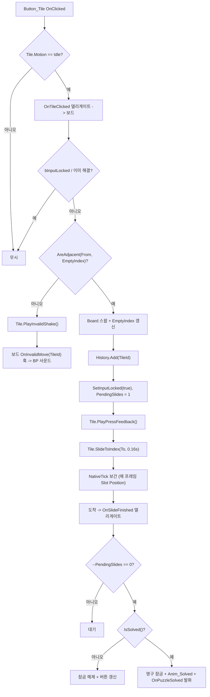

# 슬라이드 퍼즐 UI (WBP) 제작 설명서

2026-09-17 · 김민기

---

## 개요

위젯 2개(`WBP_S2SlidePuzzle`, `WBP_S2PuzzleTile`)와 C++ 베이스 클래스 2개로 만든다. 1920×1080 기준 좌표로 배치하고, 3×3 칸 배경 9개는 고정, 타일 8개만 캔버스 위에서 움직인다.

| 위젯 | 역할 | C++ 베이스 |
| --- | --- | --- |
| WBP_S2SlidePuzzle | 화면 전체. 배경, 제목, 3×3 칸, 정답 이미지, 금고 번호 칸, Undo/Reset | `UDRS2SlidePuzzleWidget` |
| WBP_S2PuzzleTile | 조각 1개. 클릭 감지, 자기 위치 보간, 오답 피드백 | `UDRS2PuzzleTileWidget` |

C++ 두 클래스는 **이미 프로젝트에 들어가 있다** (`Source/DaeRune/…/UI/Widget/Stage2/`). 남은 일은 WBP 두 개를 만들어 상속시키고 에셋을 채우는 것이다. 무엇을 코드가 하고 무엇을 WBP 그래프가 하는지는 바로 다음 장에서 가른다.

### 핵심 설계 결정 3가지

**1. 타일은 Uniform Grid Panel이 아니라 Canvas Panel에 올린다.**

Grid Panel은 지정석이다. 자식이 어느 좌석에 앉을지는 패널이 정하고, 자식은 그 좌석 밖으로 한 픽셀도 못 나간다. Canvas Panel은 자유석이라 자식이 자기 좌표를 직접 갖는다. 슬라이드는 "좌표를 서서히 바꾸는 것"이므로 Canvas가 아니면 성립하지 않는다. 9개의 칸 배경만 Uniform Grid로 깔고, 그 위에 타일용 Canvas를 겹친다.

**2. 슬라이드 이동은 UMG 애니메이션이 아니라 코드 보간으로 한다.**

UMG 애니메이션은 "이 위젯의 이 값을 0.2초 동안 A에서 B로"라고 **에디터에서 미리 못 박아 두는** 녹화 테이프다. 그런데 타일은 런타임에 생성되므로 부모의 애니메이션 트랙에 올릴 수 없고, 목표 좌표도 매번 달라진다. 이동 자체는 코드에서 Lerp로 처리하고, UMG 애니메이션은 등장·오답 흔들림·정답 연출처럼 값이 고정된 연출에만 쓴다.

**3. 칸(슬롯)과 타일은 완전히 다른 레이어다.**

칸 9개는 한 번 깔고 끝, 절대 움직이지 않는다. 타일 8개는 그 위를 떠다닌다. 빈칸은 "타일이 없는 칸"일 뿐 별도 위젯이 아니다. 이렇게 나누면 Reset은 타일 8개 좌표만 다시 찍으면 되고, 칸 배경은 건드릴 일이 없다.

---

## 역할 분담 — C++ 와 WBP 그래프

경계를 가르는 기준은 한 문장이다.

> **틀렸을 때 게임이 망가지면 C++, 보기 싫어질 뿐이면 BP.**

보드 상태·이동 판정·입력 잠금은 틀리면 조각이 겹치거나 퍼즐이 영영 안 풀린다. 사운드·하이라이트·등장 연출은 틀려도 플레이는 굴러간다. 앞의 것은 전부 C++ 에 있고, 뒤의 것은 WBP 그래프에 맡긴다.

### C++ 가 맡는 것 (이미 프로젝트에 들어가 있다)

| 기능 | 근거 |
| --- | --- |
| 보드 배열(9칸)과 빈칸 위치 | 규칙의 SSOT. BP 변수로 흩어지면 Undo/Reset 에서 어긋난다 |
| 상하좌우 인접 판정 | 줄 넘어감 버그의 진원지. 한 곳에서만 계산한다 |
| 셔플 (반드시 풀리는 배치) | 순열 짝홀 문제. BP 로 옮기면 "가끔 안 풀리는 판"이 나온다 |
| 클릭 → 이동/거부 결정 | 판정과 연출이 갈리는 분기점 |
| **조각 미끄러짐 보간** | 목표 좌표가 런타임에 정해지므로 UMG 애니메이션으로 못 박을 수 없다 |
| **못 가는 조각 좌우 흔들림** | 감쇠 사인파 계산. WBP 에 `Anim_Invalid` 를 만들어 두면 그쪽이 우선한다 |
| 입력 잠금 / `PendingSlides` | 연타 시 조각 겹침을 막는 유일한 장치 |
| Undo 히스토리 | 되돌리기는 기록하지 않는다는 규칙까지 포함 |
| 정답 판정 | |
| ESC / Ctrl+Z / R 단축키 | `NativeOnKeyDown` 은 C++ 에서 가로채는 편이 확실하다 |
| 조각 8개 생성 + Canvas Slot 세팅 | Slot 설정 4줄 중 하나만 빠져도 배치가 무너진다 |

### WBP 그래프가 맡는 것

| 기능 | 어떻게 |
| --- | --- |
| 마우스 오버 하이라이트 | `Img_Hover` 를 두면 코드가 토글한다. 더 꾸미려면 `OnHoverChanged` 훅 |
| 눌림·착지·실패 **사운드** | `OnSlideStarted` / `OnSlideEnded` / `OnInvalidMove` 훅에서 Play Sound 2D |
| 패널 등장 `Anim_Intro` | 값이 고정된 연출. 애니메이션 에셋으로 만들고 이름만 맞춘다 |
| 완성 연출 `Anim_Solved` | |
| 번호 공개 `Anim_CodeReveal` | |
| 이동 횟수·힌트 문구 | `GetMoveCount()` 를 읽어 그린다 |
| 서버에 "풀었다" 보고 | `OnPuzzleSolved` 에 붙인다. C++ 위젯이 Stage2 액터를 직접 알 필요가 없다 |
| 위젯을 띄우고 닫는 주체 | HUD BP 가 `OnSlidePuzzleUIRequested` 를 구독한다 |

### 창구 — C++ 가 BP 에게 건네는 훅

코드는 BP 에게 **이미 결정된 사실만 통보**한다. 훅 안에서 보드 상태를 바꾸면 안 된다.

| 위젯 | 훅 | 언제 |
| --- | --- | --- |
| Tile | `OnSlideStarted(Direction)` | 미끄러짐 시작 (상/하/좌/우 포함) |
| Tile | `OnSlideEnded()` | 착지 |
| Tile | `OnInvalidMove()` | 못 가는 조각을 눌렀다 |
| Tile | `OnHoverChanged(bHovered)` | 마우스 오버 변화 |
| Board | `OnBoardBuilt()` | 조각 8개 생성 완료 |
| Board | `OnMoveApplied(TileId, From, To)` | 이동 확정 (보간은 지금부터) |
| Board | `OnInvalidMove(TileId)` | 거부된 클릭 |
| Board | `OnSolvedVisual()` | 완성 |
| Board | `OnInputLockChanged(bLocked)` | 잠금 변화 |
| Board | `OnPuzzleSolved` (BlueprintAssignable) | 완성 — 서버 보고용 |

### 창구 — BP 가 C++ 에게 거는 함수

`StartNewPuzzle()` · `RequestUndo()` · `RequestReset()` · `RequestClose()` · `ShowCode(Digit)` 다섯 개뿐이다. 그 외에 보드를 건드리는 경로는 없다.

---

## 에셋 임포트 설정

올려준 PNG 16장의 실제 픽셀 크기다. UI 텍스처는 전부 **Texture Group = UI**, **Compression Settings = UserInterface2D (RGBA)**, **sRGB = 체크**, **Mip Gen Settings = NoMipmaps**, **Filter = Bilinear**로 맞춘다. 기본값(DXT1/5)으로 두면 반투명 패널 가장자리에 블록 깨짐이 생긴다.

| 파일 | 실제 크기 | 화면에 그릴 크기 | 비고 |
| --- | --- | --- | --- |
| 8Puzzle-Back.png | 1704 × 900 | 1704 × 900 (네이티브) | 오른쪽에 투명 여백 209px, 아래 23px |
| 8Puzzle-Back-SoftLight.png | 1601 × 901 | 1601 × 901 | 소프트 글로우, 크기 정밀도 불필요 |
| 8Puzzle-Console.png | 530 × 676 | 224 × 224 (9장) | 알파 0.39의 납작한 둥근사각형, 늘려 써도 무방 |
| 8Puzzle-Console-Reference.png | 362 × 367 | 362 × 367 (네이티브) | 테두리 색 RGB(91,129,200) |
| 8Puzzle-Console-Number.png | 174 × 167 | 174 × 167 (네이티브) | |
| 8Puzzle-Console-Undo.png | 174 × 79 | 174 × 79 (네이티브) | 글자 포함, 자식 텍스트 불필요 |
| 8Puzzle-Console-Reset.png | 174 × 79 | 174 × 79 (네이티브) | |
| 8Puzzle-Puzzle01~08.png | 각 224 × 224 | 224 × 224 (1:1) | 셀 크기와 정확히 일치 |
| 8Puzzle-ReferenceImage.png | 2048 × 2048 | 332 × 332 | 6배 축소 |

### 주의 1 — Back.png의 투명 여백

`8Puzzle-Back.png`는 1704×900 캔버스지만 실제 패널 테두리는 **x 172~1437, y 101~828** 안에만 있다. 즉 위젯 박스의 중심과 눈에 보이는 패널의 중심이 (−48, +10)만큼 어긋나 있다. 좌표표의 Position 값은 이 어긋남을 이미 보정한 값이다.

여유가 되면 포토샵에서 **Image → Trim (Transparent Pixels)** 으로 잘라 다시 export하는 쪽이 깔끔하다. 그러면 위젯 크기 = 보이는 크기가 되어 앵커 계산이 단순해진다.

### 주의 2 — ReferenceImage의 밉맵

정답 이미지만 예외다. 2048px를 332px로 그리면 NoMipmaps 상태에서 심하게 반짝거린다(aliasing). 이 한 장만 **Mip Gen Settings = FromTextureGroup**으로 두거나, 512×512로 리사이즈한 사본을 따로 임포트해서 쓴다. 후자가 메모리도 아끼고 결과도 더 깨끗하다.

### 주의 3 — Image의 Brush Image Size

UMG `Image`는 Brush의 **Image Size**가 Desired Size가 된다. 이 값을 안 건드리면 텍스처 원본 크기가 그대로 들어와서 레이아웃이 밀린다. Canvas Slot에 넣을 때는 슬롯 Size를 명시하므로 큰 문제는 없지만, Overlay·Box 안에 넣는 이미지는 반드시 Brush Image Size를 직접 채운다.

---

## 1920×1080 좌표 설계

아래 값은 시안 두 장을 엣지 검출로 실측해서 뽑은 것이다. 모든 Position은 **좌상단 기준**이고, 모든 위젯은 **Anchor = Top-Left (0,0), Alignment = (0,0)** 을 쓴다.

### 좌표계를 고정하는 방법

루트 Canvas에 자식을 바로 넣으면 해상도가 바뀔 때마다 좌표가 흔들린다. 그래서 **화면 한가운데에 1920×1080짜리 도화지를 한 장 핀으로 꽂아 놓고**, 그 안에서만 좌표를 쓴다.

```
CanvasPanel_Screen (루트)
└── SizeBox_Stage   Width Override 1920 / Height Override 1080
                    Anchor = Center(0.5,0.5), Alignment = (0.5,0.5), Position = (0,0), Size To Content = ✔
    └── CanvasPanel_Stage   ← 이 안의 좌표가 시안 좌표와 1:1
```

여기에 Project Settings → Engine → User Interface → **DPI Scaling Rule = Shortest Side**, 커브에서 1080 → 1.0을 찍어 두면 4K에서도 같은 비율로 커진다. 축척이 정해진 도면과 같다. 도면은 한 장만 그리고, 인쇄할 때 배율만 바꾸는 식이다.

### 요소별 배치표 (CanvasPanel_Stage 기준)

| 위젯 | Position (X, Y) | Size (W, H) | ZOrder | 브러시 |
| --- | --- | --- | --- | --- |
| Img_BackGlow | (164, 100) | 1601 × 901 | 0 | 8Puzzle-Back-SoftLight |
| Img_PanelBack | (160, 85) | 1704 × 900 | 1 | 8Puzzle-Back |
| Text_Title | (460, 64) | 1000 × 80 | 2 | — |
| Overlay_Board | (358, 212) | 676 × 676 | 3 | — |
| Overlay_Reference | (1129, 267) | 362 × 367 | 3 | 8Puzzle-Console-Reference |
| Overlay_Code | (1129, 660) | 174 × 167 | 3 | 8Puzzle-Console-Number |
| Btn_Undo | (1312, 660) | 174 × 79 | 3 | 8Puzzle-Console-Undo |
| Btn_Reset | (1312, 749) | 174 × 79 | 3 | 8Puzzle-Console-Reset |
| HBox_BackHint | (1666, 960) | 156 × 48 | 4 | — |

검증용 수치: 패널 테두리는 x 332~1597, y 186~913에 떨어진다. 시안(x 322~1607, y 181~919)보다 가로 20px 좁지만 중심은 같아서 눈으로는 구분이 안 된다. 시안과 픽셀 단위로 맞추고 싶으면 Size를 1732 × 915로 올리고 Position을 (147, 78)로 바꾼다.

### 셀 좌표 공식

보드 안의 9칸은 하나의 식으로 떨어진다. `Overlay_Board` 안쪽 `CanvasPanel_Tiles` 기준 로컬 좌표다.

```
CellSize  = 224        // 타일 PNG와 1:1
CellGap   =   2
CellPitch = 226        // CellSize + CellGap

Col = Index % 3
Row = Index / 3

Position = ( Col * 226, Row * 226 )
Size     = ( 224, 224 )

보드 전체 = 226 * 3 - 2 = 676
```

인덱스는 좌상단 0부터 우하단 8까지 가로로 센다.

| Index | 0 | 1 | 2 |
| --- | --- | --- | --- |
| **X** | 0 | 226 | 452 |

| Index | 0 | 3 | 6 |
| --- | --- | --- | --- |
| **Y** | 0 | 226 | 452 |

한 칸 이동 거리는 항상 **226px**다. 이 값 하나만 상수로 빼 두면 나중에 4×4 퍼즐로 바꿀 때도 공식이 그대로 산다.

---

## WBP_S2SlidePuzzle 하이어라키

```
CanvasPanel_Screen                      [루트, Fill Screen]
│
└── SizeBox_Stage                       1920 × 1080, Anchor=Center, Align=(0.5,0.5), Pos=(0,0)
    │
    └── CanvasPanel_Stage               ← 여기부터 좌표 = 시안 좌표
        │
        ├── Img_BackGlow                8Puzzle-Back-SoftLight       Z=0
        ├── Img_PanelBack               8Puzzle-Back                 Z=1
        ├── Text_Title                  "Complete the Puzzle"        Z=2
        │
        ├── Overlay_Board               (358,212) 676×676            Z=3
        │   ├── UniformGrid_Slots       ← 고정 칸 9개
        │   │   ├── Img_Slot_0  (Row0,Col0)   8Puzzle-Console
        │   │   ├── Img_Slot_1  (Row0,Col1)
        │   │   ├── … Img_Slot_8 (Row2,Col2)
        │   └── CanvasPanel_Tiles       ← 런타임에 WBP_S2PuzzleTile 8개 Add
        │
        ├── Overlay_Reference           (1129,267) 362×367           Z=3
        │   ├── Img_ReferenceFrame      8Puzzle-Console-Reference
        │   └── SizeBox_RefInner        332 × 332, H/V Align = Center
        │       └── Img_ReferencePicture  8Puzzle-ReferenceImage
        │
        ├── Overlay_Code                (1129,660) 174×167           Z=3
        │   ├── Img_CodeSlot            8Puzzle-Console-Number
        │   └── Text_Code               "?" → 해결 시 숫자, Align=Center
        │
        ├── Btn_Undo                    (1312,660) 174×79            Z=3
        ├── Btn_Reset                   (1312,749) 174×79            Z=3
        │
        └── HBox_BackHint               (1666,960) 156×48            Z=4
            ├── Img_EscKey              ESC 키캡 (9-slice 또는 Border+Text)
            └── Text_Back               "BACK"
```

### 패널 선택 근거

| 위치 | 쓴 패널 | 이유 |
| --- | --- | --- |
| Overlay_Board | Overlay | 칸 레이어와 타일 레이어를 정확히 같은 사각형 위에 겹치기 위해. 자식 2개가 자동으로 부모 크기를 꽉 채운다 |
| UniformGrid_Slots | Uniform Grid Panel | 9칸이 절대 안 움직이므로 지정석이 오히려 편하다. Slot Padding으로 2px 간격 처리 |
| CanvasPanel_Tiles | Canvas Panel | 타일이 임의 좌표로 보간되어야 하므로 필수 |
| Overlay_Reference / Overlay_Code | Overlay | 액자 + 내용물 2장 겹치기 |

### UniformGrid_Slots 세부

- Overlay Slot: H Align = Fill, V Align = Fill
- Slot Padding: **1.0** (사방 1px → 칸 사이 간격 2px, 가장자리 1px)
- `Min Desired Slot Width / Height`는 건드리지 않는다. 부모가 676×676이면 Uniform Grid가 자동으로 225.33씩 나눈다
- 소수점이 싫으면 Uniform Grid 대신 **Canvas Panel + Img_Slot 9개를 셀 좌표 공식으로 직접 배치**해도 된다. 타일과 완전히 같은 공식을 쓰게 되므로 정렬 오차가 0이 된다. 규모가 작으니 이쪽을 권한다

### CanvasPanel_Tiles 세부

- Overlay Slot: H Align = Fill, V Align = Fill
- `Is Variable` **체크 필수** — C++에서 `BindWidget`으로 잡아야 한다
- 디자이너에서는 비어 있다. 타일은 전부 런타임 생성이다
- 자식 추가 시 Slot 설정: `Anchors = (0,0,0,0)`, `Alignment = (0,0)`, `AutoSize = false`, `Size = (224,224)`

### Text_Title

| 속성 | 값 |
| --- | --- |
| Text | Complete the Puzzle |
| Justification | Center |
| Font Size | 54 |
| Letter Spacing | 60 ~ 100 |
| Font | 프로젝트 SF 계열 (Rajdhani / Saira Condensed 계열이 시안과 가깝다) |
| Shadow Offset | (0, 2), Shadow Color = (0,0,0,0.5) |
| Color | 밝은 청백색 RGB(220, 235, 255) |

---

## 위젯별 디테일 설정

### 배경 2장

| 위젯 | 설정 |
| --- | --- |
| Img_BackGlow | Brush: 8Puzzle-Back-SoftLight, Draw As = **Image**, Image Size (1601, 901), Tint (1,1,1,0.55), **Visibility = Not Hit-Testable (Self & All Children)** |
| Img_PanelBack | Brush: 8Puzzle-Back, Draw As = **Image**, Image Size (1704, 900), Tint (1,1,1,1), Visibility = Not Hit-Testable |

배경 이미지의 Visibility를 반드시 `Not Hit-Testable`로 내린다. 기본값 `Visible`이면 이미지가 마우스를 먹어서, 타일 클릭이 안 먹는 원인이 되기 쉽다.

### 칸 배경 (Img_Slot_0 ~ 8)

| 속성 | 값 |
| --- | --- |
| Brush | 8Puzzle-Console |
| Draw As | Image (모서리 라운드가 5px라 Box 9-slice까지는 불필요) |
| Image Size | (224, 224) |
| Tint | (1, 1, 1, 1) |
| Visibility | Not Hit-Testable |

모서리를 끝까지 살리고 싶으면 Draw As = **Box**, Margin = 0.012 / 0.009 로 두면 530×676 → 224×224로 찌그러져도 라운드가 유지된다.

### Overlay_Reference

| 자식 | 설정 |
| --- | --- |
| Img_ReferenceFrame | Brush 8Puzzle-Console-Reference, Image Size (362, 367), Overlay Slot H/V Align = **Fill** |
| SizeBox_RefInner | Width/Height Override = 332, Overlay Slot H/V Align = **Center** |
| Img_ReferencePicture | Brush 8Puzzle-ReferenceImage, Image Size (332, 332) |

정답 이미지는 원본이 정사각(2048×2048)이라 332×332로 넣으면 비율이 그대로다. 액자 안쪽 여백이 위아래 17px, 좌우 15px 정도로 잡힌다.

### Overlay_Code

| 자식 | 설정 |
| --- | --- |
| Img_CodeSlot | Brush 8Puzzle-Console-Number, Image Size (174, 167), H/V Align = Fill, Not Hit-Testable |
| Text_Code | Font Size 72, Justification Center, Overlay Slot H/V Align = **Center**, Is Variable ✔, 초기 Text = 빈 문자열, Render Opacity 0 |

초기값을 `?`로 두면 "뭔가 있긴 한데 안 보인다"는 인상을 주고, 빈 문자열이면 해결 순간의 등장이 더 또렷하다.

### Btn_Undo / Btn_Reset

버튼은 이미지에 글자가 이미 박혀 있으므로 자식 위젯을 넣지 않는다. Style 3종만 채운다.

| Style 슬롯 | 설정 |
| --- | --- |
| Normal | Image = 8Puzzle-Console-Undo(또는 Reset), Draw As = Image, Image Size (174,79), Tint (1,1,1,1) |
| Hovered | 같은 이미지, Tint (1.15, 1.18, 1.25, 1) |
| Pressed | 같은 이미지, Tint (0.8, 0.85, 0.95, 1) |
| Disabled | 같은 이미지, Tint (0.5, 0.5, 0.5, 0.6) |

그 외:

- **Normal Padding / Pressed Padding = (0,0,0,0)** — 기본값이 남아 있으면 누를 때 버튼이 아래로 툭 튄다
- Is Focusable = 체크 해제 (마우스 전용 UI일 때). 게임패드를 지원하면 체크하고 Navigation 규칙을 따로 잡는다
- Click Method = **Down and Up** (기본), Touch Method = Down and Up
- `Is Variable` ✔

### HBox_BackHint

`Img_EscKey`(키캡 이미지가 따로 없으면 `Border` + `Text_Esc`)와 `Text_Back`을 Horizontal Box에 나란히 넣는다. 전체 Visibility는 `Not Hit-Testable` — ESC는 키 입력으로만 받고, 클릭 대상은 아니다.

### 공통 체크

- 모든 `Image` 위젯은 기본적으로 `Not Hit-Testable`. 클릭을 받아야 하는 건 `Button_Tile`, `Btn_Undo`, `Btn_Reset` 셋뿐이다
- C++에서 잡을 위젯은 전부 `Is Variable` ✔ — 이름이 헤더의 `BindWidget` 변수명과 **철자까지 완전히 일치**해야 컴파일이 통과한다

---

## WBP_S2PuzzleTile 하이어라키

조각 하나짜리 위젯이다. 8개가 런타임에 복제되어 `CanvasPanel_Tiles`에 붙는다.

```
SizeBox_Tile                       [루트] Width/Height Override = 224
└── Overlay_Content                Is Variable ✔  ← 애니메이션은 전부 이 녀석의 Render Transform
    ├── Img_Tile                   조각 텍스처, Image Size (224,224), Not Hit-Testable
    ├── Img_Hover                  흰색 1x1, Tint (1,1,1,0.10), 기본 Visibility = Hidden
    └── Button_Tile                투명 버튼, Overlay Slot H/V Align = Fill
```

### 왜 Button을 맨 위에 두는가

`Button`을 루트로 놓고 그 안에 이미지를 넣는 구성이 흔하지만, 여기서는 **버튼을 가장 위 레이어의 투명 히트박스로** 쓴다. 이유는 두 가지다.

1. `Button`은 내부적으로 `SBorder`라서 자식에게 여백과 정렬을 강제한다. 224×224 조각이 미묘하게 어긋날 수 있다
2. 애니메이션 대상(`Overlay_Content`)과 히트박스가 분리되어 있어야, 이동 중에 히트박스가 엉뚱한 데서 클릭을 먹는 사고를 막기 쉽다

### 위젯별 설정

| 위젯 | 속성 | 값 |
| --- | --- | --- |
| SizeBox_Tile | Width / Height Override | 224 |
| Overlay_Content | Is Variable | ✔ (애니메이션 트랙 대상) |
| Img_Tile | Brush / Image Size | 런타임에 세팅 / (224, 224) |
| Img_Tile | Visibility | Not Hit-Testable |
| Img_Hover | Brush | 엔진 기본 흰색, Tint (1,1,1,0.10) |
| Img_Hover | Visibility | **Hidden** (초기값) |
| Button_Tile | Style Normal/Hovered/Pressed | 전부 Draw As = **None** |
| Button_Tile | Normal/Pressed Padding | (0,0,0,0) |
| Button_Tile | Is Variable | ✔ |

`Img_Hover`는 `Button_Tile`의 `OnHovered` / `OnUnhovered`에서 Visibility만 토글한다.

### 애니메이션 2개 (선택 — 안 만들어도 동작한다)

둘 다 `BindWidgetAnimOptional` 이라 **없으면 그냥 null 이 되고 컴파일도 통과한다.** 이름이 맞으면 코드 연출을 대체한다.

| 이름 | 길이 | 트랙 | 키 | 없을 때 |
| --- | --- | --- | --- | --- |
| Anim_Invalid | 0.25s | Overlay_Content → Render Transform → Translation X | 0.00s: 0 / 0.06s: 7 / 0.13s: −7 / 0.19s: 4 / 0.25s: 0 | 코드가 감쇠 사인파로 흔든다 (동일한 모양) |
| Anim_Press | 0.12s | Overlay_Content → Render Transform → Scale | 0.00s: (1,1) / 0.06s: (0.94, 0.94) / 0.12s: (1,1) | 눌림 연출 없음 |

두 애니메이션 모두 **Render Transform**만 건드린다. Render Transform은 레이아웃을 바꾸지 않고 그리기만 옮기는, 무대 위 배우가 발만 옮기는 것과 같다. Canvas Slot의 Position을 바꾸는 건 좌석표 자체를 고쳐 쓰는 것이다.

**중요**: `Overlay_Content`의 Render Transform Pivot은 (0.5, 0.5)로 둔다. 기본값이 그대로면 Scale 애니메이션이 좌상단 기준으로 커져서 조각이 튄다.

---

## 슬라이드 이동 구현 방식

한 칸 이동은 항상 상하좌우 226px다. 그래서 선택지가 셋 나온다.

| | A. UMG 애니메이션 4개 | B. 코드 보간 (권장) | C. FCurveSequence |
| --- | --- | --- | --- |
| 이동 처리 | Render Translation을 ±226으로 미리 녹화 | Tick에서 Canvas Slot Position을 Lerp | Slate 커브 시퀀스 + Tick |
| 방향 | 4개 필요 (상/하/좌/우) | 1개 함수로 전부 | 1개 |
| 커브 튜닝 | 타임라인에서 디자이너가 직접 | `UCurveFloat` 에셋 1개 | 내장 이징 enum |
| 셔플·Reset (임의 거리 대량 이동) | 불가, 즉시 스냅만 | 그대로 동작 | 그대로 동작 |
| 4×4 확장 | 226 → 새 값으로 애니 4개 수정 | 상수 1개 수정 | 상수 1개 수정 |
| 블루프린트 접근성 | 높음 | 중간 | 낮음 (C++ 전용) |

**B를 권장한다.** 이유는 셔플과 Reset 때문이다. 시작할 때 8개 조각이 제각기 다른 거리를 동시에 이동해야 하는데, A는 거리가 고정이라 여기서 무너진다.

A를 완전히 버리지는 않는다. 조각 흔들림(`Anim_Invalid`), 눌림(`Anim_Press`), 패널 등장, 번호 공개처럼 **값이 고정된 연출**은 A가 훨씬 편하다.

| 쓰임 | 방식 |
| --- | --- |
| 조각 한 칸 이동, 셔플, Reset 복귀 | 코드 보간 (B) |
| **못 가는 조각 좌우 흔들림** | **코드 보간 (B)** — 감쇠 사인파. `Anim_Invalid` 를 만들어 두면 그쪽이 우선 |
| 눌림, 패널 등장, 번호 공개, 정답 연출 | UMG 애니메이션 (A) |

흔들림까지 코드로 내린 이유는 **성능이 아니다.** 에셋 의존을 없애고, 조각의 "지금 바쁜가" 상태를 한 군데로 모으기 위해서다. 자세한 근거는 아래 **C++ 구현 → 왜 UMG 애니메이션이 아니라 코드인가**에 적었다.

`Anim_Invalid` 애니메이션을 WBP 에 만들어 두면 코드 흔들림 대신 그것이 재생된다. 둘 중 하나만 동작하므로 겹칠 일이 없다.

### 이동 타이밍 값

| 항목 | 값 | 비고 |
| --- | --- | --- |
| 한 칸 이동 시간 | 0.16s | 0.12 이하는 뚝뚝 끊겨 보이고, 0.25 이상은 답답하다 |
| 이징 | Ease Out (지수 2) | 출발은 빠르고 도착에서 감속 |
| 셔플 시 | 0.0s (즉시 스냅) | 시작 배치는 애니메이션 없이 찍는다 |
| Reset | 0.22s | 8개가 동시에 움직이므로 조금 길게 |
| Undo | 0.16s | 일반 이동과 동일 |

### 이징 커브 에셋

Content Browser → Miscellaneous → **Curve → CurveFloat**, 이름 `C_PuzzleSlideEase`.

| Time | Value | 접선 |
| --- | --- | --- |
| 0.0 | 0.0 | Auto |
| 1.0 | 1.0 | Auto, 끝점 접선을 수평에 가깝게 |

0~1을 0~1로 매핑하는 정규화 커브다. 시간과 거리는 코드가 알고 있고, 커브는 "진행률 대비 완료율"만 담당한다. 커브를 안 만들면 코드가 `FMath::InterpEaseOut(0.f, 1.f, Alpha, 2.f)`로 자동 대체한다.

---

## 데이터 모델과 규칙

### 보드 표현

```cpp
TArray<int32> Board;   // 길이 9. 값 = TileId(1~8), 0 = 빈칸
                       // 인덱스 = Row * 3 + Col
int32 EmptyIndex;      // Board에서 0이 있는 자리 (매번 찾지 말고 캐싱)
```

정답 상태는 `{1,2,3,4,5,6,7,8,0}`이다. 즉 `8Puzzle-Puzzle01`이 인덱스 0, `Puzzle08`이 인덱스 7, 인덱스 8이 빈칸.

조각 순서가 정답 이미지와 안 맞으면 코드를 고칠 필요 없이 `TileTextures` 배열의 순서만 바꾼다.

### 이동 판정

조각이 움직일 수 있는 조건은 하나뿐이다. **빈칸과 상하좌우로 맞닿아 있을 것.**

```cpp
bool AreAdjacent(int32 A, int32 B)
{
    const int32 RA = A / 3, CA = A % 3;
    const int32 RB = B / 3, CB = B % 3;
    return FMath::Abs(RA - RB) + FMath::Abs(CA - CB) == 1;
}
```

`FMath::Abs(A - B) == 1`로만 검사하면 **인덱스 2와 3처럼 줄이 넘어가는 경우**를 못 걸러낸다. 오른쪽 끝 조각이 왼쪽 끝으로 순간이동하는 버그가 여기서 나온다. 반드시 Row/Col로 풀어서 비교한다.

### 클릭 → 이동 흐름

규칙만 적으면 세 줄이다.

1. 입력이 잠겨 있거나 이미 해결된 퍼즐이면 무시
2. 클릭한 조각이 빈칸과 상하좌우로 맞닿았으면 → **그 칸으로 미끄러진다**
3. 아니면 → **좌우로 짧게 흔들리고 제자리에 남는다**

보간이 끝나기 전에는 입력을 받지 않는다. 안 막으면 조각 두 개가 같은 칸으로 겹쳐 들어간다.

단계별 흐름도와 실제 코드는 아래 **C++ 구현 → 클릭 한 번에 벌어지는 일**에 있다.

### 셔플 — 반드시 풀 수 있는 배치로

8퍼즐은 9칸을 무작위로 섞으면 **절반이 절대 풀리지 않는다.** 순열의 짝홀(inversion parity)이 정답과 달라지면 아무리 움직여도 도달할 수 없다.

안전한 방법은 하나다. **정답 상태에서 시작해, 합법적인 이동을 N번 무작위로 실행한다.** 되짚어 올 수 있는 길로만 갔으니 되짚어 갈 수도 있다. 미로를 출구에서부터 걸어 나와 입구를 만드는 것과 같다.

```cpp
void Shuffle(int32 Steps /* 40~80 권장 */)
{
    Board = {1,2,3,4,5,6,7,8,0};
    int32 Empty = 8;
    int32 PrevEmpty = INDEX_NONE;

    for (int32 s = 0; s < Steps; ++s)
    {
        TArray<int32> Cands = GetNeighbors(Empty);
        Cands.Remove(PrevEmpty);              // 직전 이동 되돌리기 방지
        const int32 Pick = Cands[FMath::RandRange(0, Cands.Num() - 1)];
        Swap(Board[Empty], Board[Pick]);
        PrevEmpty = Empty;
        Empty     = Pick;
    }
    EmptyIndex = Empty;
}
```

- `Steps`가 20 미만이면 눈에 보이게 쉬워진다. 40~80이 적당하다
- 드물게 원래 자리로 되돌아올 수 있으니 `if (IsSolved()) Shuffle(Steps);`로 한 번 더 돌린다
- 셔플 결과를 `StartBoard`에 복사해 둔다. Reset이 이 배열을 쓴다

### Undo

히스토리에 **움직인 조각의 TileId만** 쌓는다. 좌표를 저장할 필요가 없다.

```cpp
TArray<int32> History;   // 움직인 TileId 순서대로
```

조각이 빈칸으로 들어가면, 빈칸은 그 조각이 있던 자리로 간다. 즉 **같은 조각을 한 번 더 움직이면 정확히 제자리로 돌아온다.** Undo는 `History.Pop()`한 TileId를 그냥 다시 이동시키면 되고, 이때는 History에 push하지 않는다.

히스토리가 비면 `Btn_Undo`를 `SetIsEnabled(false)`로 내린다.

### Reset

| 동작 | 처리 |
| --- | --- |
| Board | `StartBoard`를 복사 |
| 타일 위치 | 8개 모두 `SlideToIndex(..., 0.22f)` |
| History | `Empty()` |
| Btn_Undo | Disabled |

셔플을 다시 돌리는 게 아니라 **그 판의 시작 배치로 되돌린다.** 플레이어가 꼬였을 때 원점으로 돌아가는 게 목적이므로, 새 배치를 주면 오히려 배신감이 든다.

### 정답 판정

```cpp
bool IsSolved() const
{
    for (int32 i = 0; i < 8; ++i)
        if (Board[i] != i + 1) return false;
    return true;
}
```

인덱스 8(빈칸)은 검사할 필요가 없다. 앞 8개가 맞으면 나머지는 자동으로 0이다.

---

## C++ 구현

파일 4개는 **이미 프로젝트에 들어가 있고 컴파일도 통과했다.** 클래스 이름은 프로젝트 관례(`DR` / `DRS2` 접두어, `DAERUNE_API`)를 따른다.

| 파일 | 내용 |
| --- | --- |
| `Source/DaeRune/Public/UI/Widget/Stage2/DRS2PuzzleTileWidget.h` | 조각 1개 |
| `Source/DaeRune/Private/UI/Widget/Stage2/DRS2PuzzleTileWidget.cpp` | |
| `Source/DaeRune/Public/UI/Widget/Stage2/DRS2SlidePuzzleWidget.h` | 보드 전체 |
| `Source/DaeRune/Private/UI/Widget/Stage2/DRS2SlidePuzzleWidget.cpp` | |

`DaeRune.Build.cs` 의 `PublicDependencyModuleNames` 에 `UMG` / `Slate` / `SlateCore` 는 이미 들어 있다. 추가 작업 없다.

| WBP | 부모로 지정할 C++ 클래스 |
| --- | --- |
| WBP_S2SlidePuzzle | `UDRS2SlidePuzzleWidget` |
| WBP_S2PuzzleTile | `UDRS2PuzzleTileWidget` |

두 클래스 모두 `UDRUserWidget` 을 상속한다(프로젝트 공통 베이스 — 언어 변경 시 텍스트 재갱신을 자동으로 받는다). 그리고 둘 다 `UCLASS(Abstract)` 다. **C++ 클래스를 직접 `TileWidgetClass` 에 넣으면 생성되지 않는다.** 반드시 WBP 를 만들어 지정한다.

### BindWidget 요구 사항

이름이 **철자·대소문자까지** 같아야 잡힌다. 설명서의 하이어라키를 그대로 따랐다면 그대로 맞는다.

| 위젯 | 클래스 | 필수/선택 | 빠지면 |
| --- | --- | --- | --- |
| `CanvasPanel_Tiles` | Canvas Panel | **필수** | 컴파일 에러. 조각을 붙일 데가 없다 |
| `Text_Code` | Text Block | 선택 | 번호 표시만 안 된다 |
| `Btn_Undo` / `Btn_Reset` | Button | 선택 | 해당 버튼 기능만 빠진다 (단축키는 살아 있다) |
| `Img_Tile` | Image | **필수** | 컴파일 에러. 조각 그림이 없다 |
| `Button_Tile` | Button | **필수** | 컴파일 에러. 클릭을 받을 수 없다 |
| `Overlay_Content` | Overlay | 선택 | 흔들림이 위젯 전체에 걸린다 (보이는 결과는 같다) |
| `Img_Hover` | Image | 선택 | 오버 하이라이트만 없다 |

애니메이션 5개(`Anim_Invalid`, `Anim_Press`, `Anim_Intro`, `Anim_Solved`, `Anim_CodeReveal`)는 **전부 선택**이다. 없으면 null 로 남고 코드가 알아서 우회한다.

---

### ★핵심★ 두 움직임은 서로 다른 채널을 쓴다

이 구현에서 가장 중요한 결정이다.

| | 미끄러짐 | 흔들림 |
| --- | --- | --- |
| 무엇이 바뀌나 | 조각의 **진짜 자리** | 그림만 (자리는 그대로) |
| 건드리는 값 | `UCanvasPanelSlot::SetPosition` | `UWidget::SetRenderTranslation` |
| 끝나면 | 새 좌표에 그대로 남는다 | 반드시 0 으로 되돌린다 |
| 레이아웃 | 다시 계산된다 | 영향 없음 |

거꾸로 하면 각각 이렇게 깨진다.

- **미끄러짐을 Render Translation 으로 하면**: 화면에선 옮겨간 것처럼 보이지만 Canvas Slot 의 좌표는 제자리다. 두 번째 이동의 출발점이 첫 이동 이전 자리라서, 조각이 한 번 뒤로 튀었다가 움직인다.
- **흔들림을 Slot Position 으로 하면**: 흔드는 동안 매 프레임 레이아웃이 다시 잡히고, 도중에 프레임이 끊기면 조각이 비뚤어진 좌표에 그대로 눌러앉는다.

Render Transform 은 무대 위 배우가 발만 옮기는 것이고, Slot Position 은 좌석표를 고쳐 쓰는 것이다. 흔들림은 앞의 것, 이동은 뒤의 것이다.

---

### 클릭 한 번에 벌어지는 일



**조각은 자기가 갈 수 있는지 모른다.** 클릭 사실만 보드에 알리고, 판정은 보드가 한다. 그래서 눌림 연출도 조각이 스스로 재생하지 않는다 — 판정 뒤에 보드가 `PlayPressFeedback()` 이나 `PlayInvalidShake()` 중 **하나만** 부른다. 둘이 같은 Render Transform 을 다투는 사고가 구조적으로 막힌다.

#### 이동 조건은 하나뿐이다

```cpp
// 인덱스 차이가 1이면 인접? -> 틀렸다. 2와 3은 화면에서 줄이 다르다.
bool UDRS2SlidePuzzleWidget::AreAdjacent(int32 A, int32 B)
{
    const int32 RowA = A / DRS2Puzzle::GridSize, ColA = A % DRS2Puzzle::GridSize;
    const int32 RowB = B / DRS2Puzzle::GridSize, ColB = B % DRS2Puzzle::GridSize;

    return FMath::Abs(RowA - RowB) + FMath::Abs(ColA - ColB) == 1;   // 맨해튼 거리 1
}
```

"주변 상하좌우에 빈칸이 있으면 그쪽으로" 가 곧 이 한 줄이다. 빈칸은 언제나 하나이므로, **클릭된 조각이 빈칸과 맞닿았는지**만 보면 방향은 자동으로 정해진다. 따로 방향을 고를 필요가 없다.

---

### 미끄러짐 — 보간 수식

```cpp
void UDRS2PuzzleTileWidget::TickSlide(float DeltaTime)
{
    SlideElapsed += DeltaTime;

    const float Raw = FMath::Clamp(SlideElapsed / SlideDuration, 0.f, 1.f);
    const float Alpha = SlideCurve
        ? SlideCurve->GetFloatValue(Raw)
        : FMath::InterpEaseOut(0.f, 1.f, Raw, 2.f);

    SetSlotPosition(FMath::Lerp(SlideStartPos, SlideEndPos, Alpha));

    if (Raw >= 1.f)
    {
        SetSlotPosition(SlideEndPos);        // 커브가 1.0 에서 안 끝나는 경우 대비
        Motion = EDRS2TileMotion::Idle;
        OnSlideEnded();                      // BP 훅
        OnSlideFinished.ExecuteIfBound(this);// 보드에 통보
    }
}
```

| 항목 | 값 | 비고 |
| --- | --- | --- |
| 한 칸 이동 시간 | 0.16s (`MoveDuration`) | 0.12 이하는 끊겨 보이고 0.25 이상은 답답하다 |
| 이징 | `C_PuzzleSlideEase` 또는 `InterpEaseOut(exp 2)` | 커브를 안 만들면 자동 대체 |
| 이동 거리 | 항상 226px | `DRS2Puzzle::CellPitch` |
| Reset | 0.22s (`ResetDuration`) | 8개가 동시에 움직이므로 조금 길게 |
| 셔플·초기 배치 | 즉시 (`SnapToIndex`) | 애니메이션 없음, 완료 콜백도 없음 |

`Duration <= 0` 으로 `SlideToIndex` 를 부르면 즉시 배치 + 완료 콜백이다. **초기 배치에는 이걸 쓰면 안 된다** — 완료 콜백이 8번 날아와 잠금 카운터를 음수로 끌어내린다. 그래서 초기 배치 전용으로 콜백을 쏘지 않는 `SnapToIndex()` 가 따로 있다.

---

### 흔들림 — 감쇠 사인파

```cpp
void UDRS2PuzzleTileWidget::TickShake(float DeltaTime)
{
    ShakeElapsed += DeltaTime;

    const float U = FMath::Clamp(ShakeElapsed / ShakeDuration, 0.f, 1.f);

    const float Damping = 1.f - U;                                        // 진폭이 선형으로 줄어든다
    const float OffsetX = ShakeAmplitude * Damping * FMath::Sin(2.f * PI * ShakeCycles * U);

    if (UWidget* Target = GetMotionTarget())
    {
        Target->SetRenderTranslation(FVector2D(OffsetX, 0.f));
    }

    if (U >= 1.f)
    {
        GetMotionTarget()->SetRenderTranslation(FVector2D::ZeroVector);    // ★반드시 0 으로★
        Motion = EDRS2TileMotion::Idle;
    }
}
```

사인파를 쓰는 이유는 **U=0 과 U=1 에서 오프셋이 정확히 0** 이기 때문이다. 시작과 끝에서 튀지 않고, 중간 값을 손으로 찍을 필요도 없다. 감쇠(1−U)를 곱하면 "세게 → 약하게" 잦아드는 모양이 된다.

기본값(`ShakeDuration 0.25` / `ShakeAmplitude 7` / `ShakeCycles 2`)에서 실제로 그려지는 궤적이다.

| 진행률 U | 0 | 0.125 | 0.25 | 0.375 | 0.5 | 0.625 | 0.75 | 0.875 | 1.0 |
| --- | --- | --- | --- | --- | --- | --- | --- | --- | --- |
| 시각(초) | 0.000 | 0.031 | 0.063 | 0.094 | 0.125 | 0.156 | 0.188 | 0.219 | 0.250 |
| **X 오프셋(px)** | 0 | **+6.1** | 0 | **−4.4** | 0 | **+2.6** | 0 | **−0.9** | 0 |

오른쪽 → 왼쪽 → 오른쪽 → 왼쪽으로 2왕복하며 잦아든다. 설명서 앞쪽 `Anim_Invalid` 키프레임(0 / 7 / −7 / 4 / 0)과 사실상 같은 모양이고, 숫자 세 개로 조절된다.

| 파라미터 | 기본값 | 조절 감각 |
| --- | --- | --- |
| `ShakeDuration` | 0.25s | 0.35 이상이면 "고장난 것 같다"는 인상을 준다 |
| `ShakeAmplitude` | 7px | 칸 간격(2px)보다 충분히 커야 한다. 12 를 넘으면 옆 칸을 침범해 보인다 |
| `ShakeCycles` | 2 | 1 이면 한 번 툭 밀렸다 오고, 3 이상은 신경질적으로 보인다 |

전부 WBP_S2PuzzleTile 의 **Class Defaults → S2|Puzzle|Shake** 에서 컴파일 없이 만진다.

#### 왜 UMG 애니메이션이 아니라 코드인가

**성능 때문이 아니다.** 둘 다 프로파일러에 잡히지 않는다. 굳이 따지면 코드 쪽이 프레임당 `sin()` 한 번이라 시퀀스 플레이어를 돌리는 UMG 보다 미세하게 싸지만, 조각 8개 규모에서 그건 측정 오차다. 진짜 이유는 넷이다.

**1. 에셋 의존이 사라진다.** 원안은 `Anim_Invalid` 를 `BindWidgetAnim`(필수)으로 잡았다. 그러면 WBP 에 그 이름의 애니메이션이 없거나 철자가 하나 틀리면 **위젯 블루프린트 자체가 컴파일되지 않는다.** 흔들림은 "있으면 좋은 피드백"인데, 없다고 퍼즐 전체가 안 열리는 건 비용이 너무 크다. 지금 구조는 WBP 를 만들자마자 동작한다.

**2. 숫자 세 개로 조절된다.** 시퀀서를 열어 키 5개를 다시 찍는 대신 Class Defaults 에서 진폭·길이·왕복수를 만진다. 특히 진폭은 실기에서 몇 번 맞춰 봐야 감이 오는 값이라 왕복이 잦다.

**3. "이 조각이 지금 바쁜가"의 답이 하나가 된다.** 조각은 이동 때문에 이미 `NativeTick` 과 `Motion` 상태 기계를 갖고 있다. 흔들림을 같은 상태에 넣으면 `Motion != Idle` **한 줄로** 이동 중 클릭과 흔들림 중 클릭이 동시에 걸러진다. UMG 애니메이션으로 흔들면 재생 중에도 `Motion` 은 `Idle` 이라, "흔들리는 중인가"를 `IsAnimationPlaying()` 으로 따로 물어야 한다. 상태를 두 군데서 관리하게 되는 셈이다.

**4. 끝나는 자리가 확실하다.** Render Translation 은 지워 주지 않으면 남는 값이다. 코드 경로는 `U >= 1` 에서 명시적으로 0 을 찍고, 흔들리는 도중에 이동 명령이 와도 `SlideToIndex` 진입부에서 0 으로 되돌린다. 애니메이션을 중간에 끊으면 Restore State 설정에 따라 조각이 몇 픽셀 밀린 채 남을 수 있다.

**그럼 왜 UMG 경로를 남겨 뒀나.** 흔들림에 회전이나 색 번짐을 얹고 싶어지는 순간부터는 코드보다 시퀀서가 낫기 때문이다. `Anim_Invalid` 를 만들면 코드는 알아서 비켜선다 — 둘 중 하나만 돈다.

> 참고: 눌림(`Anim_Press`)과 흔들림이 서로의 Render Transform 을 덮어쓰는 사고는 **구현 방식과 무관하게** 막혀 있다. 판정 뒤 보드가 `PlayPressFeedback()` 과 `PlayInvalidShake()` 중 하나만 부르기 때문이다.

#### 흔들림이 끝난 자리를 지우는 세 지점

Render Translation 은 "지워 주지 않으면 남는" 값이다. 코드에서 0 으로 되돌리는 곳이 셋이다.

1. 흔들림 종료 (`TickShake` 의 `U >= 1.f`)
2. 미끄러짐 시작 (`SlideToIndex` 진입부 — 흔들리던 중에 이동 명령이 오는 경우)
3. 즉시 배치 (`SnapToIndex`) 와 `StopMotion()`

---

### 조각 — `DRS2PuzzleTileWidget.h` (발췌)

```cpp
/** 보드 기하 상수 SSOT. 4x4 로 바꾸려면 GridSize 와 CellSize 만 고친다. */
namespace DRS2Puzzle
{
    inline constexpr int32 GridSize  = 3;
    inline constexpr int32 CellCount = GridSize * GridSize;   // 9
    inline constexpr int32 TileCount = CellCount - 1;         // 8
    inline constexpr float CellSize  = 224.f;
    inline constexpr float CellGap   = 2.f;
    inline constexpr float CellPitch = CellSize + CellGap;    // 226
}

/** 한 번에 하나만 성립한다. Idle 이 아닌 조각은 클릭을 흘려보낸다. */
UENUM(BlueprintType)
enum class EDRS2TileMotion : uint8 { Idle, Sliding, Shaking };

UENUM(BlueprintType)
enum class EDRS2SlideDir : uint8 { None, Up, Down, Left, Right };

DECLARE_DELEGATE_OneParam(FDRS2TileClicked,       int32 /*TileId*/);
DECLARE_DELEGATE_OneParam(FDRS2TileSlideFinished, UDRS2PuzzleTileWidget* /*Tile*/);

UCLASS(Abstract)
class DAERUNE_API UDRS2PuzzleTileWidget : public UDRUserWidget
{
    GENERATED_BODY()

public:
    FDRS2TileClicked       OnTileClicked;
    FDRS2TileSlideFinished OnSlideFinished;

    void InitTile(int32 InTileId, UTexture2D* InTexture);
    void SnapToIndex(int32 InIndex);                      // 즉시 (콜백 없음)
    void SlideToIndex(int32 InIndex, float Duration);     // 보간 (콜백 있음)
    void PlayInvalidShake();
    void PlayPressFeedback();
    void StopMotion();

    static FVector2D     IndexToPosition(int32 Index);
    static EDRS2SlideDir ComputeDirection(int32 From, int32 To);

protected:
    UPROPERTY(meta = (BindWidgetOptional)) TObjectPtr<UOverlay> Overlay_Content;
    UPROPERTY(meta = (BindWidget))         TObjectPtr<UImage>   Img_Tile;
    UPROPERTY(meta = (BindWidgetOptional)) TObjectPtr<UImage>   Img_Hover;
    UPROPERTY(meta = (BindWidget))         TObjectPtr<UButton>  Button_Tile;

    UPROPERTY(Transient, meta = (BindWidgetAnimOptional)) TObjectPtr<UWidgetAnimation> Anim_Invalid;
    UPROPERTY(Transient, meta = (BindWidgetAnimOptional)) TObjectPtr<UWidgetAnimation> Anim_Press;

    UPROPERTY(EditDefaultsOnly, Category = "S2|Puzzle|Slide") TObjectPtr<UCurveFloat> SlideCurve;
    UPROPERTY(EditDefaultsOnly, Category = "S2|Puzzle|Shake") float ShakeDuration  = 0.25f;
    UPROPERTY(EditDefaultsOnly, Category = "S2|Puzzle|Shake") float ShakeAmplitude = 7.f;
    UPROPERTY(EditDefaultsOnly, Category = "S2|Puzzle|Shake") float ShakeCycles    = 2.f;

    // BP 연출 훅 (전부 통보용)
    UFUNCTION(BlueprintImplementableEvent, Category = "S2|Puzzle") void OnSlideStarted(EDRS2SlideDir Direction);
    UFUNCTION(BlueprintImplementableEvent, Category = "S2|Puzzle") void OnSlideEnded();
    UFUNCTION(BlueprintImplementableEvent, Category = "S2|Puzzle") void OnInvalidMove();
    UFUNCTION(BlueprintImplementableEvent, Category = "S2|Puzzle") void OnHoverChanged(bool bHovered);
};
```

### 조각 — 클릭과 흔들림 진입부

```cpp
void UDRS2PuzzleTileWidget::HandleClicked()
{
    // 움직이는 중에는 클릭을 흘려보낸다. 보드도 따로 막지만 여기서 한 번 더 거른다.
    if (Motion != EDRS2TileMotion::Idle) { return; }

    // ★눌림 연출을 여기서 재생하지 않는다★ 갈 수 있는지 아직 모르기 때문이다.
    OnTileClicked.ExecuteIfBound(TileId);
}

void UDRS2PuzzleTileWidget::PlayInvalidShake()
{
    if (Motion == EDRS2TileMotion::Sliding) { return; }   // 이동 중에는 흔들지 않는다

    OnInvalidMove();                                      // BP 훅 (사운드)

    if (Anim_Invalid)                                     // 디자이너가 만들어 뒀으면 그쪽 우선
    {
        Motion = EDRS2TileMotion::Idle;
        GetMotionTarget()->SetRenderTranslation(FVector2D::ZeroVector);
        PlayAnimation(Anim_Invalid);
        return;
    }

    Motion       = EDRS2TileMotion::Shaking;              // 없으면 코드가 흔든다
    ShakeElapsed = 0.f;                                   // 연타하면 처음부터 다시
}
```

`NativeTick` 은 맨 앞에서 `Motion == Idle` 이면 즉시 빠진다. 8개가 매 프레임 도는 비용의 대부분을 이 한 줄이 막는다.

---

### 보드 — `DRS2SlidePuzzleWidget.h` (발췌)

```cpp
// ★정답 숫자를 싣지 않는다★ 숫자는 서버가 복제해 준 값만 쓴다.
DECLARE_DYNAMIC_MULTICAST_DELEGATE(FDRS2OnSlidePuzzleSolved);

UCLASS(Abstract)
class DAERUNE_API UDRS2SlidePuzzleWidget : public UDRUserWidget
{
    GENERATED_BODY()

public:
    UPROPERTY(BlueprintAssignable, Category = "S2|Puzzle")
    FDRS2OnSlidePuzzleSolved OnPuzzleSolved;

    UFUNCTION(BlueprintCallable, Category = "S2|Puzzle") void StartNewPuzzle();
    UFUNCTION(BlueprintCallable, Category = "S2|Puzzle") void RequestUndo();
    UFUNCTION(BlueprintCallable, Category = "S2|Puzzle") void RequestReset();
    UFUNCTION(BlueprintCallable, Category = "S2|Puzzle") void RequestClose();
    UFUNCTION(BlueprintCallable, Category = "S2|Puzzle") void ShowCode(int32 Digit);

    UFUNCTION(BlueprintPure, Category = "S2|Puzzle") bool  IsSolved() const;
    UFUNCTION(BlueprintPure, Category = "S2|Puzzle") bool  IsInputLocked() const;
    UFUNCTION(BlueprintPure, Category = "S2|Puzzle") int32 GetMoveCount() const;

    /** 테스트 전용 (DevelopmentOnly) */
    UFUNCTION(BlueprintCallable, Category = "S2|Puzzle|Debug", meta = (DevelopmentOnly))
    void DebugSolveInstantly();

protected:
    UPROPERTY(meta = (BindWidget))         TObjectPtr<UCanvasPanel> CanvasPanel_Tiles;
    UPROPERTY(meta = (BindWidgetOptional)) TObjectPtr<UTextBlock>   Text_Code;
    UPROPERTY(meta = (BindWidgetOptional)) TObjectPtr<UButton>      Btn_Undo;
    UPROPERTY(meta = (BindWidgetOptional)) TObjectPtr<UButton>      Btn_Reset;

    UPROPERTY(Transient, meta = (BindWidgetAnimOptional)) TObjectPtr<UWidgetAnimation> Anim_Intro;
    UPROPERTY(Transient, meta = (BindWidgetAnimOptional)) TObjectPtr<UWidgetAnimation> Anim_Solved;
    UPROPERTY(Transient, meta = (BindWidgetAnimOptional)) TObjectPtr<UWidgetAnimation> Anim_CodeReveal;

    UPROPERTY(EditDefaultsOnly, Category = "S2|Puzzle") TSubclassOf<UDRS2PuzzleTileWidget> TileWidgetClass;
    UPROPERTY(EditDefaultsOnly, Category = "S2|Puzzle") TArray<TObjectPtr<UTexture2D>>     TileTextures;
    UPROPERTY(EditDefaultsOnly, Category = "S2|Puzzle") int32 ShuffleSteps  = 60;
    UPROPERTY(EditDefaultsOnly, Category = "S2|Puzzle") float MoveDuration  = 0.16f;
    UPROPERTY(EditDefaultsOnly, Category = "S2|Puzzle") float ResetDuration = 0.22f;
    UPROPERTY(EditDefaultsOnly, Category = "S2|Puzzle") bool  bStartOnConstruct = true;
    UPROPERTY(EditDefaultsOnly, Category = "S2|Puzzle") bool  bHandleKeyboardShortcuts = true;

private:
    TArray<int32> Board;        // 길이 9. 값 = TileId(1~8), 0 = 빈칸
    TArray<int32> StartBoard;   // Reset 용
    TArray<int32> History;      // 움직인 TileId 순서
    int32 EmptyIndex = DRS2Puzzle::CellCount - 1;

    UPROPERTY() TMap<int32, TObjectPtr<UDRS2PuzzleTileWidget>> TileWidgets;

    bool  bInputLocked  = false;
    bool  bSolvedOnce   = false;
    int32 PendingSlides = 0;
};
```

### 보드 — 클릭 판정과 이동

```cpp
void UDRS2SlidePuzzleWidget::HandleTileClicked(int32 InTileId)
{
    if (bInputLocked || bSolvedOnce) { return; }

    const int32 From = Board.IndexOfByKey(InTileId);
    if (From == INDEX_NONE) { return; }

    // 빈칸과 상하좌우로 맞닿아 있는가. 이것이 8퍼즐의 유일한 이동 조건이다.
    if (!AreAdjacent(From, EmptyIndex))
    {
        if (TObjectPtr<UDRS2PuzzleTileWidget>* Found = TileWidgets.Find(InTileId))
        {
            (*Found)->PlayInvalidShake();          // ← 좌우 흔들림
        }
        OnInvalidMove(InTileId);                   // BP 훅
        return;
    }

    MoveTile(InTileId, MoveDuration, /*bRecordHistory=*/true);
}

bool UDRS2SlidePuzzleWidget::MoveTile(int32 InTileId, float Duration, bool bRecordHistory)
{
    const int32 From = Board.IndexOfByKey(InTileId);
    if (From == INDEX_NONE || !AreAdjacent(From, EmptyIndex)) { return false; }

    // 조각이 빈칸으로 가고, 빈칸은 조각이 있던 자리로 온다.
    const int32 To = EmptyIndex;
    Swap(Board[From], Board[To]);
    EmptyIndex = From;

    if (bRecordHistory) { History.Add(InTileId); }

    // ★잠금과 카운터를 SlideToIndex 보다 먼저 세운다★
    // Duration 이 0 이면 완료 콜백이 그 자리에서 되돌아오기 때문이다.
    SetInputLocked(true);
    PendingSlides = 1;

    if (TObjectPtr<UDRS2PuzzleTileWidget>* Found = TileWidgets.Find(InTileId))
    {
        (*Found)->PlayPressFeedback();             // 흔들림과 배타
        (*Found)->SlideToIndex(To, Duration);      // ← 미끄러짐
    }
    else
    {
        PendingSlides = 0;                         // 위젯이 없으면 콜백이 안 온다
        SetInputLocked(false);
    }

    OnMoveApplied(InTileId, From, To);             // BP 훅
    return true;
}

void UDRS2SlidePuzzleWidget::HandleSlideFinished(UDRS2PuzzleTileWidget* Tile)
{
    if (PendingSlides <= 0) { return; }            // 흘러들어온 콜백 방어
    if (--PendingSlides > 0) { return; }           // Reset 은 8개가 끝나야 0 이 된다

    if (!bSolvedOnce && IsSolved()) { HandleSolved(); return; }

    SetInputLocked(false);
    RefreshButtons();
}
```

### 보드 — 셔플·Undo·Reset의 함정 세 가지

```cpp
// 1) 셔플: 정답에서 출발해 합법 이동만 밟는다 (무작위 순열은 절반이 안 풀린다)
for (int32 Step = 0; Step < ShuffleSteps; ++Step)
{
    TArray<int32> Candidates = GetNeighbors(Empty);
    Candidates.Remove(PrevEmpty);                 // 직전 이동 되돌리기 방지
    if (Candidates.Num() == 0) { continue; }

    const int32 Pick = Candidates[FMath::RandRange(0, Candidates.Num() - 1)];
    Swap(Board[Empty], Board[Pick]);
    PrevEmpty = Empty;
    Empty     = Pick;
}
// 드물게 정답으로 되돌아오므로 IsSolved() 면 최대 8번까지 다시 섞는다

// 2) Undo: 되돌리기는 히스토리에 기록하지 않는다 (기록하면 제자리걸음)
const int32 TileId = History.Last();
if (MoveTile(TileId, MoveDuration, /*bRecordHistory=*/false))
{
    History.Pop();                                // 이동에 성공했을 때만 뺀다
}

// 3) Reset: 먼저 전부 세고, 그 다음에 이동시킨다
PendingSlides = 0;
for (int32 i = 0; i < Board.Num(); ++i)
{
    if (Board[i] != 0 && TileWidgets.Contains(Board[i])) { ++PendingSlides; }
}
for (int32 i = 0; i < Board.Num(); ++i) { /* ... SlideToIndex(i, ResetDuration) ... */ }
```

3번을 한 루프로 합치면, 첫 조각의 콜백이 (0초 이동일 때) 즉시 돌아와 카운터가 1→0 으로 떨어지고 **나머지 7개가 출발하기도 전에 잠금이 풀린다.**

### 그 외 전체 코드

위에 옮기지 않은 부분(`BuildTiles`, `StartNewPuzzle`, `ApplyBoardInstant`, `RefreshButtons`, `NativeOnKeyDown`, `ShowCode`, 조각의 `InitTile` / `SnapToIndex` / `NativeTick` 등)은 실제 파일에 있다. 설명서에 복사본을 두면 코드가 바뀔 때마다 둘이 어긋나므로, **소스가 원본이고 이 문서는 지도**다.

---

## 서버 연동 (멀티플레이)

이 위젯은 **조작한 플레이어의 클라이언트에만** 뜬다. 여는 경로는 이미 코드로 깔려 있다.

```
ADRS2PuzzleTerminal::ExecuteInteract          (서버)
  -> ADRS2SlidePuzzle::RequestOpenUI          (서버 · 이미 풀린 퍼즐이면 무시)
  -> ADRPlayerController::Client_OpenSlidePuzzleUI   (요청한 클라 1명)
  -> OnSlidePuzzleUIRequested 브로드캐스트      <- HUD BP 가 여기서 WBP_S2SlidePuzzle 을 만든다
```

### ★정답 숫자를 위젯이 들고 있으면 안 된다★

`ADRS2SlidePuzzle` 의 계약은 명확하다. `SecretDigit` 은 서버 전용이고, `RevealedDigit` 은 **해결된 뒤에만** 복제된다. 해결 전에는 클라에 정답 정보가 아예 존재하지 않는다.

그러므로 위젯 Class Defaults 에 `SafeDigit` 같은 숫자를 박아 두면 그 계약이 무너진다 — 쿠킹된 위젯 에셋을 열면 누구나 금고 번호를 읽을 수 있다. 이 구현의 `UDRS2SlidePuzzleWidget` 에 숫자 프로퍼티가 없고 `ShowCode(Digit)` 로 **받아서 표시만** 하는 이유다.

BP 배선은 이렇게 된다.

```
(HUD BP) OnSlidePuzzleUIRequested(Puzzle)
   -> Create Widget (WBP_S2SlidePuzzle)  -> Add to Viewport
   -> 위젯의 BP 변수 "OwnerPuzzle" 에 Puzzle 저장        ← BP 변수면 충분하다. C++ 이 알 필요 없다
   -> Set Input Mode UI Only (Widget to Focus = 위젯) + Show Mouse Cursor

(위젯 BP) OnPuzzleSolved  (C++ 델리게이트)
   -> OwnerPuzzle 에게 "풀었다" 보고            ← 아래 참조
   -> (해결이 복제되어 돌아오면) ShowCode(Puzzle->GetRevealedDigit())
```

### 클라 → 서버 보고 (구현 완료)

퍼즐은 클라에서 풀리는데 `ADRS2SlidePuzzle::NotifySolved()` 는 `HasAuthority()` 가드가 있어 서버에서만 동작한다. 클라에서 부르면 **조용히 아무 일도 일어나지 않는다.** 그 사이를 잇는 다리를 `ADRPlayerController` 에 넣었다.

```cpp
// DRPlayerController.h - Client_OpenSlidePuzzleUI 바로 아래
UFUNCTION(Server, Reliable, BlueprintCallable, Category = "S2|Puzzle")
void Server_ReportSlidePuzzleSolved(ADRS2SlidePuzzle* Puzzle);

// DRPlayerController.cpp
void ADRPlayerController::Server_ReportSlidePuzzleSolved_Implementation(ADRS2SlidePuzzle* Puzzle)
{
    if (!IsValid(Puzzle)) return;
    if (Puzzle->IsSolved()) return;     // NotifySolved 안에도 가드가 있지만 로그를 깨끗하게 둔다

    UE_LOG(LogDR, Log, TEXT("[S2Puzzle] %s 가 8퍼즐 해결을 보고"), *GetNameSafe(this));

    Puzzle->NotifySolved();
}
```

`BlueprintCallable` 이라 위젯 BP 에서 바로 부를 수 있다. 서버에서 `NotifySolved()` 가 돌면 `RevealedDigit` 복제 → `ADRS2CodeScreen` 표시 → `UDRS2PuzzlePhase` 진행도가 줄줄이 따라온다.

#### ★서버가 보드를 재검증하지는 않는다★

판정 로직이 클라 위젯에만 있으므로, 서버는 "풀었다"는 보고를 그대로 믿는다. 조작하면 금고 한 자리를 앞당길 수 있다. 협동 PvE 라 **남에게 피해가 가지 않고 자기 팀 진행을 건너뛰는 정도**라서 받아들인 선택이다.

서버 권위가 필요해지는 순간(랭킹, 경쟁 모드 등)에는 흉내만 내서는 안 되고, **보드 상태 자체를 `ADRS2SlidePuzzle` 로 옮기고 타일 이동을 RPC 로 받아야 한다.** 위젯은 복제된 보드를 그리기만 하는 뷰가 된다. 지금 구조에서 검증만 덧붙이는 건 의미가 없다 — 서버에 보드가 없기 때문이다.

#### 위젯 BP 배선 (3~4 노드)

```
(위젯 BP) OnPuzzleSolved  ← C++ 델리게이트
   -> Get Owning Player -> Cast To DRPlayerController
   -> Server_ReportSlidePuzzleSolved (Puzzle = OwnerPuzzle 변수)

(BP_S2SlidePuzzle) OnPuzzleSolvedVisual(Digit)   ← 액터의 RepNotify 가 전 클라에서 부른다
   -> 열려 있는 위젯에 ShowCode(Digit)
```

숫자 표시가 액터 쪽 이벤트에서 들어오는 이유는 **해결이 서버를 한 바퀴 돌아야 `RevealedDigit` 가 채워지기 때문**이다. 위젯이 완성을 감지한 그 프레임에는 아직 숫자가 없다.

---

## 참고 — 순수 BP 로 옮길 경우

**이 프로젝트가 택한 길은 아니다.** 위 C++ 구현이 이미 들어가 있으므로 아래는 읽을거리로 남겨 둔다. 다른 프로젝트에 이 퍼즐을 옮기거나, 코드를 못 만지는 상황에서 급히 프로토타입을 볼 때 참고한다.

C++ 없이 가려면 구조를 그대로 두고 로직만 BP로 옮긴다. 달라지는 지점만 정리한다.

### WBP_S2PuzzleTile (BP)

| 변수 | 타입 | 용도 |
| --- | --- | --- |
| TileId | Integer | 조각 번호 1~8 |
| GridIndex | Integer | 현재 칸 |
| bSliding | Boolean | |
| StartPos / TargetPos | Vector 2D | |
| Elapsed / SlideDuration | Float | |
| OnTileClicked | Event Dispatcher (int32 TileId) | |
| OnSlideFinished | Event Dispatcher (PuzzleTile ref) | |

**Event Tick** 노드 구성:

```
Event Tick
  → Branch (bSliding)
     True →
       Elapsed = Elapsed + Delta Seconds
       Alpha = Clamp(Elapsed / SlideDuration, 0, 1)
       Eased = Ease (Exponential, Ease Out, Alpha=Alpha, Exp=2)
       Slot As Canvas Slot (Get Parent → Slot As Canvas Slot)
          → Set Position ( VLerp2D(StartPos, TargetPos, Eased) )
       → Branch (Alpha >= 1.0)
            True → Set bSliding = false → Call OnSlideFinished (Self)
```

`Slot As Canvas Slot`은 위젯 자신을 Target으로 받는 노드다. 검색창에 "Slot as Canvas Slot"으로 나온다.

**Set Position** 대신 `Set Render Translation`을 쓰면 안 된다. Render Translation은 그리기만 옮기고 실제 좌표는 그대로라, 다음 이동의 `StartPos`가 틀어진다.

### WBP_S2SlidePuzzle (BP)

- `Board`는 **Integer 배열**, 초기 길이 9
- `TileWidgets`는 **Map<Integer, PuzzleTile>**
- 타일 생성 루프: `Create Widget` → `Add Child to Canvas` → 반환된 Canvas Slot에 `Set Anchors(0,0,0,0)` / `Set Alignment(0,0)` / `Set Auto Size(false)` / `Set Size(224,224)`
- 이벤트 연결: `Bind Event to OnTileClicked` / `Bind Event to OnSlideFinished`
- `Board.IndexOfByKey` 대신 **Find Item in Array** 노드
- `Swap` 대신 임시 변수 3개로 스왑

### BP에서 특히 조심할 것

1. `Add Child to Canvas`의 반환값(Canvas Panel Slot)을 **반드시 받아서** Size를 지정한다. 안 하면 Auto Size가 켜진 상태로 붙어서 크기가 제멋대로다
2. Tick을 쓰는 위젯이 8개라 프로파일링에서 눈에 띈다. 움직이지 않을 때 `bSliding = false`로 조기 return하는 Branch를 Tick 맨 앞에 둔다
3. Map을 쓰는 게 부담되면 Integer 배열 인덱스로 타일 배열을 관리해도 된다. `TileWidgets[TileId - 1]`

---

## UMG 애니메이션 목록

### WBP_S2SlidePuzzle 안에 만들 것

| 이름 | 길이 | 트랙 | 키프레임 |
| --- | --- | --- | --- |
| Anim_Intro | 0.35s | SizeBox_Stage → Render Transform → Scale | 0.00s (0.94, 0.94) → 0.35s (1.0, 1.0), 보간 Cubic Out |
| Anim_Intro | | CanvasPanel_Stage → Render Opacity | 0.00s: 0 → 0.20s: 1 |
| Anim_CodeReveal | 0.55s | Text_Code → Render Opacity | 0.00s: 0 → 0.25s: 1 |
| Anim_CodeReveal | | Text_Code → Render Transform → Scale | 0.00s (1.6, 1.6) → 0.35s (1.0, 1.0), Cubic Out |
| Anim_CodeReveal | | Img_CodeSlot → Color and Opacity | 0.00s (1,1,1,1) → 0.12s (2.2, 2.4, 2.8, 1) → 0.55s (1,1,1,1) |
| Anim_Solved | 0.80s | Img_PanelBack → Color and Opacity | 0.00s (1,1,1,1) → 0.15s (1.6,1.8,2.2,1) → 0.80s (1,1,1,1) |

`Anim_Intro`의 Scale 트랙은 `SizeBox_Stage`에 건다. `CanvasPanel_Screen`(루트)은 애니메이션 트랙 대상으로 잡히지 않으므로, 한 단계 아래에 전용 컨테이너를 두는 구조가 여기서 값을 한다.

`Text_Code`의 Render Transform Pivot을 (0.5, 0.5)로 맞춰야 Scale이 가운데서 커진다.

### WBP_S2PuzzleTile 안에 만들 것 (둘 다 선택)

`Anim_Invalid`(0.25s 흔들림)와 `Anim_Press`(0.12s 눌림) 둘뿐이고, **둘 다 안 만들어도 된다.**

- `Anim_Invalid` 를 안 만들면 코드가 감쇠 사인파로 같은 모양을 그린다
- `Anim_Press` 를 안 만들면 눌림 연출만 없다 (기능에는 영향 없음)

### 호출 시점 (전부 코드가 알아서 부른다)

| 시점 | 애니메이션 | 호출 위치 |
| --- | --- | --- |
| 위젯 열림 | Anim_Intro | `UDRS2SlidePuzzleWidget::NativeConstruct` 끝 |
| 정상 이동 확정 | Anim_Press | 보드가 `Tile->PlayPressFeedback()` |
| 못 움직이는 조각 클릭 | Anim_Invalid | 보드가 `Tile->PlayInvalidShake()` (없으면 코드 흔들림) |
| 퍼즐 완성 | Anim_Solved | `HandleSolved()` |
| 번호 공개 | Anim_CodeReveal | `ShowCode(Digit)` — **BP 가 부른다** |

`Anim_CodeReveal` 만 호출 시점이 다르다. 숫자는 서버가 복제해 준 뒤에야 알 수 있으므로, 완성 즉시가 아니라 **숫자가 도착한 시점**에 BP 가 `ShowCode` 를 부른다.

완성 연출과 번호 공개를 0.3초쯤 띄우고 싶으면 BP 에서 `OnSolvedVisual` → Delay(0.3) → `ShowCode` 로 잇는다. 타이머를 코드에 박는 것보다 디자이너가 만지기 쉽다.

### 런타임 생성 위젯과 애니메이션

`CanvasPanel_Tiles` 안의 타일 8개는 **`WBP_S2SlidePuzzle`의 애니메이션 트랙에 올릴 수 없다.** 애니메이션은 디자이너 트리에 존재하는 위젯만 대상으로 잡는다.

조각을 하나씩 순차 등장시키고 싶다면 두 가지 길이 있다.

1. `Overlay_Board` 전체의 Render Opacity를 한 번에 페이드 — 가장 간단하고 충분하다
2. 타일 쪽에 `Anim_TileIntro`를 만들고, 부모가 `BuildTiles` 직후 인덱스 × 0.04초 타이머로 하나씩 `PlayAnimation` 호출

2번은 지연 시간만큼 입력을 잠가야 한다. 1번을 권한다.

---

## 입력 모드와 잠금 규칙

### 위젯을 띄울 때

HUD BP 가 `OnSlidePuzzleUIRequested` 를 받아 처리한다. C++ 로 쓰면 이렇다.

```cpp
// 퍼즐을 여는 쪽 (HUD, 플레이어 컨트롤러 등)
PuzzleWidget = CreateWidget<UDRS2SlidePuzzleWidget>(PC, PuzzleWidgetClass);
PuzzleWidget->AddToViewport(10);

FInputModeUIOnly Mode;
Mode.SetWidgetToFocus(PuzzleWidget->TakeWidget());
Mode.SetLockMouseToViewportBehavior(EMouseLockMode::DoNotLock);
PC->SetInputMode(Mode);
PC->SetShowMouseCursor(true);
```

`SetWidgetToFocus`를 빼먹으면 `NativeOnKeyDown`이 아예 안 불린다. 포커스가 없는 위젯에는 키 이벤트가 오지 않는다.

Is Focusable 은 **코드가 `NativeOnInitialized` 에서 켜 둔다.** 디테일 패널에서 따로 체크하지 않아도 되지만, 켜 두어도 문제는 없다. (반대로 `NativeConstruct` 에서 켜면 늦다 — Slate 위젯이 이미 만들어진 뒤라 무시된다.)

닫기는 `RequestClose()` 하나로 끝난다. 입력 모드를 게임으로 되돌리고 커서를 감춘 뒤 위젯을 제거한다. ESC 키도 같은 함수로 들어온다.

### 입력 잠금 규칙

| 상황 | 잠금 | 해제 시점 |
| --- | --- | --- |
| 조각 1개 이동 중 | ON | 보간 완료 콜백 |
| Undo 이동 중 | ON | 보간 완료 콜백 |
| Reset 8개 동시 이동 중 | ON | `PendingSlides`가 0이 될 때 |
| 퍼즐 완성 | ON | 해제하지 않음 (영구) |
| Intro 애니메이션 재생 중 | 선택 | `OnAnimationFinished` 바인딩 |

`PendingSlides` 카운터가 Reset의 핵심이다. 8개가 동시에 끝나므로 콜백이 8번 온다. 마지막 하나가 끝났을 때만 잠금을 푼다.

버튼 쪽도 같이 막는다. `bInputLocked`가 켜진 동안 `Btn_Undo` / `Btn_Reset`을 `SetIsEnabled(false)`로 내려 두면, 비활성 스타일까지 같이 먹어서 시각적으로도 명확해진다.

---

## 제작 순서 체크리스트

### 1단계 — 준비

- [ ] PNG 16장 임포트, Texture Group = UI / Compression = UserInterface2D 일괄 적용
- [ ] ReferenceImage만 밉맵 켜기 (또는 512px 사본 준비)
- [ ] Project Settings → User Interface → DPI Scaling Rule = Shortest Side, 1080 → 1.0
- [ ] `C_PuzzleSlideEase` 커브 에셋 생성
- [ ] `Build.cs`에 UMG / Slate / SlateCore 확인

### 2단계 — C++ 골격 (이미 끝나 있다)

파일 4개는 프로젝트에 들어가 있고 컴파일도 통과했다. 확인만 한다.

- [x] `Source/DaeRune/Public|Private/UI/Widget/Stage2/DRS2PuzzleTileWidget.h/.cpp`
- [x] `Source/DaeRune/Public|Private/UI/Widget/Stage2/DRS2SlidePuzzleWidget.h/.cpp`
- [x] `DaeRune.Build.cs` 에 UMG / Slate / SlateCore
- [ ] 에디터를 열어 `DRS2SlidePuzzleWidget` / `DRS2PuzzleTileWidget` 이 클래스 목록에 보이는지

### 3단계 — WBP_S2PuzzleTile

- [ ] `DRS2PuzzleTileWidget` 상속으로 WBP 생성
- [ ] SizeBox_Tile(224) → Overlay_Content → Img_Tile / Img_Hover / Button_Tile
- [ ] `Overlay_Content`, `Img_Tile`, `Img_Hover`, `Button_Tile` 전부 Is Variable ✔
- [ ] Overlay_Content의 Render Transform Pivot = (0.5, 0.5)
- [ ] Class Defaults에서 `SlideCurve` = `C_PuzzleSlideEase` (비워 두면 코드 이징으로 대체)
- [ ] (선택) `Anim_Invalid`, `Anim_Press` 생성 — 안 만들면 코드가 대신한다
- [ ] 컴파일 — BindWidget 에러가 뜨면 `Img_Tile` / `Button_Tile` 이름 오타다

### 4단계 — WBP_S2SlidePuzzle 레이아웃

- [ ] `DRS2SlidePuzzleWidget` 상속으로 WBP 생성, Designer 해상도를 1920×1080으로
- [ ] SizeBox_Stage → CanvasPanel_Stage 구조 먼저 세우기
- [ ] 배경 2장 배치 후 시안과 눈으로 대조 — 여기서 안 맞으면 아래가 전부 밀린다
- [ ] Text_Title
- [ ] Overlay_Board (358, 212, 676×676) → 칸 9개 + CanvasPanel_Tiles
- [ ] Overlay_Reference, Overlay_Code
- [ ] Btn_Undo, Btn_Reset (Style 4종 전부)
- [ ] HBox_BackHint
- [ ] 모든 Image의 Visibility를 Not Hit-Testable로

### 5단계 — 연결

- [ ] Class Defaults → `TileWidgetClass` = **WBP_S2PuzzleTile** (C++ 클래스가 아니다. Abstract 라 생성되지 않는다)
- [ ] `TileTextures`에 Puzzle01~08을 **순서대로** 등록 (이 순서가 정답 순서다)
- [ ] `ShuffleSteps` = 60 / `MoveDuration` = 0.16 / `ResetDuration` = 0.22 확인
- [ ] (선택) `Anim_Intro`, `Anim_Solved`, `Anim_CodeReveal` 생성
- [ ] HUD BP: `OnSlidePuzzleUIRequested` → 위젯 생성 + Input Mode UI Only + 커서 표시
- [ ] 위젯 BP: `OnPuzzleSolved` → `Server_ReportSlidePuzzleSolved(OwnerPuzzle)`
- [ ] BP_S2SlidePuzzle: `OnPuzzleSolvedVisual(Digit)` → 위젯의 `ShowCode(Digit)`
- [ ] `SafeDigit` 같은 정답 숫자를 위젯 Class Defaults 에 **넣지 않는다**

### 6단계 — 검증

- [ ] 조각 8개가 겹치지 않고 칸에 정확히 들어가는가
- [ ] 빈칸 옆 조각 클릭 → 0.16초 미끄러짐
- [ ] 빈칸과 안 붙은 조각 클릭 → 좌우로 2왕복 흔들리고 **정확히 제자리에 멈추는가**
- [ ] 흔들리는 도중에 같은 조각을 또 눌러도 비뚤어진 채 남지 않는가
- [ ] 흔들리는 도중에 옆 조각(이동 가능)을 누르면 정상 이동하는가
- [ ] **인덱스 2 ↔ 3, 5 ↔ 6 경계에서 줄 넘어가는 이동이 막히는가** (가장 흔한 버그)
- [ ] 이동 중 연타해도 조각이 겹치지 않는가
- [ ] Undo 반복 → 시작 배치까지 정확히 되돌아가고 버튼이 비활성되는가
- [ ] Reset → 8개가 동시에 미끄러지고 히스토리가 비는가
- [ ] 완성 → 번호 등장, 이후 클릭 무반응
- [ ] **2인 PIE(리슨 서버)**: 클라가 풀어도 서버 로그에 `[S2Puzzle] ... 해결을 보고` 가 찍히고, 양쪽 `ADRS2CodeScreen` 에 숫자가 뜨는가
- [ ] 해결된 퍼즐 단말을 다시 조작하면 UI 가 안 열리는가 (`RequestOpenUI` 의 `bSolved` 가드)
- [ ] ESC → 닫히고 마우스 커서 사라지고 캐릭터 조작 복귀
- [ ] 2560×1440, 1280×720에서 레이아웃이 비율 유지되는가
- [ ] 조각 텍스처가 선명한가 (흐리면 Image Size가 224가 아니다)

---

## 흔히 겪는 함정

| 증상 | 원인 | 해결 |
| --- | --- | --- |
| 조각이 클릭해도 안 움직임 | 배경 Image가 마우스를 먹고 있음 | 모든 Image의 Visibility를 Not Hit-Testable로 |
| 조각이 칸에 안 맞고 커/작음 | `Add Child to Canvas` 후 Slot Size 미지정 → AutoSize 상태 | `SetAutoSize(false)` + `SetSize(224,224)` |
| 오른쪽 끝 조각이 왼쪽 끝으로 순간이동 | 인접 판정을 `Abs(A-B)==1`로 함 | Row/Col로 분해해서 맨해튼 거리 1 검사 |
| 연타하면 조각 두 개가 겹침 | 보간 중 입력 미차단 | `bInputLocked` + `PendingSlides` |
| Reset 후 입력이 영영 안 풀림 | `PendingSlides`를 0으로 초기화 안 하고 ++만 함 | Reset 진입 시 `PendingSlides = 0` |
| 셔플했는데 아무리 해도 안 풀림 | 무작위 순열 사용 | 정답에서 합법 이동 N번으로 생성 |
| Undo가 이상하게 동작 | `HandleUndoClicked`에서도 History에 push | Undo 경로에서는 절대 push 안 함 |
| 조각 텍스처가 흐림 | Brush Image Size ≠ 224, 또는 밉맵이 켜짐 | Image Size 224, Mip = NoMipmaps |
| 반투명 패널 가장자리가 지저분 | Compression이 DXT | UserInterface2D (RGBA) |
| 정답 이미지가 반짝거림 | 2048 → 332 축소 + NoMipmaps | 이 한 장만 밉맵 켜기 |
| 버튼 누를 때 툭 내려감 | Style의 Pressed Padding 잔존 | Normal/Pressed Padding = 0 |
| Scale 애니메이션이 좌상단 기준으로 커짐 | Render Transform Pivot이 (0,0) | Pivot = (0.5, 0.5) |
| ESC / Ctrl+Z가 안 먹음 | 위젯에 포커스 없음 | `Is Focusable` ✔ + `SetWidgetToFocus` |
| 4K에서 UI가 깨짐 | DPI Scaling Rule 미설정 | Shortest Side + 1080 → 1.0 |
| 패널이 화면에서 오른쪽으로 치우침 | Back.png의 투명 여백 209px | 좌표표의 Position (160, 85) 사용, 또는 PNG Trim |
| BindWidget 컴파일 에러 | WBP의 위젯 이름과 C++ 변수명 불일치 | 철자·대소문자까지 동일하게 |
| 타일 애니메이션 트랙에 타일이 안 보임 | 런타임 생성 위젯은 부모 애니메이션 대상 아님 | 타일 자체 애니메이션을 만들거나 부모 컨테이너를 페이드 |
| **첫 이동 뒤 입력이 영영 안 풀림** | 초기 배치를 0초 `SlideToIndex` 로 해서 완료 콜백이 8번 날아옴 → `PendingSlides` 가 음수 | 초기 배치는 콜백 없는 `SnapToIndex()`, `HandleSlideFinished` 맨 앞에 `PendingSlides <= 0` 가드 |
| **흔든 조각이 비뚤어진 채로 멈춤** | Render Translation 을 0 으로 안 되돌림 | 흔들림 종료 / 이동 시작 / `SnapToIndex` 세 곳에서 0 으로 리셋 |
| **눌림 연출과 흔들림이 서로 튐** | 둘 다 같은 위젯의 Render Transform 을 건드림 (UMG 2D 트랙은 Translation·Scale 이 한 프로퍼티) | 판정 뒤 `PlayPressFeedback()` 과 `PlayInvalidShake()` 중 하나만 호출 |
| **금고 번호가 클라에 미리 노출** | 위젯 Class Defaults 에 정답 숫자를 박음 | 서버가 복제한 `RevealedDigit` 를 `ShowCode()` 로 전달 |
| **퍼즐을 풀었는데 서버가 모름** | `NotifySolved()` 는 `HasAuthority()` 가드가 있어 클라 호출이 무시됨 | `ADRPlayerController::Server_ReportSlidePuzzleSolved` 경유 (**§서버 연동**) |
| **완성했는데 번호 칸이 비어 있음** | 완성 프레임에는 `RevealedDigit` 가 아직 −1 (서버 왕복 전) | 액터의 `OnPuzzleSolvedVisual(Digit)` 에서 `ShowCode` 호출 |
| BindWidgetAnim 컴파일 에러 | WBP 에 같은 이름 애니메이션이 없음 | 이 구현은 전부 `BindWidgetAnimOptional` 이라 에러가 안 난다. 이름이 다르면 조용히 null 이 될 뿐 |

### 성능 메모

타일 8개가 각자 `NativeTick` 을 돈다. 멈춰 있을 때는 맨 첫 줄에서 빠진다.

```cpp
if (Motion == EDRS2TileMotion::Idle) { return; }
```

실측 부담은 사실상 이 한 줄 값이다. 8개 규모에서 더 손댈 이유가 없다.

**런타임에 Tick 을 껐다 켜는 API 는 UE 5.5 `UUserWidget` 에 없다.** `TickFrequency`(`EWidgetTickFrequency::Never` / `Auto`)는 `EditDefaultsOnly` 이고 Slate 위젯을 만들 때 한 번 읽히고 끝이다. `Never` 로 두면 애니메이션과 Latent 액션까지 같이 죽는다.

굳이 줄인다면 길은 둘이다.

1. 네이티브 클래스에 `meta = (DisableNativeTick)` 을 달고 **보드가 이동 중인 조각들을 대신 굴린다** — 틱하는 위젯이 8개에서 1개로 준다
2. 조각 좌표를 Slot Position 대신 Render Translation 오프셋으로 굴려 레이아웃 재계산을 없앤다 (단, 논리 좌표는 즉시 목표 칸으로 확정해야 한다)

둘 다 4×4(15조각)나 퍼즐 여러 판이 동시에 떠 있을 때나 의미가 생긴다.
